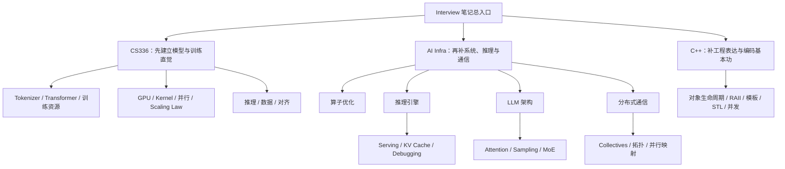

# Interview Notes

工程师视角的技术面试准备仓库，聚焦 **AI Infra 系统工程**、**C++ 核心知识** 与 **CS336 大模型课程主线**，目标不是“记住更多术语”，而是建立**能串起来、能复述、能定位问题**的知识网络。

> **📖 在线文档站：[kimmozag.github.io/Interview](https://kimmozag.github.io/Interview)**

---

## 学习路径图

如果你希望把它当成一套“从概念到面试表达”的复习系统，可以按下面顺序推进：

| 目标 | 推荐起点 | 建议路径 |
|---|---|---|
| 3 天快速热身 | [CS336 总索引](cs336/00-index.md) | `CS336 01 → 02 → 03` → `AI Infra 算子优化` → `C++ 通用知识` |
| 1 周系统梳理 | [AI Infra 总索引](ai-infra/00-index.md) | `算子优化 → 推理引擎 → LLM 架构 → 通信` |
| 面试冲刺 | [CS336 面试准备指南](cs336/interview-prep-guide.md) | 结合各索引页的“高频问题 + 推荐顺序”定向复习 |

---

## 核心导航（MOC / Map of Content）

### 🔧 AI Infra

- 总索引：[`ai-infra/00-index.md`](ai-infra/00-index.md)
- 重构路线：[`ai-infra/restructure-roadmap.md`](ai-infra/restructure-roadmap.md)
- 统一模板：[`ai-infra/05-appendix/chapter-template.md`](ai-infra/05-appendix/chapter-template.md)

核心入口：

- [张量 / 形状 / 内存布局](ai-infra/01-operator-optimization/01-tensors-shapes-layout.md)
- [内存层级与 Roofline](ai-infra/01-operator-optimization/03-memory-hierarchy-and-roofline.md)
- [LLM Serving](ai-infra/02-inference-engine/04-llm-serving.md)
- [可观测性与调试](ai-infra/02-inference-engine/06-observability-and-debugging.md)
- [Attention 与 KV Cache](ai-infra/03-llm-architecture/02-attention-kv-cache.md)
- [Collectives](ai-infra/04-communication/04-collectives.md)

### 🎓 CS336

- 总索引：[`cs336/00-index.md`](cs336/00-index.md)
- 学习路线图：[`cs336/study-roadmap.md`](cs336/study-roadmap.md)
- 面试准备指南：[`cs336/interview-prep-guide.md`](cs336/interview-prep-guide.md)

核心入口：

- [01 概览与 Tokenization](cs336/01-overview-and-tokenization.md)
- [02 PyTorch 与资源核算](cs336/02-pytorch-and-resource-accounting.md)
- [05 GPUs](cs336/05-gpus.md)
- [07 Parallelism](cs336/07-parallelism.md)
- [10 Inference](cs336/10-inference.md)
- [15 Alignment / SFT / RLHF](cs336/15-alignment-sft-rlhf.md)

### ⚡ C++

- 总索引：[`c++/00-index.md`](c++/00-index.md)

核心入口：

- [工具链与构建](c++/general/01-toolchain-and-build.md)
- [对象生命周期与值语义](c++/general/02-object-lifetime-and-value-semantics.md)
- [RAII 与智能指针](c++/general/03-raii-and-smart-pointers.md)
- [模板与类型](c++/general/04-templates-and-types.md)
- [STL 容器 / 算法](c++/general/05-stl-containers-iterators-algorithms.md)
- [并发基础](c++/general/06-concurrency-basics.md)

---

## 这套笔记现在怎么用

这份仓库不再只按“章节顺序”读，而是按“**索引页 → 核心主题 → 相对路径跳转 → 面试复述**”来使用。

建议固定动作：

1. 先从模块 `00-index.md` 建立全局地图；
2. 再进入核心文章，优先看 **What & Why / 对比表 / 排查 checklist**；
3. 看到概念边界时，立刻顺着相对路径跳到前置或平行主题；
4. 最后回到文章底部的 **面试高频 Q&A** 做 2 分钟口述复盘。

一句话概括：**不要把笔记读成流水账，要把它读成一张可往返跳转的知识图。**

---

## 命名、链接与模板规范

### 文件命名

新增或重写的笔记，目标格式统一为：

`序号_领域_核心知识点.md`

例如：

- `01_Java基础_多线程与并发.md`
- `02_AIInfra_KVCache与PagedAttention.md`
- `03_CPP_RAII与智能指针.md`

> 当前仓库已有对外发布链接，**旧文件不做一次性批量改名**，避免外链断裂；新写或重写的文章开始逐步迁移到统一命名规范。

### 相对路径链接

每篇核心笔记至少补齐 3 类跳转：

- **前置知识**：回到基础概念
- **平行主题**：对比类似方案
- **下游落地**：跳到工程实践或调试场景

例如：

`[参考 Attention 与 KV Cache](ai-infra/03-llm-architecture/02-attention-kv-cache.md)`

### 统一模板

- 通用写作规范：[`reference/note-writing-playbook.md`](reference/note-writing-playbook.md)
- AI Infra 章节模板：[`ai-infra/05-appendix/chapter-template.md`](ai-infra/05-appendix/chapter-template.md)

---

## 当前仓库状态

这套仓库目前已经基本完成从“线性笔记”到“网状知识库”的主干重构：

- 根目录与模块级 `README / 00-index` 已统一成入口页；
- `CS336` 已补齐学习路线、面试指南与核心主干页的实战型重构；
- `AI Infra` 的算子、推理、架构、通信四条主线已建立索引、桥接与核心页完成标记；
- 通用写作规范已经沉淀到 [`reference/note-writing-playbook.md`](reference/note-writing-playbook.md)，可直接拿来带学员做 few-shot 改写练习。

一句话总结：现在这份仓库更适合被当成**学习系统 + 复习系统 + 面试演练底稿**来使用，而不是只按目录顺序浏览。

## 学习进度打卡

### 个人复习打卡

- [ ] CS336 8 讲核心主线过完一轮
- [ ] AI Infra 五大板块各完成一篇“2 分钟口述”
- [ ] C++ 通用知识完成一轮高频问答复盘
- [ ] 至少补完 10 篇文章的踩坑记录

---

## 接下来优先看哪里

如果你只想先抓最值钱的部分，推荐从下面 6 篇开始：

1. [`cs336/02-pytorch-and-resource-accounting.md`](cs336/02-pytorch-and-resource-accounting.md)
2. [`ai-infra/01-operator-optimization/03-memory-hierarchy-and-roofline.md`](ai-infra/01-operator-optimization/03-memory-hierarchy-and-roofline.md)
3. [`ai-infra/02-inference-engine/04-llm-serving.md`](ai-infra/02-inference-engine/04-llm-serving.md)
4. [`ai-infra/03-llm-architecture/02-attention-kv-cache.md`](ai-infra/03-llm-architecture/02-attention-kv-cache.md)
5. [`ai-infra/04-communication/04-collectives.md`](ai-infra/04-communication/04-collectives.md)
6. [`c++/general/03-raii-and-smart-pointers.md`](c++/general/03-raii-and-smart-pointers.md)

这 6 篇分别覆盖：**资源直觉、性能瓶颈、服务系统、KV cache、通信模式、工程表达**——已经很接近一场面试的主干了。
