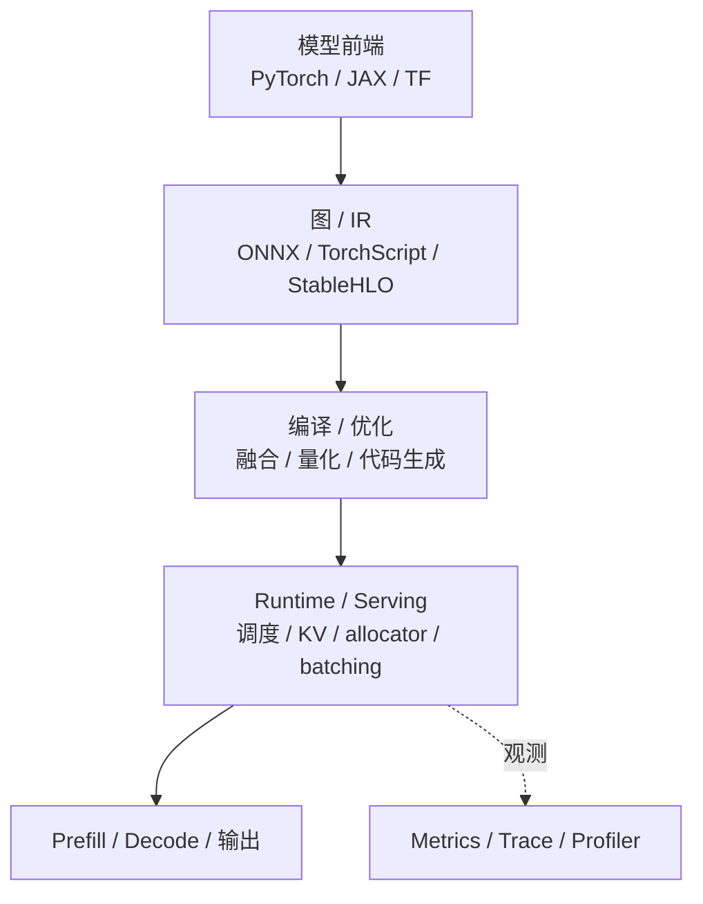

# 推理栈全景：前端→图→kernel→执行

## 核心定义（What & Why）

> **一句话总结**：推理栈全景回答的是“一个请求从模型语义一路落到硬件执行，到底经过了哪些层”，它解决的是为什么同一个线上症状可能分别来自前端、图优化、编译缓存、runtime 调度或 serving 队列等完全不同的层次。

## 关联知识网络

- 延伸：[`LLM Serving`](04-llm-serving.md)
- 延伸：[`推理优化 Playbook`](05-optimization-playbook.md)
- 排障：[`可观测性与调试`](06-observability-and-debugging.md)
- 平行：[`图编译：TVM / MLIR / XLA`](03-graph-compiler-tvm-mlir-xla.md)
- 平行：[`Runtime：ONNX Runtime / TensorRT`](02-runtime-onnxruntime-tensorrt.md)
- 课程桥接：[`CS336 / 10 推理优化`](../../cs336/10-inference.md)

## 要点

- 把推理系统拆成 4 层更容易定位问题：**模型前端 → 中间表示(IR/图) → 编译/优化 → 执行时(runtime)**
- 性能与稳定性问题，往往发生在“层与层交界处”（shape/dtype/layout/动态批处理）
- 从 CS336 Lecture 10 的视角看，推理系统还必须显式分成 **prefill** 与 **decode** 两种负载，否则你会把两个完全不同的问题混在一起
- 真正有用的推理栈理解，不是背 4 个层名，而是能说清：**请求从进来到出 token，中间每一层分别可能在哪些地方出问题**。

## 通用知识

### 它是什么

推理栈可以理解成：

- 上层定义模型和请求语义
- 中层把模型表示变成可优化的图或 IR
- 下层把图变成更适合硬件执行的 kernel / engine
- runtime 最终负责执行、内存管理、并发与调度

所以“推理”并不是一个单一动作，而是一条从模型语义到硬件执行的完整链路。

### 它解决什么问题

它解决的是：

- 模型如何从高层定义落到真实硬件执行
- 图优化、编译缓存、kernel 调度、内存分配分别在什么阶段发挥作用
- 为什么同一个模型在不同 runtime 或不同 serving 方案里表现差异很大

### 为什么在 AI 系统里重要

因为很多线上问题都不是单独属于“模型层”或“kernel 层”，而是卡在交界处：

- 导出后的 shape / dtype 和预期不一致
- 图优化没有生效，kernel 数量异常多
- runtime fallback 到意外路径
- 调度和 cache 策略把好好的模型执行拖慢了

### 它的收益与代价

收益：

- 帮你把问题分层定位，而不是把所有性能问题都归因给“模型大”
- 帮你理解 runtime、compiler、serving 各自的职责边界

代价：

- 系统一旦分层，问题也会更容易发生在层与层的边界
- 同样一个线上症状，根因可能来自完全不同层次

## 典型数据流

1. 前端（PyTorch/TF/JAX/自研）：定义模型与权重
2. 导出/表示：ONNX / TorchScript / StableHLO 等
3. 优化与编译：图优化、算子选择、融合、量化、代码生成
4. Runtime：内存管理、kernel 调度、stream 同步、并发与 batching

如果把这 4 层翻成更工程的问法，大概就是：

1. 模型长什么样
2. 模型被翻译成什么中间表示
3. 这个表示被优化成什么执行计划
4. 这个计划最终如何在设备上跑起来

## Mermaid：推理栈的最小分层图

## 再细一层：LLM 推理的最小请求生命周期

对于大语言模型，更实用的链路通常是：

1. 请求进入
2. tokenize / 输入校验
3. prefill
4. decode 循环
5. detokenize / 后处理
6. 日志、指标、缓存回收

这条链路里，prefill 与 decode 往往需要被分开观测、分开优化、分开汇报。

这一点尤其重要，因为很多团队会不小心把：

- 请求排队时间
- prefill 计算时间
- decode 单步时间

混成一个“生成慢”。

而一旦混在一起，优化动作很容易南辕北辙。

## 这四层最常见各自管什么

### 1. 前端层

关心：

- 模型结构定义
- 权重加载
- 输入输出语义
- tokenize / detokenize 等前后处理

### 2. 图 / IR 层

关心：

- 模型是否被稳定表示出来
- shape / dtype / layout 是否清晰
- 是否有机会做图级融合、常量折叠、算子重排

### 3. 编译 / 优化层

关心：

- 哪些子图会被特化
- 是否有编译缓存
- kernel / engine 是否适配目标硬件

### 4. Runtime / Serving 层

关心：

- 请求怎么进队列
- batch 怎么组织
- KV cache / allocator 怎么管理
- kernel 什么时候发射，stream 怎么同步

这个分层不是为了漂亮，而是为了排障时可以问对问题。

## 你需要能画出来的“最小架构图”（建议你后续补）

- 请求进入 → 预处理(tokenize) → prefill → decode 循环 → 后处理
- 动态 batching 在哪里做？cache 在哪里存？

如果你在面试里要口头描述，一个够用的版本是：

- 请求先进队列
- 经过 tokenize 和长度检查
- 进入 prefill 生成初始 KV
- 再进入 decode 循环不断出 token
- 同时 runtime 管理 cache、batching 和调度

## 对比表：问题落在不同层时，动作为什么完全不同

| 层 | 更常见的问题 | 常见症状 | 更像的动作 |
|---|---|---|---|
| 前端 | tokenize、输入校验、权重加载 | 首次请求慢、CPU 热点高 | 预热、缓存、线程池优化 |
| 图 / IR | shape/dtype/layout 不稳、图优化缺失 | kernel 数异常多、fallback | 导出修正、图优化验证 |
| 编译 / 优化 | compile cache 未命中、特化失败 | 冷启动重、首轮抖动 | 预编译、缓存、特化策略 |
| Runtime / Serving | batching、KV、allocator、同步 | TTFT / TPOT / p99 异常 | 调度、cache、内存管理优化 |

## 为什么 CS336 会把 inference 单独拎出来讲

因为在线推理不是“训练时 forward 的一个子集”，而是一套独立系统：

- 训练更关心吞吐和大 batch
- 推理更关心 TTFT、TPOT、队列、cache 和尾延迟
- 训练的热点不一定等于推理的热点

一个很有用的心智模型是：

- prefill 更像 dense compute 系统问题
- decode 更像缓存、调度和访存系统问题

## 最小例子

假设一个请求进入系统后出现了“首 token 很慢”的现象。

如果你按推理栈拆开看，可以有至少 4 种不同解释：

1. 前端：tokenize 或输入校验太慢
2. 图/编译：首次命中冷启动，compile / engine build 污染了结果
3. runtime：prefill kernel 没融合好，kernel 数过多
4. serving：动态 batching / queue 把短请求拖住了

同一个症状，落在不同层，动作完全不同。

这就是“推理栈分层”最真实的价值。

## 工程例子

一个常见误判是：

- 看到线上 TTFT 高
- 就立刻怀疑 attention 或 kernel 不够快

但真实情况可能是：

- runtime 在做冷启动构图
- 编译缓存没命中
- 请求被排在长 prompt 队列后面
- tokenize 在线程池里争用严重

所以你如果没有按推理栈分层看问题，就很容易把 serving 问题误诊成 kernel 问题，或者把编译缓存问题误诊成模型问题。

## 💥 实战踩坑记录（Troubleshooting）

> 现象：线上首 token 很慢，团队第一反应是 attention kernel 不够快。

- **误判**：直接把问题归到最“显眼”的算子层。
- **根因**：真实根因可能完全不在 kernel——比如编译缓存未命中、请求排队在长 prompt 后、tokenize 线程争用、或者 runtime fallback 到了意外路径。
- **解决动作**：
  - 先拆阶段：预处理 / prefill / decode / 后处理；
  - 再沿栈逐层问：前端、图、编译、runtime 哪一层先出现异常；
  - 最后才决定是改 kernel、改缓存，还是改调度。
- **复盘**：推理栈最大的价值，不是给你 4 个层名，而是让你不再把所有“慢”都怪到一个地方去。

## 推理优化工程师视角

这篇对推理优化工程师最重要的不是“知道四层”，而是养成两个本能：

1. 任何性能问题先问：它更像发生在前端、图、编译，还是 runtime / serving 层？
2. 任何优化动作都要问：它改变的是哪一层，是否会把问题转移到下一层？

例如：

- 图融合可能减少 kernel 数，但未必解决 queue 问题
- 更快的 runtime 可能提高单请求吞吐，但未必改善 tail latency
- 更激进的 batching 可能提升平均 tokens/s，但伤 TTFT

会这样想，推理栈就不再只是目录结构，而会变成真正的诊断框架。

## 常见面试问题

### 初级

1. 推理栈为什么通常要分成模型前端、图/IR、编译优化、runtime 几层？
2. prefill 和 decode 为什么需要分开看？

### 中级

1. 为什么很多线上性能问题发生在层与层的交界处？
2. 如果 TTFT 高，你会如何沿推理栈逐层排查？

### 高级

1. 为什么同一个模型换一个 runtime 或 serving 方案，性能曲线会明显不同？
2. 怎样判断一个问题更像 graph/compiler 问题，而不是 runtime/scheduler 问题？

## 易错点

- 只在模型层看问题，忽略 runtime 的同步与内存抖动
- 只看单次推理，忽略并发与排队造成的尾延迟
- 不区分 prefill 和 decode，导致定位和优化动作都偏了
- 把“推理栈”理解成静态图示，而不是可用于定位问题的分层方法

## 排查 checklist

- [ ] 把耗时拆解到：预处理 / prefill / decode / 后处理
- [ ] 确认“图优化是否生效”（kernel 数量是否下降）
- [ ] 确认“shape/dtype/layout 是否符合预期”
- [ ] 指标是否分开统计了 TTFT、TPOT、吞吐、p95/p99？

## 参考资料

- CS336 inference 相关讲义
- Runtime / compiler / serving 相关文档
- 建议串读：`02-runtime-onnxruntime-tensorrt.md`、`03-graph-compiler-tvm-mlir-xla.md`、`04-llm-serving.md`

## CS336 对照

- 官方 lecture 对应：Lecture 10（inference）
- 推荐官方入口：https://github.com/stanford-cs336/spring2025-lectures
- 推荐外部笔记：
  - https://www.rajdeepmondal.com/blog/cs336-lecture-10
  - https://rd.me/cs336
  - https://realwujing.github.io/page/3/
