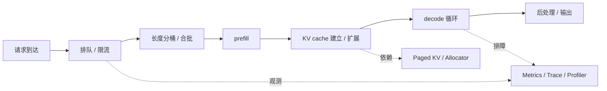

# LLM Serving：batching、paged KV、常见方案

## 核心定义（What & Why）

> **一句话总结**：LLM Serving 是把模型推理包装成稳定线上服务的一整套调度、缓存和资源管理系统，它解决的不是“模型能不能生成”，而是“请求能不能在吞吐、延迟和成本之间稳定落地”。

## 关联知识网络

- 前置：[`推理栈全景`](01-inference-stack-overview.md)
- 平行：[`Attention 与 KV Cache`](../03-llm-architecture/02-attention-kv-cache.md)
- 延伸：[`Paged KV 与 Allocator`](07-paged-kv-and-allocator.md)
- 排障：[`可观测性与调试`](06-observability-and-debugging.md)
- 方法论：[`推理优化 Playbook`](05-optimization-playbook.md)
- 多卡视角：[`Collectives`](../04-communication/04-collectives.md)
- 课程桥接：[`CS336 / 10 推理优化`](../../cs336/10-inference.md)

## 要点

- 线上推理的关键：**调度**（谁先跑、怎么合批）+ **缓存**（KV cache）+ **隔离**（资源与尾延迟）
- 需要把指标拆成：TTFT、TPOT、吞吐、p95/p99
- 大模型服务不是“把 forward 放进 API”这么简单，而是一个 **队列系统 + 缓存系统 + 调度系统**。

## 通用知识

### 它是什么

LLM Serving 关心的是：请求进入系统后，如何经过排队、分桶、合批、prefill、decode、后处理，最终稳定地返回结果。

它和离线单次推理最大的不同在于：

- 请求动态到达
- 请求长度分布不均匀
- 系统必须同时兼顾吞吐与尾延迟

### 它解决什么问题

Serving 解决的不是“模型能不能生成”，而是：

- 多个请求如何共享 GPU
- 长短请求如何尽量不互相拖累
- KV cache 如何高效管理
- 整体系统如何在高并发下仍然稳定

### 为什么在 AI 系统里重要

因为线上系统真正关心的通常不是单次 forward 时间，而是：

- TTFT 是否够低
- TPOT 是否平稳
- p95 / p99 是否失控
- 显存是否会因为 cache / allocator / batching 抖动而炸掉

### 它的收益与代价

好的 serving 设计可以：

- 提高 GPU 利用率
- 提高吞吐
- 降低单位请求成本

代价是：

- 调度逻辑更复杂
- cache / allocator 成为系统级状态
- 问题不再只来自模型，而是来自排队、混部、资源争抢

## 常见调度与合批

- Static batching：固定 batch，简单但对动态请求不友好
- Dynamic batching：按时间窗合批，吞吐好但可能拉高 TTFT
- Continuous batching：生成过程中持续合并新请求（常用于 LLM）

## Mermaid：一次请求在 Serving 系统里的生命周期

## 对比表

| 方案 | 优点 | 代价 | 更适合的场景 |
|---|---|---|---|
| Static batching | 实现简单，行为稳定 | 动态请求下利用率差 | 离线任务、输入长度相近 |
| Dynamic batching | 比静态 batch 更能吃满 GPU | 时间窗设置不当会拉高 TTFT | 中等并发、长度波动不大 |
| Continuous batching | 吞吐高，能更灵活接入新请求 | 调度复杂，状态管理重 | 高频在线生成、长短请求混跑 |

## KV cache 管理

- 连续分配：简单但容易碎片/扩容拷贝
- 分页/分块（paged）：更利于复用与减少拷贝，但实现更复杂

## 最小例子

假设同时来了 3 个请求：

- A：输入 64 token，输出 64 token
- B：输入 2k token，输出 256 token
- C：输入 16 token，输出 32 token

如果简单静态合批：

- A 和 C 很可能被 B 的长 prefill / 长 decode 拖慢

如果采用 continuous batching + 长度感知调度：

- 可以更灵活地让短请求先拿到首 token
- 同时让 decode 阶段维持较高 GPU 利用率

这就是为什么 serving 的核心不只是“批量更大”，而是“怎么让不同长度请求尽量别互相伤害”。

## 工程关注点

- 长短请求混合：如何避免长请求拖慢短请求
- 资源隔离：多模型、多租户、限流与降级
- 失败恢复：超时、重试、熔断

## 工程例子

一个典型线上现象：

- 平均吞吐还不错
- 但短请求 TTFT 很差，p99 非常难看

常见根因：

- 动态 batching 时间窗设置过大
- 长 prompt 请求占据 prefill 资源
- decode 阶段 KV cache 和 allocator 抖动拉高尾延迟

这时如果只看平均 tokens/s，往往会误判“系统没问题”。

## 💥 实战踩坑记录（Troubleshooting）

> 现象：平均吞吐正常，但短请求 TTFT 明显恶化，且 p99 抖动严重。

- **误判**：第一反应以为是 attention kernel 不够快，想先继续压单次算子延迟。
- **根因**：真正的问题出在调度窗口过大、长 prompt 挤占 prefill 资源，以及 KV cache / allocator 抖动把尾延迟放大了。
- **解决动作**：
	- 先拆开看 `排队 -> prefill -> decode -> 后处理` 的时延；
	- 按输入长度分桶看 TTFT / TPOT；
	- 再检查 KV cache 扩容、显存碎片和 block 分配稳定性。
- **复盘**：Serving 很多时候不是“算得慢”，而是“排得乱、抢得狠、抖得大”。

> 常见报错：CUDA out of memory while expanding KV cache blocks

- 如果报错只在高并发或长上下文下出现，优先怀疑 **KV cache 增长曲线** 和 **allocator 策略**，不要只盯模型权重大小。

## 推理优化工程师视角

对推理优化工程师来说，这一章几乎就是“线上现实主义”。因为很多离线优化是否真的有价值，最后都要到 serving 场景里见真章：

- 优化是不是只提升了平均吞吐，却伤了 TTFT 或 p99
- kernel 变快之后，是否反而被调度、排队、allocator 抖动抵消
- batch 变大之后，是否让短请求体验明显变差

所以服务优化通常不是单指标游戏，而是多目标平衡：

1. 先明确目标是首 token、稳定性，还是单位成本
2. 再分开看 prefill 与 decode 的资源模式
3. 最后用长度分桶和尾延迟指标验证是否真的对用户有帮助

如果没有这层系统视角，很多“看上去更快”的优化上线后都会变成另一种排队问题。

## 常见面试问题

### 初级

1. Static batching、dynamic batching、continuous batching 的区别是什么？
2. 为什么 LLM serving 里需要区分 TTFT 和 TPOT？

### 中级

1. 为什么长短请求混跑时，平均吞吐高不代表用户体验好？
2. 为什么 KV cache 管理会成为 serving 核心问题？

### 高级

1. 如果系统吞吐不错但 p99 很差，你会优先检查哪些环节？
2. 如果 TTFT 高而 TPOT 正常，你更怀疑调度、prefill，还是 decode？为什么？

## 易错点

- 只追吞吐导致尾延迟恶化
- 显存碎片化导致偶发 OOM 或性能抖动
- 把 serving 问题只归因给模型大小，而忽略队列和调度策略
- 不区分 prefill 和 decode 的资源模式，导致优化动作混乱

## 排查 checklist

- [ ] 分桶统计：按输入长度/输出长度/并发
- [ ] 分解延迟：排队/预处理/prefill/decode/后处理
- [ ] 观察显存：峰值、碎片、cache 命中
- [ ] 是否分别看了 TTFT、TPOT、吞吐和 p95/p99？

## 参考资料

- vLLM / TensorRT-LLM / TGI 等 serving 系统资料
- 相关 runtime / allocator 文档
- LLM 服务性能优化工程博客
