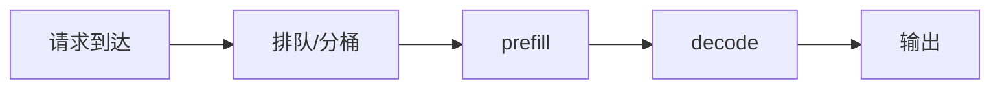

# 实战型章节模板（统一写法）

> 适用范围：`算子优化 / 推理引擎 / LLM 架构 / 通信技术` 四大主线。

目标不是把一篇文章写成“百科条目”，而是写成：**能快速复习、能解释 trade-off、能在面试里展开、能在排障时回看**的实战笔记。

---

## 1. 核心定义（What & Why）

开头必须先用一句话讲清：

1. 它是什么；
2. 它解决什么问题；
3. 为什么它会成为面试高频点。

建议格式：

> **一句话总结**：`主题` 是什么，它解决了什么痛点，它在 AI 系统里为什么重要。

---

## 2. 关联知识网络

每篇核心笔记都应显式写出相对路径链接，至少覆盖三种关系：

- **前置**：读这篇前要先懂什么；
- **平行**：和哪些概念容易混淆或需要比较；
- **延伸**：下游在哪些系统场景中落地。

示例：

- 前置：[`张量 / 形状 / 内存布局`](../01-operator-optimization/01-tensors-shapes-layout.md)
- 平行：[`Attention 与 KV Cache`](../03-llm-architecture/02-attention-kv-cache.md)
- 延伸：[`LLM Serving`](../02-inference-engine/04-llm-serving.md)

---

## 3. 核心代码 / 操作演示（How）

要求：

- 只保留最核心逻辑；
- 代码块必须写注释；
- 如果更适合用伪代码、命令、配置或公式，也可以不用真实代码。

推荐类型：

- shape 变化例子
- FLOPs / Bytes 粗估
- 显存估算
- 调度流程拆解
- profiling / tracing / 排查命令

---

## 4. 对比表 / 决策表

凡是有 trade-off 的内容，都尽量压缩成表格：

| 方案 | 优点 | 代价 | 适用场景 |
|---|---|---|---|
| 方案 A |  |  |  |
| 方案 B |  |  |  |

这部分的价值很高，因为它天然就是面试回答框架。

---

## 5. 💥 实战踩坑记录（Troubleshooting）

这是最值钱的一段，至少记录一个真实问题：

- 现象是什么；
- 原始报错是什么；
- 你最开始误判了什么；
- 最终如何定位和解决。

建议用引用高亮原始报错：

> RuntimeError: CUDA out of memory while allocating KV cache

建议结构：

- **现象**：
- **误判**：
- **根因**：
- **解决动作**：
- **复盘**：下次看到什么指标就应该先怀疑它。

---

## 6. 🎯 面试高频 Q&A

每篇末尾至少 2～3 题，最好按三层组织：

### 初级

- 解释定义
- 讲清作用

### 中级

- 解释 trade-off
- 比较两个方案为什么不同

### 高级

- 给定一个线上现象，你会怎么定位
- 解释为什么某个优化在另一种 workload 下不成立

回答时尽量写成“回答要点”，而不是长段落废话。

---

## 7. Mermaid 流程图（可选但推荐）

遇到调度流程、系统拓扑、时序关系时，不要只堆文字，优先考虑 Mermaid：



---

## 8. 排查 checklist

每篇都尽量给出**可执行**而不是空泛的 checklist：

- [ ] 我应该先看哪个指标？
- [ ] 我应该先切哪种维度做分桶统计？
- [ ] 我应该先判断 compute-bound 还是 memory-bound？
- [ ] 我应该优先排查 kernel、allocator、调度还是通信？

---

## 9. 参考资料

控制在 3～5 个来源，优先级建议：

1. 官方文档
2. 经典论文
3. 高质量工程实践总结

---

# 快速骨架（可直接复制）

## 要点

- 
- 
- 

## 核心定义（What & Why）

> **一句话总结**：

## 关联知识网络

- 前置：[]()
- 平行：[]()
- 延伸：[]()

## 核心代码 / 操作演示（How）

```text
# 只保留最关键逻辑，并写注释
```

## 对比表

| 方案 | 优点 | 代价 | 适用场景 |
|---|---|---|---|
|  |  |  |  |
|  |  |  |  |

## 💥 实战踩坑记录（Troubleshooting）

> 原始报错 / 异常现象

- 现象：
- 误判：
- 根因：
- 解决动作：

## 🎯 面试高频 Q&A

### 初级

1. 
2. 

### 中级

1. 
2. 

### 高级

1. 
2. 

## Mermaid（可选）


## 排查 checklist

- [ ] 
- [ ] 

## 参考资料

- 
- 
