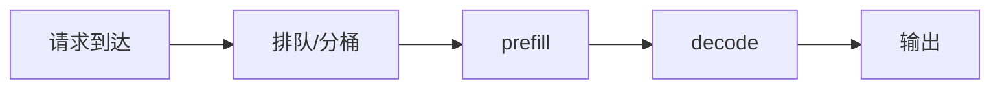

# 实战型章节模板（统一写法）

> 适用范围：`算子优化 / 推理引擎 / LLM 架构 / 通信技术` 四大主线。

目标不是把一篇文章写成“百科条目”，而是写成：**能快速复习、能解释 trade-off、能在面试里展开、能在排障时回看**的实战笔记。

> **强制要求**：每个小章节都必须按下面 4 段顺序展开：
>
> 1. **背景**：为什么会有这个技术、它要解决什么痛点、旧方案为什么失败；
> 2. **技术介绍**：重点讲实现机制，并尽量结合**原汁原味的代码**来讲；
> 3. **面试考点**：给出高频问题、回答要点与常见追问；
> 4. **思考题**：给出一组能逼着读者继续往下推演的问题。

---

## 1. 背景：为什么会有这个技术

开头必须先讲清三件事：

1. 当时的系统或工程痛点是什么；
2. 旧方案为什么不够好，失败在什么边界；
3. 新技术到底想解决什么核心问题。

建议格式：

> **一句话总结**：`主题` 的出现，是因为旧方案在 `瓶颈 / 失败点` 上已经撑不住，而它试图通过 `核心机制` 解决 `关键痛点`。

推荐补齐：

- 这个技术出现前，主流方案是什么；
- 旧方案在哪个 workload / 规模 / 资源约束下失败；
- 为什么它会成为今天的面试高频点。

---

## 2. 技术介绍：实现机制 + 原汁原味代码

这一段是正文核心，必须尽量贴近真实实现，而不是只讲抽象概念。

要求：

- 优先引用**原项目里的真实代码、真实接口、真实配置或真实调用链**；
- 如果引用原始实现，必须说明这段代码在整体系统里的位置与作用；
- 如果原始代码太长，只截取最关键的几行，并逐行解释；
- 只有在拿不到源码时，才退化成伪代码，但要显式说明“这是简化版”。

推荐类型：

- 调度流程拆解
- 关键数据结构
- 核心函数调用链
- profiling / tracing / 排查命令
- 配置项与运行参数
- shape / FLOPs / Bytes / 显存预算的真实计算

---

## 3. 面试考点：高频问题 + 回答要点

每篇末尾至少 2～3 题，最好按三层组织：

### 初级

- 解释定义
- 讲清作用

### 中级

- 解释 trade-off
- 比较两个方案为什么不同

### 高级

- 给定一个线上现象，你会怎么定位
- 解释为什么某个优化在另一种 workload 下不成立

回答时尽量写成“回答要点”，而不是长段落废话。

---

## 4. 思考题：逼着读者继续推演

每篇至少给出 3 道思考题，重点不是“记忆回放”，而是继续推：

- 如果前提条件变了，这个技术还成立吗？
- 如果资源预算缩小 / 放大，trade-off 会怎样变化？
- 如果把它迁移到另一个框架 / 硬件 / workload，会遇到什么问题？
- 如果你是系统 owner，会优先观察哪些指标来验证它是否有效？

推荐格式：

1. 如果 `条件 A` 变化，原来的结论还成立吗？为什么？
2. 如果让你在 `方案 A / 方案 B` 之间做选择，你会看哪些指标？
3. 如果线上出现 `现象 X`，你会优先怀疑哪一层？

---

## 5. 关联知识网络（推荐补充）

每篇核心笔记都应显式写出相对路径链接，至少覆盖三种关系：

- **前置**：读这篇前要先懂什么；
- **平行**：和哪些概念容易混淆或需要比较；
- **延伸**：下游在哪些系统场景中落地。

示例：

- 前置：[`张量 / 形状 / 内存布局`](../01-operator-optimization/01-tensors-shapes-layout.md)
- 平行：[`Attention 与 KV Cache`](../03-llm-architecture/02-attention-kv-cache.md)
- 延伸：[`LLM Serving`](../02-inference-engine/04-llm-serving.md)

---

## 6. 对比表 / 决策表（推荐补充）

凡是有 trade-off 的内容，都尽量压缩成表格：

| 方案 | 优点 | 代价 | 适用场景 |
|---|---|---|---|
| 方案 A |  |  |  |
| 方案 B |  |  |  |

这部分的价值很高，因为它天然就是面试回答框架。

---

## 7. 核心代码 / 操作演示（可并入“技术介绍”）

如果“技术介绍”一节里还没展开够，可以单独补一节更细的代码 / 命令 / 配置演示。

- shape 变化例子
- FLOPs / Bytes 粗估
- 显存估算
- 调度流程拆解
- profiling / tracing / 排查命令

---

## 8. 💥 实战踩坑记录（Troubleshooting）

这是最值钱的一段，至少记录一个真实问题：

- 现象是什么；
- 原始报错是什么；
- 你最开始误判了什么；
- 最终如何定位和解决。

建议用引用高亮原始报错：

> RuntimeError: CUDA out of memory while allocating KV cache

建议结构：

- **现象**：
- **误判**：
- **根因**：
- **解决动作**：
- **复盘**：下次看到什么指标就应该先怀疑它。

---

## 9. Mermaid 流程图（可选但推荐）

遇到调度流程、系统拓扑、时序关系时，不要只堆文字，优先考虑 Mermaid：



---

## 10. 排查 checklist

每篇都尽量给出**可执行**而不是空泛的 checklist：

- [ ] 我应该先看哪个指标？
- [ ] 我应该先切哪种维度做分桶统计？
- [ ] 我应该先判断 compute-bound 还是 memory-bound？
- [ ] 我应该优先排查 kernel、allocator、调度还是通信？

---

## 11. 参考资料

控制在 3～5 个来源，优先级建议：

1. 官方文档
2. 经典论文
3. 高质量工程实践总结

---

# 快速骨架（可直接复制）

## 要点

- 
- 
- 

## 1. 背景：为什么会有这个技术

> **一句话总结**：

- 旧方案的痛点：
- 旧方案为什么失败：
- 新技术要解决什么问题：

## 2. 技术介绍：实现机制 + 原汁原味代码

> 代码优先引用真实项目实现；如果只能写伪代码，请明确标注“这是简化版”。

```text
# 贴最关键的真实代码 / 调用链 / 配置，并逐行解释
```

## 3. 面试考点

### 初级

1. 
2. 

### 中级

1. 
2. 

### 高级

1. 
2. 

## 4. 思考题

1. 
2. 
3. 

## 关联知识网络（推荐补充）

- 前置：[]()
- 平行：[]()
- 延伸：[]()

## 对比表（推荐补充）

| 方案 | 优点 | 代价 | 适用场景 |
|---|---|---|---|
|  |  |  |  |
|  |  |  |  |

## 💥 实战踩坑记录（Troubleshooting）

> 原始报错 / 异常现象

- 现象：
- 误判：
- 根因：
- 解决动作：

## Mermaid（可选）


## 排查 checklist

- [ ] 
- [ ] 

## 参考资料

- 
- 
