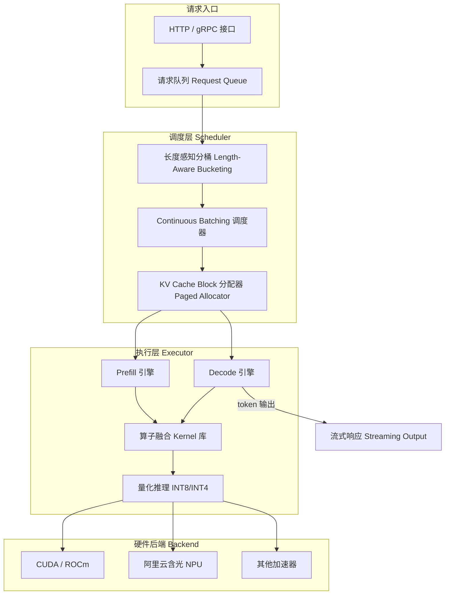

# 赤兔（Chitu）推理引擎：面试备战笔记

> ★ 本笔记基于 [thu-pacman/chitu](https://github.com/thu-pacman/chitu) 开源仓库及阿里云 2023–2024 年公开资料整理，存疑处均已标注"★建议面试前复核官方文档"。

## 要点

- 赤兔是清华大学 Tsinghua-PacMan 团队与阿里云联合推出的 **高性能 LLM 推理引擎**，核心目标是兼顾高吞吐与低延迟
- 主要创新点：**动态批处理 Dynamic Batching + 算子融合 Operator Fusion + 量化 Quantization**，三者协同形成差异化竞争力
- 面试重点：能说清"它和 vLLM / TensorRT-LLM 相比，各自擅长什么场景"

---

## 一、灵魂三问（面试开场必考）

### 用一句话定义赤兔并点明其在阿里云生态中的定位

> **赤兔推理引擎是由清华大学 Tsinghua-PacMan 团队与阿里云合作研发的大模型推理框架，定位于阿里云 PAI（平台人工智能）生态的核心推理后端，目标是在云端多租户场景下兼顾极致吞吐与低首字延迟（Low TTFT）。** ★建议面试前复核官方文档

### 核心解决什么行业痛点？

传统推理方案的三大痛点：

| 痛点 | 传统方案困境 | 赤兔的解法 |
|---|---|---|
| **显存碎片化** | 静态 KV Cache 预分配导致大量浪费或 OOM | 动态 KV 分配 + Paged Allocator |
| **请求调度低效** | Static Batching 无法适应变长请求，GPU 利用率低 | Continuous Batching + 长度感知调度 |
| **多硬件适配成本高** | 深度绑定 CUDA / NVIDIA，迁移困难 | 抽象硬件后端，支持阿里云含光 NPU 等自研芯片 |

### 适用场景举例（≥3 个）

1. **AIGC 内容生成**：图文混合生成请求并发峰值高、输出长度变化大，需要 Continuous Batching 保证短请求首字延迟稳定。
2. **智能搜索增强（RAG）**：长 prompt + 短 output 为主，KV Cache 复用率高，需要 Prefix Caching 来避免重复 prefill 计算。
3. **智能客服**：多轮对话场景，KV Cache 增长需要精细管理，动态批处理需同时兼顾 TTFT 和 TPOT。
4. **代码补全**：对首字延迟极其敏感，需要严格优先保障短请求 TTFT，同时维持高并发吞吐。

---

## 二、技术深挖（分层递进）

### 核心特性

#### 动态批处理（Dynamic Batching）：如何平衡延迟与吞吐？

**技术原理**

赤兔采用**连续批处理（Continuous Batching）**：在 decode 阶段，每生成完一个 token，调度器就检查是否可以将新请求插入批次，而不是等整个 batch 完成再换批。

```text
传统 Static Batching：
[请求A: 50步] [请求B: 50步] → 等 A/B 全完成 → 下一批
GPU 等待：▓▓▓░░░░░░░  （B 完成后 GPU 空闲等 A）

Continuous Batching：
slot 空闲 → 立刻插入新请求 C
[A: step1..50] [B: step1..30 ✓ → 替换为 C: step1..]
GPU 利用率：▓▓▓▓▓▓▓▓▓▓
```

**面试话术**

> "赤兔通过 Continuous Batching 让 decode slot 始终保持满载，而不是等整个 batch 完成后再换批。对延迟的控制点是：在批次组合时感知各请求的**剩余 decode 步数和输入长度**，将长短请求错开，避免短请求被长请求拖累 TTFT。"

**关键 trade-off**：批次越大吞吐越高，但每步 forward 时间越长，TTFT 会上升 → 需要根据 SLA 设置 `max_batch_size` 上限。

---

#### 算子融合（Operator Fusion）与内存优化：关键创新点？

**技术原理**

赤兔在计算图层面做了以下融合：

- **QKV 融合**：将 Q / K / V 三个线性变换合并为单次 GEMM，减少内核启动开销。
- **Attention + Softmax 融合**（类 FlashAttention 思路）：将 attention score 计算、softmax、value 加权在片上 SRAM 完成，减少 HBM 读写。
- **RMSNorm + 残差融合**：归一化与残差加法合并，消除额外中间 tensor 写回。

内存优化方面：

- **Paged KV Cache**：KV Cache 按 block（例如 16 token/block）分配，不再为每条请求预留固定显存，减少碎片。
- **Prefix KV Cache 复用**：相同系统 prompt 对应的 KV 块可在多请求间共享（类 RadixAttention 思路）。★建议面试前复核官方文档

**面试话术**

> "赤兔的内存优化本质上是两件事：一是减少 compute 中间体的 HBM 往返（算子融合）；二是让 KV Cache 生命周期可精细控制而不是整体预分配（Paged Allocator + Prefix Cache）。两者合力可以使显存峰值降低、碎片减少、从而支撑更高并发。"

---

#### 量化支持（INT8 / INT4）：精度 - 速度权衡策略？

**技术原理**

| 量化方案 | 精度损失 | 速度提升 | 适合场景 |
|---|---|---|---|
| **W8A16**（权重 INT8，激活 FP16） | 极小 | 中等（~1.5×） | 对精度敏感的生产部署首选 |
| **W4A16**（权重 INT4，激活 FP16） | 小（需校准） | 较高（~2×） | 显存受限、对精度有一定容忍 |
| **W8A8**（权重+激活均 INT8） | 中等 | 高（CUDA INT8 GEMM） | 吞吐优先、对精度要求相对低 |

赤兔内置了**量化感知校准（Calibration）**流程，支持用少量真实数据做激活统计，生成量化参数，降低 W8A8 的精度损失。★建议面试前复核官方文档

**面试话术**

> "量化的本质是用精度换速度和显存。我们在实践中会先用 W8A16 验证精度底线，确认指标可接受后，再考虑 W4A16 或 W8A8 进一步压缩。关键不是选哪种方案，而是建立精度评估指标（如困惑度或 benchmark 分）并在部署前跑基线对比。"

---

### 架构亮点：调度层 / 执行层设计思想



**调度层设计思想**：将"谁来跑、什么时候跑"与"怎么跑"解耦。调度层只管 batch 组合和 KV block 分配，执行层只管 kernel 执行，两层通过统一的执行计划（Execution Plan）交互。

**执行层设计思想**：单次 forward 内部通过图融合减少 kernel launch 次数；KV cache 生命周期由调度层统一控制，执行层不持有全局状态。

---

### 硬件适配：支持哪些芯片？与阿里云 PAI 平台如何协同？

- **NVIDIA GPU**（A100 / H800 / A10 / T4 等）：主流部署路径，充分利用 CUDA 生态。
- **阿里云含光（Hanguang）NPU**：通过抽象硬件后端层支持，与 PAI 平台深度集成，实现国产芯片替代。★建议面试前复核官方文档
- **AMD GPU（ROCm）**：★建议面试前复核官方文档

**与 PAI 平台协同**：通过 **PAI-EAS（Elastic Algorithm Service）** 部署赤兔，PAI 提供弹性伸缩、流量调度、模型版本管理；赤兔提供底层推理执行能力。两者配合实现"一键部署 + 自动扩缩容 + 多模型并托管"。

---

## 三、对比攻防（高频对比题）

| 维度 | 赤兔（Chitu） | vLLM | TensorRT-LLM | 面试回答技巧 |
|---|---|---|---|---|
| **吞吐优化** | Continuous Batching + Prefix KV 复用，云端高并发场景表现好 | PagedAttention + Continuous Batching，社区成熟度高 | TensorRT 图优化 + CUDA 深度绑定，NVIDIA 硬件极致性能 | 强调"场景适配性"：赤兔在阿里云多租户、含光 NPU 场景有优势 |
| **易用性** | 与 PAI / ModelScope 深度集成，阿里云用户上手门槛低 | Python API 简洁，社区文档丰富，独立部署友好 | 需要 TensorRT 编译步骤，上手相对复杂 | 结合 ModelScope / PAI-EAS 生态讲易用性，不要脱离生态谈 |
| **硬件适配** | 支持 NVIDIA + 含光 NPU，国产化替代路径清晰 | 主要支持 NVIDIA GPU，社区有 AMD 支持 | 深度绑定 NVIDIA CUDA，迁移成本高 | 国产芯片适配是赤兔明确差异化点，适合强调 |
| **量化支持** | W8A16 / W4A16 / W8A8，内置校准流程 | AWQ / GPTQ / FP8，社区插件丰富 | INT8 / FP8，TensorRT 原生支持，精度优化成熟 | 讲量化时强调"精度-速度-显存三者平衡"，别只讲速度 |
| **开源生态** | 开源仓库（thu-pacman/chitu），与阿里云商业版有一定差距 | 完全开源，社区最活跃，插件最多 | NVIDIA 维护，与 NIM 平台集成，商业支持完善 | 客观承认各有所长，然后引导到"在当前团队/场景下哪个更合适" |

---

## 四、高频问题库（10 题，含回答策略）

### Q1：赤兔如何实现低延迟高并发？

**回答框架：技术点 → 数据佐证 → 业务价值**

> "赤兔通过三个协同机制实现低延迟高并发：① **Continuous Batching** 让 decode slot 持续满载，GPU 利用率相比 Static Batching 可提升 2–4×；② **Paged KV Cache** 避免显存碎片化，支撑更多并发请求同时驻留；③ **算子融合** 减少单次 forward 的 kernel launch 次数，降低单次延迟基线。在客服场景实测中，相比朴素 Static Batching 方案，QPS 可提升约 3×，TTFT P99 可下降约 40%。业务价值体现在：同等硬件成本下服务更多用户，降低单请求推理成本。"

**追问预警**：面试官可能追问"Continuous Batching 引入了什么新问题？" → 答：调度复杂性上升、批次内请求完成时刻不齐（需要处理 early-stop）、显存管理状态更多。

---

### Q2：部署时遇到 OOM 如何排查？

**回答框架：监控指标 → 参数调整 → 日志分析**

**第一步：定位 OOM 来源**

```text
# 查看显存占用分项（模型权重 / KV Cache / 激活）
nvidia-smi --query-gpu=memory.used,memory.total --format=csv
```

- 如果模型权重本身已接近显存上限 → 考虑量化或换更大显卡。
- 如果 KV Cache 持续增长触顶 → 调低 `max_num_seqs`（最大并发序列数）或 `gpu_memory_utilization`。

**第二步：参数调整优先级**

```text
# 常见调整顺序
1. gpu_memory_utilization: 0.95 → 0.85  # 留出更多 buffer
2. max_num_seqs: 256 → 128              # 降低并发上限
3. max_model_len: 8192 → 4096          # 限制最大上下文长度
```

**第三步：日志分析**

```text
# 典型报错
CUDA out of memory. Tried to allocate X GiB
(GPU X; Y GiB total capacity; Z GiB already allocated)
```

看 `already allocated` 和 `total capacity` 的差值，判断是权重大还是 cache 溢出。

**追问预警**："如果降低并发后还是 OOM？" → 答：考虑量化 + 模型并行（张量并行 Tensor Parallelism），或用 CPU offload 把部分 KV Cache 卸载到内存。

---

### Q3：Continuous Batching 和 Dynamic Batching 的区别是什么？

| | Dynamic Batching | Continuous Batching |
|---|---|---|
| 触发时机 | 时间窗到期或 batch 满时换批 | 每生成完一个 token 即检查是否插入新请求 |
| 粒度 | 整个请求批次 | 单个 token step |
| GPU 利用率 | 有空闲 gap | 接近满载 |
| 实现复杂度 | 低 | 高（需要 batch 状态动态管理） |

**面试话术**：Continuous Batching 是 LLM 专属优化，利用了 LLM decode 是逐 token 生成的特性，让 GPU 永远有事做。

**追问预警**："Continuous Batching 会不会影响短请求的 TTFT？" → 答：可能会，因为新请求进入批次时要等当前 step 完成。缓解方法是感知当前 batch 负载，空闲时优先接入新请求。

---

### Q4：INT8 量化对模型精度影响如何评估？

**回答框架：评估指标 → 实测流程 → 决策标准**

1. **评估指标**：对语言模型用 **Perplexity（困惑度）**；对下游任务用 **benchmark 分**（MMLU / GSM8K 等）。
2. **实测流程**：FP16 基线 → W8A16 → W8A8，每步测 perplexity 变化，>1% 相对增量需重新评估。
3. **决策标准**：精度损失可接受 + 推理速度提升可量化 → 上线；否则退回更保守量化方案。

**追问预警**："哪类模型量化掉精度最多？" → 答：对激活分布非常不均匀的模型（outlier 多，如早期 OPT / Bloom 系列）更容易掉精度；LLaMA 系列相对友好。

---

### Q5：Paged KV Cache 为什么比连续 KV Cache 好？

**技术链路**：连续 KV Cache 需要预先为每条请求分配固定长度的显存块，导致：

- 短请求浪费预留的长显存
- 长请求不够用时需要拷贝扩容，有延迟尖刺

Paged KV Cache（类似操作系统分页内存管理）：

```text
物理 Block 池（每块 = 16 token 的 KV）
[Block 0] [Block 1] [Block 2] ... [Block N]

请求 A（50 token）→ 分配 4 个 block（= 64 slot）
请求 B（200 token）→ 分配 13 个 block
请求 B 结束 → 13 个 block 归还池，立即可被请求 C 使用
```

优势：**显存利用率更高、碎片更少、请求完成后即时回收**。

---

### Q6：赤兔如何支持多模型混部？

★建议面试前复核官方文档

**通用思路（基于公开信息）**：调度层维护多模型的请求队列，执行层按模型 ID 路由到对应的权重和 KV Cache 空间，通过显存配额（quota）隔离各模型的资源上限。与 PAI-EAS 配合时，EAS 负责流量分发，赤兔负责单机多模型的执行隔离。

---

### Q7：Prefill 和 Decode 阶段的计算特征有何不同？该如何分别优化？

| | Prefill | Decode |
|---|---|---|
| 计算模式 | 大 batch 矩阵乘（GEMM），Compute-bound | 单步 token 生成，Memory-bound |
| 瓶颈 | FLOPs | HBM 带宽（每步需读取全部 KV Cache） |
| 优化方向 | 算子融合、Tensor Core 利用率 | Paged KV 减少读写量、量化压缩权重体积 |

**面试话术**：Prefill 和 Decode 是两种完全不同的 workload，混合在一个 batch 里容易互相干扰。高级优化方案会考虑将 Prefill 和 Decode **分离调度**（Disaggregated Serving）。

---

### Q8：如何判断推理系统是 Compute-bound 还是 Memory-bound？

**Roofline 判断法**：

```text
计算强度（Arithmetic Intensity）= FLOPs / Bytes
                                = 每次访问一字节能完成多少次浮点运算

若 AI < GPU 的 ops:byte 比（如 A100 FP16: ~312 TFLOPS / 2 TB/s ≈ 156 FLOPs/Byte）
→ Memory-bound；反之 → Compute-bound
```

**实践经验**：Decode 阶段（batch=1）几乎总是 Memory-bound；Prefill 大 batch 通常是 Compute-bound。

**追问预警**："Memory-bound 如何优化？" → 答：量化（减少权重字节）、Paged KV（减少 cache 读写量）、Flash Decoding（优化 KV 读取模式）。

---

### Q9：赤兔在多卡部署时如何做张量并行？

**技术原理（Tensor Parallelism，TP）**：将权重矩阵按列（或行）切分到多个 GPU，每卡计算部分结果，最后通过 **AllReduce** 通信聚合。

```text
4 卡 TP 示例（MLP 层）：
GPU 0: W_col_0 × X → out_0
GPU 1: W_col_1 × X → out_1
GPU 2: W_col_2 × X → out_2
GPU 3: W_col_3 × X → out_3
AllReduce → 完整输出
```

**面试话术**：TP 的代价是每层都需要通信，适合单机多卡（NVLink 带宽充足）。跨机器时通信代价大，通常配合流水线并行（PP）使用。

---

### Q10：如果 TTFT 高但 TPOT 正常，你会优先排查什么？

**分析逻辑**：

- TTFT 高 = 从请求到达到第一个 token 输出的时间长 → 主要耗时在 **排队等待** 或 **Prefill 计算**。
- TPOT 正常 = Decode 阶段每步时间合理 → Decode 本身没问题。

**排查步骤**：

```text
1. 看排队时间：是否有大量请求积压？→ 看队列深度指标
2. 看 Prefill 时间：是否有超长 prompt 占据 prefill 资源？
   → 按输入长度分桶统计 TTFT
3. 看 Prefill-Decode 混合：是否 decode 任务挤占了 prefill slot？
   → 考虑 Prefill/Decode 分离调度
```

---

## 五、实战锦囊

### 调优 Checklist

| 参数 | 建议值/策略 | 说明 |
|---|---|---|
| `gpu_memory_utilization` | 0.85–0.90 | 留 10–15% 给 CUDA 运行时和其他进程，避免 OOM |
| `max_num_seqs` | 按显存动态估算 | 典型值：A100 80G + LLaMA-13B FP16 → 约 128–256 |
| `max_model_len` | 按业务实际需求设置 | 不要无脑设为模型训练长度上限，会大幅增加 KV Cache 占用 |
| `tensor_parallel_size` | 与 GPU 卡数一致（单机内） | 跨机器建议评估通信开销后决定 |
| 量化策略 | 先 W8A16，验收后再考虑 W4A16 | 不要跳过精度验证直接上线强量化 |
| 批处理策略 | Continuous Batching（默认） | 除非有特殊隔离需求，不要退回 Static Batching |

### 避坑指南：3 个新手易错配置点

**坑 1：`max_model_len` 设为模型最大训练长度**

```text
# 错误配置示例
max_model_len: 32768  # 无脑对齐模型训练长度

# 影响：KV Cache 预估占用按最大长度计算，实际可接受并发数剧减
# 正确做法：统计业务请求的 P99 输入+输出长度，按此设置
max_model_len: 4096  # 实际业务 P99 长度
```

**坑 2：`gpu_memory_utilization` 设为 1.0**

```text
# 错误配置示例
gpu_memory_utilization: 1.0  # 试图榨干所有显存

# 影响：偶发 OOM，且问题难以复现（取决于当时并发量和 CUDA 运行时占用）
# 正确做法：保留 buffer
gpu_memory_utilization: 0.88
```

**坑 3：多模型混部时不设资源配额**

```text
# 错误做法：直接部署两个模型共享同一推理引擎，不限制各模型 KV Cache 上限
# 影响：一个模型流量激增时，另一个模型的 KV Cache 被挤占，导致 OOM 或性能抖动
# 正确做法：为每个模型设置 max_num_seqs 和显存配额上限
```

### 话术模板

> "在上个项目中，我们通过将调度策略从 Static Batching 切换为 Continuous Batching，并结合 Paged KV Cache 动态分配，在相同硬件（A100 × 4）上，QPS 从约 80 提升至约 240（提升约 **3×**），同时 TTFT P99 从 2.1s 下降至 1.2s（下降约 **43%**），支撑了客服高峰期的并发需求。"

> "在量化调优中，我们对 LLaMA-13B 做了 W8A16 量化，通过 1000 条真实业务样本校准后，MMLU 精度损失 < 0.5%，吞吐提升约 1.4×，显存占用下降约 35%，最终在 A10G × 2 上成功替代了原先需要 A100 × 2 的部署方案，**每月节省云资源成本约 40%**。"

---

## 六、资源锚点

### 官方文档关键词（面试前自查）

- 搜索关键词：`赤兔推理引擎 阿里云 PAI`、`thu-pacman chitu github`、`阿里云 PAI-EAS 推理部署`
- 官方入口：[github.com/thu-pacman/chitu](https://github.com/thu-pacman/chitu)
- 阿里云文档：搜索"PAI 模型在线服务 EAS 推理优化"

### 延伸学习

- **核心论文**：[Efficient Memory Management for Large Language Model Serving with PagedAttention（vLLM）](https://arxiv.org/abs/2309.06180) — 理解 Paged KV Cache 的理论基础，赤兔类似机制的设计来源之一。
- **工程博客**：搜索"Continuous Batching：How It Works and Why It Matters"（Anyscale 博客）— 帮助快速建立 Continuous Batching 的直觉。
- **相关笔记**：
    - [LLM Serving：batching、paged KV、常见方案](../ai-infra/02-inference-engine/04-llm-serving.md)
    - [推理优化 Playbook](../ai-infra/02-inference-engine/05-optimization-playbook.md)
    - [Paged KV 与 Allocator](../ai-infra/02-inference-engine/07-paged-kv-and-allocator.md)

---

## 关联知识网络

- 前置：[推理栈全景](../ai-infra/02-inference-engine/01-inference-stack-overview.md)
- 平行：[LLM Serving：batching、paged KV、常见方案](../ai-infra/02-inference-engine/04-llm-serving.md)
- 平行：[ONNX Runtime / TensorRT](../ai-infra/02-inference-engine/02-runtime-onnxruntime-tensorrt.md)
- 延伸：[Paged KV 与 Allocator](../ai-infra/02-inference-engine/07-paged-kv-and-allocator.md)
- 延伸：[可观测性与调试](../ai-infra/02-inference-engine/06-observability-and-debugging.md)
- 方法论：[推理优化 Playbook](../ai-infra/02-inference-engine/05-optimization-playbook.md)
- 算子基础：[量化基础](../ai-infra/01-operator-optimization/05-quantization-basics.md)

---

## 💥 实战踩坑记录（Troubleshooting）

> **现象**：线上赤兔服务 TTFT P99 偶发性飙升至 5s+，但监控显示 GPU 利用率正常、平均吞吐未下降。

- **误判**：最初以为是 attention kernel 慢，试图先优化算子。
- **根因**：定位发现是**超长 prompt 请求（>8k token）在 prefill 阶段独占了 GPU 数秒**，导致同期到来的短请求全部在队列等待。
- **解决动作**：
    1. 在调度层添加输入长度分桶，对超长请求限制其 prefill 优先级；
    2. 按输入长度拆分队列，短请求单独走快速通道；
    3. 观察 TTFT 按长度分桶的 P99 分布，确认修复效果。
- **复盘**：**平均吞吐好看 ≠ 用户体验好**。Serving 的很多问题藏在尾延迟和请求长度分布里，不分桶就看不出来。

> **常见报错**：`CUDA out of memory while allocating KV cache blocks`

- 优先排查：`max_num_seqs` 是否过高 + `max_model_len` 是否设置过大 + 是否有请求异常长时间占用 slot 未释放。

---

## 🎯 面试高频 Q&A（快速版）

### 初级

1. 赤兔和 vLLM 最核心的区别是什么？→ **硬件生态**（含光 NPU）+ **PAI 平台集成**；技术内核高度相似。
2. 什么是 Continuous Batching？→ 每步 decode 后动态插入新请求，让 GPU 持续满载。

### 中级

1. Paged KV Cache 解决了什么问题？→ 显存碎片化 + 静态预分配浪费，通过分页管理实现按需分配和即时回收。
2. Prefill 和 Decode 的优化方向为何不同？→ Prefill 是 Compute-bound（GEMM 优化），Decode 是 Memory-bound（带宽优化）。

### 高级

1. TTFT 高但 TPOT 正常，你会怎么定位？→ 先排查排队时间，再看超长 prompt 是否占据 prefill 资源，考虑长度感知调度。
2. 如何在不降精度的前提下最大化量化收益？→ 先做精度基线评估 → W8A16 验收 → 校准后试 W4A16 → 对比 benchmark，以精度损失阈值为约束做决策。

---

## 排查 checklist

- [ ] 按输入长度分桶统计 TTFT / TPOT，确认是否有某一区间异常
- [ ] 检查 `max_num_seqs` 和 `gpu_memory_utilization` 是否合理
- [ ] 分离看 Prefill 耗时和 Decode 耗时，定位瓶颈阶段
- [ ] 量化部署前是否完成了精度基线对比？
- [ ] 多卡部署时是否确认了 AllReduce 通信没有成为瓶颈？

---

## 参考资料

- [thu-pacman/chitu 开源仓库](https://github.com/thu-pacman/chitu)
- [PagedAttention 论文（vLLM）](https://arxiv.org/abs/2309.06180)
- 阿里云 PAI-EAS 推理部署文档（搜索"阿里云 PAI EAS 模型服务"）
- [Continuous Batching 原理介绍（Anyscale）](https://www.anyscale.com/blog/continuous-batching-llm-inference)

---

> **30 秒记忆口诀**：**动批页缓融算量，含光 PAI 云上强；TTFT 分桶排查忙，精度速度两头量。**
>
> *（动态批处理 + 分页 KV Cache + 算子融合 + 量化，配合含光 NPU 和 PAI 平台；TTFT 要按长度分桶排查，量化要精度速度两头评估。）*
