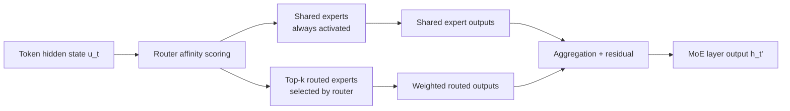
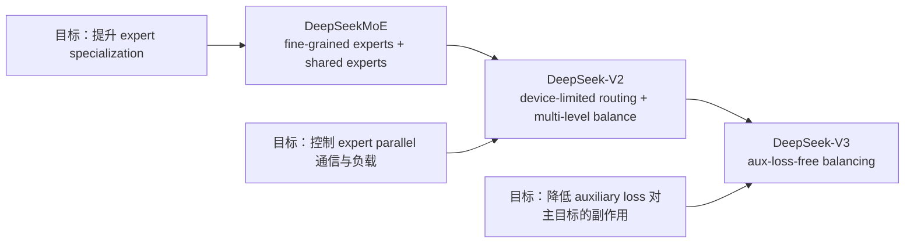

# DeepSeekMoE 架构深度解析：细粒度专家路由为什么更适合高性能训练与推理

## 背景 / 问题定义

Mixture-of-Experts 的吸引力很直接：把 Transformer 中最重的 FFN 路径稀疏化，让模型总参数继续上升，但不要求每个 token 都支付 dense FFN 的全额计算成本。[DeepSeekMoE, Section 1] 这条路线在大模型时代极具诱惑力，因为它提供了一种比“把所有层都做得更宽”更经济的扩容方式。

但传统 MoE 并不等于“把很多 experts 摆上去”就完事。DeepSeek 团队在 DeepSeekMoE 中指出，常规 top-k expert routing 至少有两个结构性问题：[DeepSeekMoE, Section 1]

1. **Knowledge Hybridity**：当 expert 数量有限、单个 expert 粒度很粗时，一个 expert 往往被迫同时吸收多类知识，导致内部参数承载的是“混装知识”。
2. **Knowledge Redundancy**：不同 routed experts 又会重复学习许多公共知识，导致专家之间出现参数冗余。

这两个问题加起来，会让 MoE 的理想状态——**expert specialization**——打折扣。换句话说，传统 sparse MoE 解决了“稀疏激活”的问题，但并没有自动解决“专家是否真正专精”的问题。[DeepSeekMoE, Section 1]

DeepSeekMoE 的核心判断因此非常明确：

- MoE 的瓶颈不只在于激活多少个 expert；
- 更关键的是 **expert 的粒度是否合适、公共知识是否被集中承接、路由是否能把 token 送到更精确的专家组合上**。[DeepSeekMoE, Section 1; DeepSeek-V2, Section 2.2.1]

这也解释了为什么 DeepSeekMoE 不是单纯沿着 Switch 或 GShard 的路线继续堆大，而是从专家划分方式本身下手。后续 DeepSeek-V2 与 DeepSeek-V3 也没有推翻这套结构，而是在其上分别补齐系统可扩展性与训练动态控制。[DeepSeek-V2, Section 2.2.1; DeepSeek-V3, Section 2.1.2]

## 图表清单

- 图 1：DeepSeekMoE 机制总览图（Mermaid）
- 表 1：Shared experts 与 routed experts 的职责划分
- 表 2：训练侧通信与路由工程问题对照表
- 表 3：核心设计收益与代价总表
- 表 4：与 Switch / GShard / dense Transformer 的对比表

## 图表总览（先看这块）

### 图 1：DeepSeekMoE 机制总览图（Mermaid）



### 表 1：Shared experts 与 routed experts 的职责划分

| 角色 | 激活方式 | 主要职责 | 解决的问题 |
|---|---|---|---|
| Shared experts | 每个 token 恒定经过 | 承接跨上下文共享的公共知识 | 缓解 routed experts 的知识冗余 |
| Routed experts | 由 router 动态 top-k 选择 | 承接更细粒度、更具区分性的知识 | 提高 expert specialization |

### 表 2：训练侧通信与路由工程问题对照表

| 工程问题 | DeepSeek 的处理方式 | 作用 |
|---|---|---|
| 激活 experts 多，跨设备 fan-out 高 | Device-limited routing，限制每 token 覆盖设备数 $M$ | 限制通信爆炸 |
| expert parallel 下负载不均 | Expert / device / communication 三层 balance loss | 降低训练尾部瓶颈 |
| 通信时间吞掉稀疏收益 | overlap shared expert computation with all-to-all | 提高计算通信重叠 |
| 稀疏激活参数较少但并行复杂 | 尽量避免 tensor parallelism | 降低额外通信 |
| 路由与通信本身开销高 | 自定义 CUDA kernels 优化通信、路由和融合算子 | 提高训练效率 |

### 表 3：核心设计收益与代价总表

| 设计点 | 主要解决什么瓶颈 | 获得了什么 | 付出的代价 | 后续版本如何补强 |
|---|---|---|---|---|
| 细粒度专家拆分 | 粗粒度 expert 知识混装 | 更高组合自由度、更细知识分工 | 激活 expert 数增加，通信与 bookkeeping 更重 | V2 引入 device-limited routing |
| Shared expert isolation | routed experts 公共知识冗余 | 公共知识集中承接，routed experts 更专精 | shared path 恒定计算，结构更复杂 | V2/V3 继续保留该结构 |
| Expert/device balance loss | routing collapse 与设备负载倾斜 | 提升训练稳定性与并行效率 | auxiliary loss 过大可能伤主目标 | V3 改成 aux-loss-free balancing |
| Device-limited routing | 细粒度 MoE 的跨设备 fan-out | 控制通信边界 | 路由自由度被轻度约束 | V2 实践表明 $M \ge 3$ 基本不伤性能 |

### 表 4：与 Switch / GShard / dense Transformer 的对比表

| 方案 | 路由方式 | expert 粒度 | 公共知识处理 | 主要优点 | 主要弱点 |
|---|---|---|---|---|---|
| Switch Transformer | top-1 | 粗粒度 | 无显式 shared experts | 路由简单，工程实现相对直接 | 表达与组合能力较弱 |
| GShard | top-2 | 粗粒度 | 无显式 shared experts | 比 top-1 表达力更强 | 仍有知识混装与冗余问题 |
| DeepSeekMoE | fine-grained top-$mK$ + shared experts | 细粒度 | shared experts 显式承接公共知识 | 更强 expert specialization、更高参数利用率 | 通信与负载均衡问题更尖锐 |
| 传统 dense Transformer | 非稀疏（无路由） | 无专家划分 | 无 shared/routed 分工 | 训练路径规整、实现成熟 | 参数与计算基本同步增长，扩容成本高 |

## 关键结论

- DeepSeekMoE 的核心创新不是“把 MoE 做得更大”，而是把 expert 的粒度与职责重新设计成更适合 specialization 的形式。[DeepSeekMoE, Sections 1, 3]
- Fine-grained expert segmentation 解决的是粗粒度 expert 的知识混装问题，shared expert isolation 解决的是 routed experts 之间的公共知识冗余问题。[DeepSeekMoE, Sections 1, 3.1-3.2]
- 这套结构的真正代价落在系统层：专家更细、激活更多，就必须面对通信、路由和负载均衡复杂度上升，因此 V2/V3 才会进一步引入 device-limited routing 与 auxiliary-loss-free balancing。[DeepSeek-V2, Section 2.2.2; DeepSeek-V3, Section 2.1.2]

## 本页在系列中的位置

- 这一页回答的是：**为什么 DeepSeek 要先从专家粒度和专家职责下手，而不是先优化路由技巧。**
- 读完本页后，最自然的下一步是 `routing_and_load_balancing.md`，因为专家一旦切细，通信边界和负载均衡就会立刻成为主问题。
- 如果你更关心推理侧收益，再继续读 `mla_attention.md`，看 DeepSeek 如何在 attention 路径上再省一层系统成本。

## 核心机制

### DeepSeekMoE 想解决的，不只是“稀疏”，而是“更专精的稀疏”

DeepSeekMoE 的结构创新可以压缩成两句话：[DeepSeekMoE, Section 3]

1. **Fine-Grained Expert Segmentation**：把 expert 切得更细，让知识分工更细。
2. **Shared Expert Isolation**：把公共知识从 routed experts 中剥离出来，交给恒定激活的 shared experts 处理。

从架构视角看，这不是给原始 top-k routing 打一个小补丁，而是重新定义了一层 MoE 中“专家”这个最小单位的粒度与职责边界。

### DeepSeek 系列里的位置：先做结构，再补系统，再调训练动态

如果把 DeepSeekMoE 单独拿出来看，它像是在回答“怎样设计一个更专精的 MoE”；但放回 DeepSeek 后续路线里看，会发现它更像整个稀疏架构栈的第一块地基：

- `DeepSeekMoE` 先解决 **expert specialization 不足**；
- `DeepSeek-V2` 再解决 **细粒度 MoE 放大后的通信边界问题**；
- `DeepSeek-V3` 最后解决 **balance loss 与模型性能之间的冲突**。[DeepSeekMoE, Section 3; DeepSeek-V2, Section 2.2.2-2.2.3; DeepSeek-V3, Section 2.1.2]



这个演进关系值得单独强调，因为它说明 DeepSeek 并不是先发明一个“新 MoE 结构”，再被系统问题逼着打补丁；更准确地说，他们是在沿着一条连续路线推进：**先把单位激活参数的知识利用率做高，再把系统代价压回可控范围，最后再优化训练目标之间的 trade-off。**

### 机制总览图


上图对应的是完整 DeepSeekMoE 路径：每个 token 一方面始终经过 shared experts，另一方面再由 router 选择少数 routed experts，最后把两路结果与残差一起聚合。[DeepSeekMoE, Section 3.2; DeepSeek-V2, Section 2.2.1]

### 细粒度专家拆分：从“少量大专家”变成“更多小专家”

传统 MoE 的基本做法是：从 $N$ 个 expert 中选 $K$ 个。DeepSeekMoE 的做法则是：在总参数量和总计算量保持不变的约束下，把每个大 expert 按 FFN 中间层维度切成 $m$ 个更小 expert，总 expert 数因此从 $N$ 变为 $mN$；与此同时，为保持计算量不变，激活的 expert 数从 $K$ 变为 $mK$。[DeepSeekMoE, Section 3.1]

这一步的意义，不是简单把数字变大，而是把 MoE 的容量组织方式从“粗粒度专家块”改造成“可组合的细粒度能力单元”。

论文给了一个极具说明性的组合空间例子：[DeepSeekMoE, Section 3.1]

- 若 $N = 16$、$K = 2$，传统 top-2 routing 的专家组合数为 $\binom{16}{2} = 120$；
- 若把每个 expert 再切成 4 份，则专家总数变成 64，激活数变成 8，组合数变成 $\binom{64}{8} = 4,426,165,368$。

这不是一个花哨的组合数学小插曲，而是在说明：

- token 可用的专家组合从“很有限”变成“极其丰富”；
- 知识能够被拆得更碎、被学得更细；
- router 有更高自由度去拼出更贴近 token 需求的 expert 子集。[DeepSeekMoE, Section 3.1]

### 共享专家与路由专家：把公共知识与特化知识分开承载

DeepSeekMoE 的第二个关键动作是 **Shared Expert Isolation**。其动机是：如果所有知识都要通过 routed experts 承接，那么常见模式、基础语法、广泛共享的事实知识会在多个 expert 里重复出现，导致 routed experts 大量浪费在“重复记忆”上。[DeepSeekMoE, Section 1; Section 3.2]

因此，DeepSeekMoE 显式隔离出若干个 **shared experts**：

- shared experts 对每个 token 恒定激活；
- routed experts 只负责 token 特异性更强的部分；
- 这样公共知识被 shared experts 统一吸收，routed experts 可以更专注于差异化知识。[DeepSeekMoE, Section 3.2]

这其实把单层 MoE 切成了两种职责：

| 角色 | 激活方式 | 主要职责 | 解决的问题 |
|---|---|---|---|
| Shared experts | 每个 token 恒定经过 | 承接跨上下文共享的公共知识 | 缓解 routed experts 的知识冗余 |
| Routed experts | 由 router 动态 top-k 选择 | 承接更细粒度、更具区分性的知识 | 提高 expert specialization |

DeepSeekMoE 的分析部分给出了一个很硬的证据：如果关闭 shared expert，同时多激活一个 routed expert 来保持计算量不变，Pile loss 会从 1.808 恶化到 2.414，说明 shared expert 不是“可有可无的兜底层”，而是承担了 routed experts 无法廉价替代的基础知识压缩功能。[DeepSeekMoE, Section 4.5]

## 数学基础

### 传统 MoE 的标准 top-k 形式

在传统 MoE 中，给定 token 的 FFN 输入 $u_t$，MoE 层输出可写为：[DeepSeekMoE, Section 2]

$$
h_t = \sum_{i=1}^{N} g_{i,t} \operatorname{FFN}_i(u_t) + u_t
$$

其中 gate 值由 top-k 选择产生：

$$
g_{i,t} =
\begin{cases}
s_{i,t}, & s_{i,t} \in \operatorname{Topk}(\{s_{j,t}\mid 1 \le j \le N\}, K) \\
0, & \text{otherwise}
\end{cases}
$$

亲和度通常由 token 与 expert centroid 的相似性给出：

$$
s_{i,t} = \operatorname{Softmax}_i(u_t^\top e_i)
$$

这一公式很短，但它默认了两个强假设：

- expert 粒度天然合适；
- 被选中的 experts 不会在知识上高度重叠。

DeepSeekMoE 的工作，正是在拆这两个默认假设。[DeepSeekMoE, Section 1]

### 细粒度专家拆分的公式

把每个 expert 切成 $m$ 个更小单元后，DeepSeekMoE 的 routed 部分变为：[DeepSeekMoE, Section 3.1]

$$
h_t = \sum_{i=1}^{mN} g_{i,t} \operatorname{FFN}_i(u_t) + u_t
$$

并且只在 $mN$ 个 experts 中选出 $mK$ 个：

$$
g_{i,t} =
\begin{cases}
s_{i,t}, & s_{i,t} \in \operatorname{Topk}(\{s_{j,t}\mid 1 \le j \le mN\}, mK) \\
0, & \text{otherwise}
\end{cases}
$$

这组公式的重要含义是：**在总成本不变时，DeepSeekMoE 用更细的专家单元换取更高的组合自由度**。[DeepSeekMoE, Section 3.1]

### Shared expert isolation 的完整形式

当引入 $K_s$ 个 shared experts 后，完整 DeepSeekMoE 形式可写为：[DeepSeekMoE, Section 3.2; DeepSeek-V2, Section 2.2.1]

$$
h_t' = u_t + \sum_{i=1}^{N_s} \operatorname{FFN}_i^{(s)}(u_t) + \sum_{i=1}^{N_r} g_{i,t} \operatorname{FFN}_i^{(r)}(u_t)
$$

其中：

- $N_s$ 是 shared experts 数量；
- $N_r$ 是 routed experts 数量；
- shared experts 恒定激活；
- routed experts 只在 top-k 中产生非零 gate。

在 DeepSeek-V2 的表述中，亲和度定义为：[DeepSeek-V2, Section 2.2.1]

$$
s_{i,t} = \operatorname{Softmax}_i(u_t^\top e_i)
$$

而 gate 值由 routed expert 的 top-k 集合决定。

### 负载均衡：为什么必须保留这一组公式

DeepSeekMoE 原论文不仅提出结构，还明确提出：如果 routing 完全放任自由学习，至少会出现两个问题：[DeepSeekMoE, Section 3.3]

1. **Routing collapse**：少数 expert 被反复选中，其他 expert 得不到有效训练；
2. **Device bottleneck**：当 experts 分布到多设备时，负载不均会拖慢整体并行效率。

因此原始 DeepSeekMoE 保留了两级 balance loss。

专家级平衡损失：

$$
\mathcal{L}_{\mathrm{ExpBal}} = \alpha_1 \sum_{i=1}^{N'} f_i P_i
$$

其中：

$$
f_i = \frac{N'}{K'T} \sum_{t=1}^{T} \mathbf{1}(\text{Token } t \text{ selects Expert } i)
$$

$$
P_i = \frac{1}{T} \sum_{t=1}^{T} s_{i,t}
$$

设备级平衡损失：

$$
\mathcal{L}_{\mathrm{DevBal}} = \alpha_2 \sum_{i=1}^{D} f_i' P_i'
$$

其目的不是追求所有 expert 绝对平均，而是更现实地追求 **device-level computation balance**。[DeepSeekMoE, Section 3.3]

### V2 的系统化扩展：设备受限路由与通信平衡

DeepSeek-V2 把 DeepSeekMoE 放进大规模 expert parallel 训练后，问题变得更实际：细粒度拆分使激活 expert 数量升高，token 覆盖设备数也会随之升高，MoE 通信代价可能明显恶化。[DeepSeek-V2, Section 2.2.2]

因此 V2 在 naive top-k 之外增加了 **device-limited routing**：[DeepSeek-V2, Section 2.2.2]

1. 先为每个 token 选择 affinity 最高的 $M$ 个设备；
2. 再只在这些设备上的 experts 中执行 top-k selection；
3. 实践上当 $M \ge 3$ 时，性能与 unrestricted top-k 大致对齐。

V2 还增加了通信平衡损失：

$$
\mathcal{L}_{\mathrm{CommBal}} = \alpha_3 \sum_{i=1}^{D} f_i'' P_i''
$$

它针对的是“发送端受限但接收端仍可能拥塞”的现实通信问题。[DeepSeek-V2, Section 2.2.3]

### V3 的进一步演进：Auxiliary-Loss-Free Balancing

DeepSeek-V3 保留了 DeepSeekMoE 的基本结构，但对 balancing 的态度更谨慎。论文明确指出：auxiliary loss 太大时会伤害模型性能，因此 V3 引入了 bias-based 的 auxiliary-loss-free balancing。[DeepSeek-V3, Section 2.1.2]

其核心形式为：

$$
g'_{i,t} =
\begin{cases}
s_{i,t}, & s_{i,t} + b_i \in \operatorname{Topk}(\{s_{j,t}+b_j\}, K_r) \\
0, & \text{otherwise}
\end{cases}
$$

这里 $b_i$ 只参与路由排序，不参与最终 FFN 输出加权；若某 expert 过载，则减小其 bias，若欠载，则增大其 bias。这样做的实质，是把“平衡压力”从损失函数主目标中部分拿掉，改为在线路由控制信号。[DeepSeek-V3, Section 2.1.2]

### 路由逻辑伪代码

```python
def deepseek_moe_forward(u_t, shared_experts, routed_experts, centroids, k):
    shared_outputs = [expert(u_t) for expert in shared_experts]

    affinity = [dot(u_t, c) for c in centroids]
    topk_idx = topk(affinity, k)
    topk_score = [affinity[i] for i in topk_idx]
    gate = normalize(topk_score)

    routed_outputs = []
    for w, idx in zip(gate, topk_idx):
        routed_outputs.append(w * routed_experts[idx](u_t))

    return u_t + sum(shared_outputs) + sum(routed_outputs)
```

如果切换到 V2 的 device-limited routing，则需要在 `topk` 前先按设备聚合 affinity、先选设备再选 expert；如果切换到 V3，则 `topk` 排序要用 `affinity + bias`，但输出权重仍由原始 affinity 归一化得到。[DeepSeek-V2, Section 2.2.2; DeepSeek-V3, Section 2.1.2]

## 工程实现

### 为什么“只做稀疏激活”还不够

DeepSeekMoE 的理论收益来自“总参数量增长快于每-token 激活计算量”，但工程端真正遇到的是另一条链：

`router -> token dispatch -> cross-device communication -> expert compute -> gather/aggregation`

当 expert 变得更细、激活 expert 数变多之后，这条链不再是论文里的次要细节，而会直接决定吞吐、尾延迟和训练可扩展性。[DeepSeek-V2, Section 2.2.2]

### 训练侧：细粒度路由把系统瓶颈从算力推向通信

DeepSeek-V2 明确指出，细粒度 expert segmentation 会增大激活 expert 数，因此如果采用 expert parallel，每个 token 涉及的设备数可能变多，MoE 通信成本也会上升。[DeepSeek-V2, Section 2.2.2]

这意味着 DeepSeekMoE 不是“免费变强”，而是把问题从：

- dense FFN 的大矩阵乘法成本

转移成：

- token 如何高效分桶；
- token 如何按 expert 所在设备重排；
- all-to-all 如何被约束和重叠；
- expert 热点如何不把少数 rank 拖死。

V2 的工程落地给了几项很关键的做法：[DeepSeek-V2, Section 3.1.2; Section 3.1.3]

| 工程问题 | DeepSeek 的处理方式 | 作用 |
|---|---|---|
| 激活 experts 多，跨设备 fan-out 高 | Device-limited routing，限制每 token 覆盖设备数 $M$ | 限制通信爆炸 |
| expert parallel 下负载不均 | Expert / device / communication 三层 balance loss | 降低训练尾部瓶颈 |
| 通信时间吞掉稀疏收益 | overlap shared expert computation with all-to-all | 提高计算通信重叠 |
| 稀疏激活参数较少但并行复杂 | 尽量避免 tensor parallelism | 降低额外通信 |
| 路由与通信本身开销高 | 自定义 CUDA kernels 优化通信、路由和融合算子 | 提高训练效率 |

DeepSeek-V2 的并行配置也很典型：16-way zero-bubble pipeline parallelism、8-way expert parallelism、ZeRO-1 data parallelism。[DeepSeek-V2, Section 3.1.3] 这组配置表达出的工程哲学非常清晰：**既然 MoE 已经带来动态路由通信，就不要再轻易叠加更多会放大通信的并行维度。**

### 推理侧：激活参数小，不等于实现天然简单

DeepSeekMoE 16B 的一个非常实用的结论是：它可以在单张 40GB GPU 上部署，无需量化；在合适的算子优化下，推理速度接近 7B dense 模型的 2.5 倍。[DeepSeekMoE, Section 1; Section 5.2.1]

这里的关键不是“总参数更小”——它其实总参数更大；真正关键的是：

- activated parameters 显著更小；
- shared experts + routed experts 的稀疏前向让单位 token 的有效计算负担更低；
- 如果 dispatch / gather 路径也被实现得足够紧凑，稀疏理论收益才有机会兑现成吞吐收益。[DeepSeekMoE, Section 5.2.1]

但也要守住边界：论文没有给出更细的 kernel timeline、batch 条件、sequence 条件或 latency breakdown，因此不能擅自展开更具体的数值结论。

### 一些容易被忽略的稳定性细节

DeepSeekMoE 原论文在放大到 16B 时没有把第一层 FFN 替换成 MoE，因为第一层的 load balance 收敛明显更慢。[DeepSeekMoE, Section 5.1.2] 这说明该设计并非“理论上最稀疏就最好”，而是要在训练动态上做出取舍。

同样，16B 版本没有继续把 expert 切得更细，论文给出的原因也很工程化：expert 太小可能伤害计算效率；更细粒度要等更大规模时再用。[DeepSeekMoE, Section 5.1.2]

这两点都说明一个事实：DeepSeekMoE 不是盲目追求更细，而是在 **specialization 增益** 与 **kernel / parallel efficiency** 之间找平衡。

## Design trade-offs

### 设计收益与代价总表

| 设计点 | 主要解决什么瓶颈 | 获得了什么 | 付出的代价 | 后续版本如何补强 |
|---|---|---|---|---|
| 细粒度专家拆分 | 粗粒度 expert 知识混装 | 更高组合自由度、更细知识分工 | 激活 expert 数增加，通信与 bookkeeping 更重 | V2 引入 device-limited routing |
| Shared expert isolation | routed experts 公共知识冗余 | 公共知识集中承接，routed experts 更专精 | shared path 恒定计算，结构更复杂 | V2/V3 继续保留该结构 |
| Expert/device balance loss | routing collapse 与设备负载倾斜 | 提升训练稳定性与并行效率 | auxiliary loss 过大可能伤主目标 | V3 改成 aux-loss-free balancing |
| Device-limited routing | 细粒度 MoE 的跨设备 fan-out | 控制通信边界 | 路由自由度被轻度约束 | V2 实践表明 $M \ge 3$ 基本不伤性能 |

### 相比标准 Transformer FFN：它不是更简单，而是更划算

相比 dense FFN，DeepSeekMoE 的核心优势是把“总参数量”与“每 token 激活计算量”解耦。[DeepSeekMoE, Section 1; Section 4.3] 从论文结果看：

- 在 2B 验证实验中，DeepSeekMoE 接近 Dense×16 这类 dense upper bound；[DeepSeekMoE, Section 4.3]
- 在 16B 规模上，DeepSeekMoE 16B 以约 40% 计算量达到与 DeepSeek 7B / LLaMA2 7B 接近的能力。[DeepSeekMoE, Section 5.2.1; Section 5.2.2]

代价则非常明确：

- forward path 从单一路径变成动态多路径；
- 系统瓶颈从 GEMM 主导转向 routing + dispatch + communication 主导；
- 训练稳定性需要额外 balance 策略维持。[DeepSeekMoE, Section 3.3; DeepSeek-V2, Section 2.2.2]

因此更准确的表述不是“MoE 更便宜”，而是：**MoE 用系统复杂度换单位激活计算下的更高容量。**

### 为什么不直接采用更常见的方案

如果只从实现简洁性看，DeepSeek 完全可以停在两条更常见的路线：

1. **继续做 dense FFN 扩宽**：实现规整、训练路径稳定，但参数量与每 token 计算量会一起涨；
2. **继续使用粗粒度 top-1 / top-2 MoE**：保留 sparse 计算优势，但 expert specialization 上限有限，公共知识也更容易在多个 experts 中重复存储。[DeepSeekMoE, Section 1; Section 4.2]

DeepSeek 没有停在这些“更省心”的方案上，本质上是因为它们分别卡在两个不同瓶颈：

| 常见方案 | 为什么常见 | DeepSeek 没停在这里的原因 |
|---|---|---|
| Dense FFN 扩宽 | kernel 规整、训练路径简单 | 计算成本会和参数一起涨，不利于经济扩容 |
| Switch top-1 | routing 简单、工程成本低 | expert 组合能力弱，难以充分释放更大专家池的潜力 |
| GShard top-2 | 比 top-1 更强的表达能力 | 仍然是粗粒度专家，knowledge hybridity / redundancy 依旧明显 |

所以 DeepSeekMoE 的选择逻辑不是“为了新而新”，而是三步判断：

- 如果继续 dense，容量扩展不经济；
- 如果继续粗粒度 sparse，expert specialization 不够；
- 那么就只能把专家切细，并把公共知识显式隔离出去。[DeepSeekMoE, Section 1; Section 3.1; Section 3.2]

这也是它最像“研究员 + 架构师”联合设计的地方：它不是默认最常见方案就是最合理方案，而是先问瓶颈在哪，再决定该增加哪一种复杂度。

### 相比 Switch / GShard：DeepSeekMoE 改的不是 top-k 数字，而是 expert 的组织方式

| 方案 | 路由方式 | expert 粒度 | 公共知识处理 | 主要优点 | 主要弱点 |
|---|---|---|---|---|---|
| Switch Transformer | top-1 | 粗粒度 | 无显式 shared experts | 路由简单，工程实现相对直接 | 表达与组合能力较弱 |
| GShard | top-2 | 粗粒度 | 无显式 shared experts | 比 top-1 表达力更强 | 仍有知识混装与冗余问题 |
| DeepSeekMoE | fine-grained top-$mK$ + shared experts | 细粒度 | shared experts 显式承接公共知识 | 更强 expert specialization、更高参数利用率 | 通信与负载均衡问题更尖锐 |

DeepSeekMoE 原论文的验证结论是，在总参数量和激活参数量相当时，DeepSeekMoE 明显优于 GShard；甚至在 2B 验证实验中，可以接近 1.5 倍 expert 参数与计算量的 GShard×1.5。[DeepSeekMoE, Section 4.2; Section 4.3]

这说明它的优势并不主要来自“多激活几个 expert”，而是来自 **专家粒度更细、shared/routed 职责更清晰后，单位激活参数里有效知识的比例更高**。[DeepSeekMoE, Section 4.5]

### 为什么这种设计适合 DeepSeek 的扩展路线

DeepSeek 系列的路线很像三步走：

1. **DeepSeekMoE**：先把 expert specialization 做出来，证明稀疏容量不是只能靠粗粒度 top-1/top-2 获得。[DeepSeekMoE, Section 3; Section 4.5]
2. **DeepSeek-V2**：把这套结构推到更大规模，正面处理通信边界与设备负载，把 fine-grained MoE 真正变成可训练的大系统。[DeepSeek-V2, Section 2.2.2; Section 3.1.3]
3. **DeepSeek-V3**：继续处理 balancing 与性能之间的张力，用 aux-loss-free routing 降低 auxiliary loss 对主训练目标的干扰。[DeepSeek-V3, Section 2.1.2]

换句话说，DeepSeekMoE 不是一个孤立的“论文技巧”，而是 DeepSeek 稀疏模型路线的结构原点。

## 与主流方案对比

### 与 Llama / GPT / 传统 dense Transformer 的对比

从架构哲学看，Llama / GPT / 传统 dense Transformer 走的是“所有 token 都经过同一套大 FFN 参数”；DeepSeekMoE 走的是“公共能力由 shared experts 承接，特化能力由 routed experts 稀疏激活”。[DeepSeekMoE, Section 2; Section 3.2]

这带来三个关键差别：

| 维度 | 传统 dense Transformer | DeepSeekMoE |
|---|---|---|
| 容量组织方式 | 单一大参数块 | 公共容量 + 稀疏专门容量 |
| 每 token 计算路径 | 固定且规整 | 动态且稀疏 |
| 工程主要瓶颈 | GEMM、显存、常规并行 | routing、负载均衡、all-to-all、dispatch/gather |
| 扩容代价 | 参数和计算常同步变大 | 总参数可更快变大，但系统复杂度显著增加 |

论文层面可确认的结论是：DeepSeekMoE 16B 相比 LLaMA2 7B，总参数更大，但 activated params 仅约 2.8B，对应计算量约为 LLaMA2 7B 的 39.6%，而大多数 benchmark 表现相当或更强。[DeepSeekMoE, Section 5.2.2]

但也要看到 trade-off：论文同样指出，DeepSeekMoE 在若干多选题任务上不占优，一个重要原因是 attention 参数相对更少。这说明 MoE 尤其擅长把 FFN 容量做大，但不等于所有能力维度都会自动同步提升。[DeepSeekMoE, Section 5.2.1]

### 与“传统 sparse MoE”的对比重点

如果用一句话概括 DeepSeekMoE 与主流 sparse MoE 的差异，那就是：

> 主流 sparse MoE 更像是在问“一个 token 该去几个大专家”；DeepSeekMoE 在问“专家本身应该切多细、公共知识该不该独立建模”。

这两种思路的区别，决定了后续系统设计也会不同：

- 传统 sparse MoE 的重点偏向 router 选择；
- DeepSeekMoE 的重点则扩展为 **expert granularity + knowledge partition + communication control**。

## 小结 / 启示

DeepSeekMoE 对 MoE 的最大贡献，不是证明“稀疏激活能省算力”——这件事在它之前大家已经知道；它真正推进的是另一层：**怎样让稀疏激活的每一份参数更有效。**

它的回答不是更复杂的 router，而是三步：

- 把专家切细，让知识更容易分工；
- 把 shared knowledge 单独隔离，减少 routed experts 冗余；
- 再在大规模训练里用 device-limited routing、multi-level balancing、aux-loss-free balancing 把这套结构真正变成可扩展系统。[DeepSeekMoE, Section 3; DeepSeek-V2, Section 2.2.2-2.2.3; DeepSeek-V3, Section 2.1.2]

如果站在长期维护的技术知识库视角，这一页最值得记住的不是某个具体超参数，而是下面这个判断：

- DeepSeekMoE 是 **结构层** 的创新；
- DeepSeek-V2 是 **系统层** 的落地；
- DeepSeek-V3 是 **训练动态层** 的优化。

这三者连起来，才构成了 DeepSeek 稀疏模型路线的完整逻辑链。

## 思考问题

- 如果不引入 shared experts，只把 routed experts 数量继续做大，哪些问题会先爆出来：知识冗余、通信成本还是训练不稳？
- fine-grained experts 提升了组合自由度，但也提高了 bookkeeping 和 all-to-all 成本。你会在什么规模下认为这笔交换开始划算？
- DeepSeekMoE 的设计更像“先提高单位激活参数的知识密度”。如果把这一思想迁移到非 MoE 架构，你会改哪里？