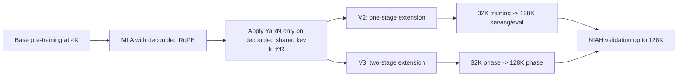

# DeepSeek 的长上下文扩展：为什么 128K 不只是把 RoPE 比例拉大

## 关键结论

DeepSeek 的长上下文能力并不是“训练一个 128K 模型”这么简单，而是建立在一条更严格的结构前提上：**先把位置编码路径从 MLA 的可压缩内容路径中拆出来，再把 YaRN 只施加到真正承载 RoPE 的那一小段状态上，最后通过阶段化 extension training 把上下文从短窗稳步扩到 128K。**

从论文给出的信息看，这条路线至少包含四个关键判断：

- DeepSeek-V2/V3 的长上下文不是独立于 MLA 之外的补丁，而是和 `decoupled RoPE` 深度绑定的 [DeepSeek-V2, Section 2.1.3; DeepSeek-V3, Section 4.3]。
- YaRN 在 DeepSeek 里**不是作用于整套注意力表示**，而是明确只作用在 decoupled shared key $k_t^R$ 上，因为它承担了位置编码信息 [DeepSeek-V2, Section 3.1.4; DeepSeek-V3, Section 4.3]。
- V2 用一次额外训练就把上下文从 `4K -> 128K`，而 V3 则改成两阶段 `4K -> 32K -> 128K`，这说明 DeepSeek 后续更重视稳定性、分布迁移和平滑扩窗，而不是一步到位 [DeepSeek-V2, Section 3.1.4; DeepSeek-V3, Section 4.3]。
- DeepSeek 论文并没有把“支持 128K”只停留在配置说明上，而是用 NIAH（Needle In A Haystack）测试展示了在各上下文长度段上都保持较稳定的检索表现 [DeepSeek-V2, Figure 4; DeepSeek-V3, Figure 8 / Section 4.3]。

一句话概括：**DeepSeek 的 128K 能力，本质上是“结构可扩展 + 位置路径可控 + 分阶段训练”的联合结果，而不是单个 RoPE scaling trick。**

## 背景 / 问题定义

如果站在传统 Transformer 视角，长上下文往往会被简化成两个工程动作：

1. 把位置编码延长；
2. 再做一些长序列继续训练。

但在 DeepSeek 里，这件事没有这么直线。原因是它的注意力已经不是普通 MHA，而是 `MLA + decoupled RoPE`。

这会带来一个很关键的变化：

- 长上下文扩展不再只是“把 RoPE 的频率改一下”；
- 它必须回答：**在哪条路径上扩？哪些表示应该被扩？哪些表示不能被位置编码污染？**

这也是为什么 DeepSeek-V2 在介绍 MLA 时就强调：标准 RoPE 与 low-rank KV compression 不兼容，因为一旦对内容路径直接加上位置相关旋转，查询侧吸收上投影矩阵的推理优化就会被破坏 [DeepSeek-V2, Section 2.1.3]。

于是，DeepSeek 先做了一件更基础的事：把承载位置编码的路径从内容路径里分离出来。这个决定本来是为了让 MLA 在推理时成立，但结果也顺手给长上下文扩展创造了一个更清晰的施力点。

换句话说，DeepSeek 的长上下文能力并不是“后来再加的能力”，而是 MLA 架构形态天然延伸出来的系统能力。

## 图表清单

- 图 1：长上下文扩展机制总览图（Mermaid）
- 表 1：DeepSeek 长上下文路线与常见思路对比

## 核心机制

### 机制总览图

这张图最重要的一点是：**DeepSeek 不是先说“我要 128K”，再回头找结构补丁；而是先把 RoPE 路径做成可单独操控，再去做长上下文扩展。**

### 为什么 decoupled RoPE 是长上下文扩展的前提

### 标准问题：RoPE 与低秩 KV 压缩会打架

DeepSeek-V2 明确指出，若直接把 RoPE 施加到 MLA 的内容 key 路径上，那么上投影矩阵 $W^{UK}$ 会与位置相关的 RoPE 矩阵耦合，导致它无法像设计目标那样在推理时被吸收到查询侧投影中 [DeepSeek-V2, Section 2.1.3]。

这会直接破坏 MLA 的一个核心收益：

- 你虽然把 KV 压缩了；
- 但推理时又可能因为位置路径耦合，被迫保留额外复杂计算或更重的状态恢复。

所以 DeepSeek 的第一步不是“怎样延长位置编码”，而是先把位置编码从内容路径里拆出来。

### DeepSeek 的解法：位置只放在 decoupled query/key 路径

在 MLA 中，DeepSeek 额外引入了承载位置编码的 decoupled query 与 shared key 路径：

$$
q_t^R = \operatorname{RoPE}(W^{QR} c_t^Q)
$$

$$
k_t^R = \operatorname{RoPE}(W^{KR} h_t)
$$

其中 $k_t^R$ 是 shared key，用来承载位置相关信息，而内容相关的压缩状态仍保留在 latent 路径中 [DeepSeek-V2, Section 2.1.3; DeepSeek-V3, Section 2.1.1]。

从长上下文扩展视角看，这个设计的真正价值是：

- 要扩位置编码时，不需要去动全部注意力状态；
- 只需要去处理真正承载 RoPE 的那条路径；
- 于是 YaRN 的施力点被大幅收窄和明确化。

这相当于把“长上下文扩展”从一个会污染整套注意力表示的全局改动，变成一个**主要针对 decoupled positional path 的局部改动**。

## 数学基础

### V2 的长上下文扩展目标

DeepSeek-V2 在初始预训练完成后，使用 YaRN 将默认上下文长度从 `4K` 扩展到 `128K` [DeepSeek-V2, Section 3.1.4]。论文给出的关键超参数为：

- scale $s = 40$
- $\alpha = 1$
- $\beta = 32$
- target maximum context length = `160K`

在这些设置下，论文认为模型可以对 `128K` 的上下文长度表现良好 [DeepSeek-V2, Section 3.1.4]。

### YaRN 在 DeepSeek 里的施加对象

V2 和 V3 都明确说明：YaRN **只应用于 decoupled shared key $k_t^R$**，因为正是它负责承载 RoPE [DeepSeek-V2, Section 3.1.4; DeepSeek-V3, Section 4.3]。

这点非常关键，因为它意味着 DeepSeek 的长上下文 scaling 不是：

$$
\text{scale all attention states}
$$

而更接近：

$$
\text{scale only the positional carrier path } k_t^R
$$

这是一种结构感知的 context extension，而不是黑盒放大。

### V2 的额外长度 scaling 因子

由于 DeepSeek 的 attention 机制不同于原始 YaRN 设定，V2 还额外调整了 length scaling factor，用于调制 attention entropy：

$$
t = 0.0707 \ln s + 1
$$

其目标是最小化 perplexity [DeepSeek-V2, Section 3.1.4]。

这说明 DeepSeek 并不是照搬 YaRN，而是根据 MLA 的注意力形态做了适配。

### V3 的对应设置

DeepSeek-V3 沿用与 V2 一致的 YaRN 配置，并同样只作用在 decoupled shared key $k_t^R$ 上 [DeepSeek-V3, Section 4.3]。论文给出的超参数为：

- $s = 40$
- $\alpha = 1$
- $\beta = 32$
- scaling factor

$$
t = 0.1 \ln s + 1
$$

[DeepSeek-V3, Section 4.3]

和 V2 相比，V3 的核心变化不在“是否继续用 YaRN”，而在于**训练过程被阶段化了**。

## 工程实现

### 从 V2 到 V3：扩窗策略为什么变了

### V2：一次 extension，训练长度 32K，服务/评测长度 128K

V2 的做法相当简洁：

- 初始预训练后进行额外 `1000` steps；
- sequence length 设为 `32K`；
- batch size 为 `576` sequences；
- 虽然训练只在 `32K` 长度上进行，但模型在 `128K` 评测中仍展现出稳定表现 [DeepSeek-V2, Section 3.1.4]。

这里最值得注意的，不是“V2 省了训练成本”，而是它暗含了一个判断：

> 只要位置扩展路径设计合理，模型未必需要完全在目标最大长度上长时间训练，才能在更长窗口上维持可用性。

这当然不是说“长上下文训练不重要”，而是 DeepSeek-V2 已经显示出：**结构正确时，extension training 的效率可以高于直觉。**

### V3：两阶段扩展，先 32K，再 128K

到 V3，DeepSeek 变得更保守也更系统：

- 第一阶段：`4K -> 32K`
- 第二阶段：`32K -> 128K`
- 每阶段都训练 `1000` steps [DeepSeek-V3, Section 4.3]

对应配置为：

- 第一阶段 sequence length = `32K`，batch size = `1920`
- 第二阶段 sequence length = `128K`，batch size = `480`
- 两阶段 learning rate 都设为 $7.3 \times 10^{-6}$，即与预训练末端学习率一致 [DeepSeek-V3, Section 4.3]

这一变化说明，V3 更强调以下几点：

1. 长度分布迁移最好分步走；
2. 真正到 128K 时，仍然值得用目标长度继续做一段适配；
3. learning rate 要足够温和，像是在“延长既有能力”，而不是重新大幅改写模型。

如果把 V2 看成“证明这条路线可行”，那么 V3 更像是在说：**既然已经证明可行，那就把扩窗过程做成更稳的标准工艺。**

### 为什么 DeepSeek 的长上下文不是单靠训练步数堆出来的

### 结构先行：只扩 $k_t^R$，不扩整套表示

DeepSeek 长上下文路线最值得记住的，不是 `1000 steps` 或某个 batch size，而是下面这条结构逻辑：

- `MLA` 先把内容和位置路径分离；
- `decoupled RoPE` 让位置路径变得清晰；
- `YaRN` 再只作用于 shared positional key；
- 最后 extension training 负责让模型适应更长窗口下的统计分布。

也就是说，DeepSeek 的长上下文不是“训练派”单独完成的，而是**结构派和训练派合写的一套方案**。

### 为什么这比“把全部 RoPE 统一拉伸”更干净

如果在普通注意力里直接统一拉伸所有位置路径，问题通常是：

- 哪些表示真的需要被拉伸？
- 哪些表示会因此失真？
- 是否会破坏已有推理优化？

DeepSeek 由于已经显式定义出位置载体 $k_t^R$，这些问题被收束了很多。工程上这意味着：

- 改动点更少；
- 注意力内容路径更稳定；
- 与 MLA 的 KV 压缩和 decode 优化兼容性更好。

这也是为什么 `mla_attention.md` 中提到“YaRN 只作用在 decoupled shared key”并不是一个边角注释，而其实是长上下文路线成立的结构性条件。

### NIAH：DeepSeek 如何验证 128K 不是纸面能力

V2 与 V3 都使用了 “Needle In A Haystack” 测试来检验长上下文表现：

- DeepSeek-V2 的 Figure 4 显示，在各长度区间直到 `128K`，模型都表现稳定 [DeepSeek-V2, Figure 4 / Section 3.1.4]；
- DeepSeek-V3 的 Figure 8 同样表明，在 supervised fine-tuning 后，模型在 `128K` 范围内保持较好的 NIAH 鲁棒性 [DeepSeek-V3, Section 4.3]。

这类评测的重要性在于，它不是只看“模型能不能接收 128K 输入”，而是在问：

> 当有用信息被埋得很深时，模型是否还能在长窗口中把它找回来？

DeepSeek 选择展示 NIAH，而不是只给一句“supports 128K”，说明他们关注的是**有效长上下文**，而不是仅仅不报错的长上下文。

### 与其他页面的关系：这页讲的不是 MLA 重复版，也不是预训练时间表复述

为了避免和已有页面重叠，这里要把边界说清楚：

- `architecture/mla_attention.md` 重点讲 **MLA 为什么能省 KV cache、为什么 decoupled RoPE 是必要补丁**；
- `training/pretraining_strategies.md` 重点讲 **预训练数据、目标函数、MTP、长上下文扩展在整体训练流程里的位置**；
- 本页则重点讲 **DeepSeek 如何把 decoupled RoPE + YaRN + staged extension 组合成一条可工作的 128K 路线**。

换句话说：

- MLA 页更偏“注意力结构”；
- 预训练页更偏“训练流程”；
- 本页更偏“长上下文机制与落地工艺”。

## 实现细节补充

### V2 的落地工艺

V2 长上下文扩展的可确认工程细节包括：

- 初始 context window：`4K`
- extension 后目标能力：`128K`
- target maximum context length：`160K`
- 额外训练：`1000` steps
- training sequence length：`32K`
- batch size：`576` [DeepSeek-V2, Section 3.1.4]

这个配置说明 V2 的目标更像是一种“高性价比扩窗”：

- 不在真正 128K 长度上做大量继续训练；
- 但借助合适的位置路径设计，争取把泛化扩到 128K。

### V3 的落地工艺

V3 的可确认细节更系统：

- 两阶段 extension training，各 `1000` steps
- 阶段一：`32K`，batch size `1920`
- 阶段二：`128K`，batch size `480`
- learning rate：$7.3 \times 10^{-6}$
- context extension 总成本：`119K H800 GPU hours` [DeepSeek-V3, Section 4.3; Table 1 summary near training cost]

这个数字很值得注意，因为它意味着：

- V3 的 128K 不是“免费送的”；
- 但相对于整次训练 `2.788M` GPU hours 来说，它仍然是一个可控的附加成本 [DeepSeek-V3, Table 1 / training cost summary]。

从工程角度说，这就是一条非常典型的 DeepSeek 式决策：

> 先用结构把扩窗问题变简单，再用一段成本可控的专门训练把它做稳。

## Design trade-offs

### 为什么 V3 不继续完全复用 V2 的“一步到位”方式

如果 V2 已经证明 32K 训练也能服务 128K，那么 V3 为什么还要多做一个真正的 128K phase？

合理的解释是：

- V3 规模更大，训练目标更多，稳定性要求更高；
- 更长上下文下 attention 统计与 batch 形态都更不一样；
- 两阶段扩展更像“逐步驯服分布迁移”，而不是赌一次泛化成功。

也就是说，V3 并不是否定 V2，而是把 V2 的经验做得更保守、更工程化。

### DeepSeek 长上下文路线真正的代价

长上下文看起来像能力扩展，但它的真实代价至少有三层：

1. **结构代价**：必须先有 decoupled RoPE 这类兼容长窗的 attention 形态；
2. **训练代价**：需要额外 extension training；
3. **服务代价**：即使 MLA 已显著降低 KV cache，128K 仍然会放大延迟、调度和显存管理压力。

所以 DeepSeek 的价值并不在于“把长上下文做得没有成本”，而在于：

- 把最麻烦的结构冲突先解开；
- 再把训练和服务成本压到一个工程上可接受的范围。

## 与主流方案对比

| 路线 | 主要做法 | 好处 | 风险 / 代价 |
| --- | --- | --- | --- |
| 直接放大 RoPE / 位置缩放 | 在原 attention 上统一延展位置编码 | 实现直观 | 可能扰动全部表示路径，兼容性未必好 |
| 单纯长序列继续训练 | 依靠更多长样本把模型“喂会” | 简单粗暴 | 训练成本高，且不解决结构冲突 |
| DeepSeek 路线 | decoupled RoPE + YaRN on $k_t^R$ + staged extension | 结构改动集中、与 MLA 兼容、训练成本相对可控 | 需要更复杂的 attention 设计与额外 extension phase |

DeepSeek 的特别之处不在于“用了 YaRN”，而在于：**它给了 YaRN 一个更明确、也更安全的作用对象。**

## 小结 / 启示

DeepSeek 的长上下文扩展，最值得记住的不是“它支持 128K”，而是它给出了一条更像工程工艺而不是单点技巧的路线：

- 先用 `decoupled RoPE` 把位置编码路径从 MLA 内容路径中拆出来；
- 再把 `YaRN` 只作用在真正承载位置的 shared key $k_t^R$ 上；
- 然后通过 `V2` 的单阶段试探和 `V3` 的双阶段扩展，把上下文逐步推到 `128K`；
- 最后用 `NIAH` 验证它是有效长上下文，而不是只是能接长输入。

如果说 `mla_attention.md` 讲的是“DeepSeek 怎样把注意力缓存做轻”，那么这一页补上的就是另一半：**缓存做轻之后，还要怎样把位置路径做对，长上下文能力才能稳定长出来。**