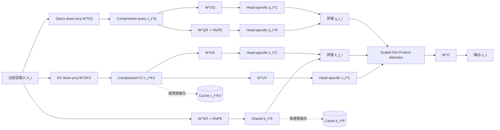

# Multi-head Latent Attention (MLA)

## 关键结论

Multi-head Latent Attention, 简称 MLA，本质上不是“把多头注意力改成共享 KV”这么简单，而是把每个 token 需要长期缓存的状态，从按 head 展开的完整 $K/V$ 张量，改成一个低秩 latent code $c_t^{KV}$，再配一个专门承载位置编码的共享 key $k_t^R$。这样，DeepSeek 把推理瓶颈从“缓存大量已展开的 head-specific KV”改成“缓存更小的可重建状态”，从而同时压缩显存占用和解码带宽压力 [DeepSeek-V2, Section 2.1; DeepSeek-V3, Section 2.1.1]。

对 DeepSeek 而言，MLA 是一根真正的系统杠杆：

- 它保留了比 MQA/GQA 更强的表达空间，因为每个 head 仍然可以通过上投影得到自己的 $K/V$ 子空间，而不是被迫共享同一组完整 KV [DeepSeek-V2, Section 2.1.2; DeepSeek-V2, Appendix D.1]。
- 它显著压缩了推理期 KV cache，论文给出的 matched comparison 中，小型 MoE 配置的 MLA 只需 MHA 的 14% KV cache，大型 MoE 配置只需 4% [DeepSeek-V2, Appendix D.2]。
- 它并不改变 attention 对历史 token 的访问模式：长上下文预填充依然有 $O(T^2)$ 的 token-token 交互，增益主要来自状态维度变小，而不是把注意力本身“变成线性”了。这一点很关键，别被“latent”两个字带偏了。
- 为了让低秩 KV 压缩与 RoPE 共存，DeepSeek 额外引入了 decoupled RoPE，把位置相关部分从可压缩内容子空间里拆出来，这是 MLA 真正成立的关键补丁 [DeepSeek-V2, Section 2.1.3]。

## 本页在系列中的位置

- 这一页回答的是：**为什么 DeepSeek 选择重写 KV 的缓存形态，而不是继续沿着 GQA/MQA 的共享路线做小修小补。**
- 它是 `long_context_and_yarn.md` 的前置页，因为长上下文扩展依赖 `decoupled RoPE` 这条位置路径先被理顺。
- 它也是 `engineering/deployment_and_serving.md` 的前置页，因为部署吞吐上的很多收益，本质上都来自 KV 状态先被压轻。

## 背景 / 问题定义

## 图表清单

- 图 1：MLA 结构流示意图（Mermaid）
- 表 1：MHA / MQA / GQA / MLA 的 KV 组织与代价对比
- 表 2：MLA 训练阶段的收益与代价
- 表 3：MLA 推理阶段的收益与代价
- 表 4：与 Llama / GPT / 传统 Transformer 的延伸对照

## 图表总览（重绘版，先看这块）

### 图 1：MLA 结构流示意图（Mermaid）

```mermaid
flowchart LR
   H[h_t] --> DQ[W^DQ]
   H --> DKV[W^DKV]
   DQ --> CQ[c_t^Q]
   DKV --> CKV[c_t^{KV}]
   CQ --> UQ[W^UQ -> q^C]
   CQ --> QR[W^QR + RoPE -> q^R]
   CKV --> UK[W^UK -> k^C]
   CKV --> UV[W^UV -> v^C]
   H --> KR[W^KR + RoPE -> k^R]
   UQ --> ATTN[Attention]
   QR --> ATTN
   UK --> ATTN
   KR --> ATTN
   UV --> ATTN
   ATTN --> O[W^O -> output]
   CKV -.cache.-> C1[(cache c_t^{KV})]
   KR -.cache.-> C2[(cache k_t^R)]
```

### 表 1：MHA / MQA / GQA / MLA 对比（精简）

| 机制 | KV 组织方式 | 每 token cache | 能力/成本取舍 |
| --- | --- | --- | --- |
| MHA | 每头独立 KV | $2 n_h d_h l$ | 能力强，成本最高 |
| MQA | 全头共享 KV | $2 d_h l$ | 成本低，能力折损风险高 |
| GQA | 组共享 KV | $2 n_g d_h l$ | 折中方案 |
| MLA | 缓存 latent + decoupled key | $(d_c + d_h^R)l$ | 兼顾能力与成本 |

### 表 2：训练阶段影响

| 项目 | MLA 带来变化 | 影响 |
| --- | --- | --- |
| 投影路径 | 增加 down/up projection | 结构更复杂 |
| 位置编码 | 引入 decoupled RoPE | 保住推理吸收优化 |
| 稳定性 | 需 RMSNorm/scaling 配合 | 训练更稳但调参更难 |

### 表 3：推理阶段影响

| 项目 | 常规方案 | MLA |
| --- | --- | --- |
| KV cache | 随多头维度线性膨胀 | 缓存压缩状态 |
| 带宽 | 读取完整历史 KV | 读取压缩态，带宽更低 |
| 长上下文潜力 | 易受显存约束 | 更易做大上下文 |

### 为什么长上下文和高吞吐推理会被 KV Cache 限制

在标准自回归解码里，当前 token 不只要做一次前向，还要读取所有 prefix token 的历史键值。对每一层而言，prefix 越长，缓存越大；并发请求越多，总缓存越容易吃满 GPU 显存。DeepSeek-V2 明确把 inference-time KV cache 视为限制最大 batch size 和 sequence length 的大瓶颈 [DeepSeek-V2, Section 2.1.1]。

如果记：

- $n_h$ 为注意力头数
- $d_h$ 为每头维度
- $l$ 为层数
- $T$ 为上下文长度

那么标准 MHA 的每 token 缓存规模为：

$$
S_{\mathrm{MHA}} = 2 n_h d_h l
$$

总缓存规模随上下文线性增长：

$$
M_{\mathrm{MHA}}(T) = T \cdot 2 n_h d_h l
$$

对解码阶段，每生成一个新 token，系统都要反复读取历史 KV，因此带宽压力也与历史长度线性相关，可写成：

$$
B_{\mathrm{MHA}}(t) = O\bigl(t \cdot 2 n_h d_h l\bigr)
$$

这就是为什么长上下文服务和高吞吐服务常常不是先被算力打爆，而是先被显存容量和 HBM 带宽卡住：算子没饿死，KV 先吃满了。

### MHA / MQA / GQA 分别如何权衡质量与成本

MHA 的问题不在表达力，而在缓存和带宽太贵；MQA/GQA 的问题不在系统成本，而在它们通过共享 key/value 来换成本，容易损失 head-specific 表达能力。DeepSeek-V2 在附录里做了直接消融：在相近 7B dense 规模下，MHA 在 BBH、MMLU、C-Eval、CMMLU 上都明显优于 GQA 和 MQA [DeepSeek-V2, Appendix D.1]。

| 机制 | KV 组织方式 | 每 token KV cache | 表达能力直觉 | 系统代价直觉 |
| --- | --- | --- | --- | --- |
| MHA | 每个 head 独立 $K/V$ | $2 n_h d_h l$ | 最强 | 最大 |
| GQA | 多个 query head 共享一组 $K/V$ | $2 n_g d_h l$ | 中等 | 中等 |
| MQA | 全部 query head 共享一组 $K/V$ | $2 d_h l$ | 最弱 | 最小 |
| MLA | 缓存共享 latent，再恢复 head-specific 内容 | $(d_c + d_h^R) l$ | 接近甚至超过 MHA | 很低 |

DeepSeek 的出发点很清楚：

1. 不想接受 MQA/GQA 那种“显存省了，能力也掉了”的典型 trade-off。  
2. 想要把可缓存状态压缩到远小于 $n_h d_h$ 的维度。  
3. 同时保留每个 head 的专属内容子空间。  

这三个目标一起，才推导出 MLA 这条路线 [DeepSeek-V2, Section 2.1]。

## 核心机制

### latent representation 的定义

MLA 对每个 token 先生成一个共享的 KV latent：

$$
c_t^{KV} = W^{DKV} h_t
$$

其中：

- $h_t \in \mathbb{R}^d$ 是当前层输入隐状态
- $c_t^{KV} \in \mathbb{R}^{d_c}$ 是压缩后的 latent state
- $d_c \ll n_h d_h$

随后，再通过上投影恢复出用于注意力计算的内容部分：

$$
k_t^C = W^{UK} c_t^{KV}, \qquad v_t^C = W^{UV} c_t^{KV}
$$

这里最重要的点是：缓存里保留的是 $c_t^{KV}$，不是展开后的 $k_t^C, v_t^C$。换句话说，DeepSeek 缓存的是“生成 head-specific KV 的坐标”，而不是“已经展开好的 KV 成品” [DeepSeek-V2, Section 2.1.2]。

### 为什么把 K/V 压到 latent space 有意义

因为在推理里，KV cache 的主要成本来自“每个历史 token 都要留下完整的多头状态”。如果这些状态在统计上位于一个更低秩的共享子空间里，那么缓存完整 $K/V$ 就是一种昂贵的冗余。

MLA 的隐含假设是：

$$
K_t, V_t \approx \text{head-specific linear maps of a shared latent code}
$$

这带来两个系统收益：

1. **显存收益**：每个 token 只存较小的 $c_t^{KV}$ 和额外的 $k_t^R$。  
2. **带宽收益**：解码时每步读取的历史状态更小，HBM 压力同步下降。  

这也是 MLA 与 MQA/GQA 最本质的差别：MQA/GQA 是直接减少“被缓存的 head 数”；MLA 是减少“被缓存状态的内在维度”。前者属于结构共享，后者属于状态压缩。

### head-specific 与 shared latent 的关系

这部分最容易被误解。MLA 不是说所有 head 真的只看到同一个 key/value，而是说：

- **存储时共享**：大家共享 $c_t^{KV}$ 这个 latent state。  
- **使用时分头**：每个 head 通过 $W^{UK}$、$W^{UV}$ 的不同切片拿到自己的 $k_{t,i}^C$、$v_{t,i}^C$。  

因此，MLA 并没有像 MQA 那样把所有 head 的 KV 完全绑死在一起；它共享的是“底座表征”，保留的是“上层投影视角”。这正是它能在压缩 cache 的同时保住表达能力的关键原因 [DeepSeek-V2, Section 2.1.2; DeepSeek-V2, Appendix D.2]。

## 数学基础

### 标准注意力公式

先回顾标准 MHA。令：

$$
q_t = W^Q h_t, \qquad k_t = W^K h_t, \qquad v_t = W^V h_t
$$

再按 head 切分后，第 $i$ 个 head 的输出为：

$$
o_{t,i} = \sum_{j=1}^{t} \operatorname{Softmax}_j\left(\frac{q_{t,i}^T k_{j,i}}{\sqrt{d_h}}\right) v_{j,i}
$$

最终：

$$
u_t = W^O [o_{t,1}; o_{t,2}; \dots; o_{t,n_h}]
$$

标准 MHA 的问题不在公式本身，而在历史 token 的 $k_{j,i}, v_{j,i}$ 都必须以完整多头形式缓存下来 [DeepSeek-V2, Section 2.1.1]。

### MLA 的关键映射过程

DeepSeek-V2 给出了 MLA 的完整结构，DeepSeek-V3 沿用同一核心公式 [DeepSeek-V2, Appendix C; DeepSeek-V3, Section 2.1.1]。

先压缩 query：

$$
c_t^Q = W^{DQ} h_t
$$

$$
[q_{t,1}^C; q_{t,2}^C; \dots; q_{t,n_h}^C] = q_t^C = W^{UQ} c_t^Q
$$

再压缩 key/value：

$$
c_t^{KV} = W^{DKV} h_t
$$

$$
[k_{t,1}^C; k_{t,2}^C; \dots; k_{t,n_h}^C] = k_t^C = W^{UK} c_t^{KV}
$$

$$
[v_{t,1}^C; v_{t,2}^C; \dots; v_{t,n_h}^C] = v_t^C = W^{UV} c_t^{KV}
$$

如果只做到这里，RoPE 会把位置相关矩阵夹在 $W^{UK}$ 和查询侧吸收路径之间，导致上投影无法在推理时被吸收到其他矩阵里。于是 DeepSeek 增加了 decoupled RoPE：

$$
[q_{t,1}^R; q_{t,2}^R; \dots; q_{t,n_h}^R] = q_t^R = \operatorname{RoPE}(W^{QR} c_t^Q)
$$

$$
k_t^R = \operatorname{RoPE}(W^{KR} h_t)
$$

最终每个 head 的 query/key 由内容部分和位置部分拼接：

$$
q_{t,i} = [q_{t,i}^C; q_{t,i}^R], \qquad k_{t,i} = [k_{t,i}^C; k_t^R]
$$

于是注意力输出变为：

$$
o_{t,i} = \sum_{j=1}^{t} \operatorname{Softmax}_j\left(\frac{q_{t,i}^T k_{j,i}}{\sqrt{d_h + d_h^R}}\right) v_{j,i}^C
$$

$$
u_t = W^O [o_{t,1}; o_{t,2}; \dots; o_{t,n_h}]
$$

这套结构里，真正需要跨 token 长期缓存的是：

- $c_t^{KV}$：承载内容信息  
- $k_t^R$：承载位置相关信息  

也就是说，缓存集合从完整多头 $K/V$，变成了“latent content + decoupled positional key” [DeepSeek-V2, Section 2.1.3; DeepSeek-V3, Section 2.1.1]。

### KV 压缩的形式化表达

MLA 的每 token 缓存规模：

$$
S_{\mathrm{MLA}} = (d_c + d_h^R) l
$$

因此总缓存为：

$$
M_{\mathrm{MLA}}(T) = T \cdot (d_c + d_h^R) l
$$

对应的解码带宽读取规模可写作：

$$
B_{\mathrm{MLA}}(t) = O\bigl(t \cdot (d_c + d_h^R) l\bigr)
$$

与标准 MHA 对比：

$$
\frac{S_{\mathrm{MLA}}}{S_{\mathrm{MHA}}} = \frac{d_c + d_h^R}{2 n_h d_h}
$$

DeepSeek-V2 设定为 $d_c = 4 d_h$、$d_h^R = \frac{1}{2} d_h$，因此：

$$
S_{\mathrm{MLA}} = \left(4 + \frac{1}{2}\right) d_h l = 4.5 d_h l
$$

而：

$$
S_{\mathrm{MHA}} = 2 n_h d_h l
$$

当 $n_h = 128$ 时，MLA 与完整 MHA 相比，缓存状态维度是一个非常激进的缩减。这也解释了为什么 DeepSeek 把 MLA 视为“boosting inference efficiency”的核心手段 [DeepSeek-V2, Section 2.1.4]。

### 为什么推理阶段还能进一步省计算

DeepSeek-V2 在附录特别强调了一个工程要点：由于矩阵乘法结合律，推理时 $W^{UK}$ 可以被吸收到 query 侧变换里，$W^{UV}$ 可以被吸收到输出侧变换里，因此不必为每个历史 token 显式重建完整 $k_t^C, v_t^C$ [DeepSeek-V2, Appendix C]。

这点非常值钱。因为如果每步解码都要把全部 prefix token 的 latent 再显式上投影回完整多头 KV，那么 MLA 只是把存储压力换成了重建计算压力。DeepSeek 的设计避免了这类“压缩得很美，落地时翻车”的常见尴尬。

### 结构流示意



## 与主流方案对比

### 机制与缓存对比

| 维度 | MHA | MQA | GQA | MLA |
| --- | --- | --- | --- | --- |
| Query 头 | 多头 | 多头 | 多头 | 多头 |
| Key/Value 头 | 每头独立 | 全共享 | 组共享 | 存储共享，使用时可恢复出 head-specific 内容 |
| 核心省法 | 不省 | 直接减少 KV 头数 | 组级共享 KV | 低秩 joint compression + decoupled RoPE |
| 每 token cache | $2 n_h d_h l$ | $2 d_h l$ | $2 n_g d_h l$ | $(d_c + d_h^R) l$ |
| 表达力直觉 | 最强 | 最弱 | 折中 | 接近甚至超过 MHA |
| 主要风险 | 显存/带宽过高 | 共享过头导致能力损失 | 仍有能力折损 | 实现更复杂，需稳定低秩压缩 |

DeepSeek-V2 的消融给出两个非常明确的信号：

- 在 7B dense 对比里，MHA 明显优于 GQA 和 MQA，说明“直接共享 KV”确实会伤害硬 benchmark 能力 [DeepSeek-V2, Appendix D.1]。
- 在小/大两档 MoE 对比里，MLA 不仅优于 MHA，而且 cache 大幅更小，说明“低秩共享存储 + head-specific 恢复”比“直接完整存储”更有效 [DeepSeek-V2, Appendix D.2]。

### 训练阶段影响

| 训练侧问题 | MLA 的变化 | 收益 | 代价 |
| --- | --- | --- | --- |
| Query/Key/Value 投影 | 增加 down/up projection | 降低激活与缓存维度 | 线性层更多，图更复杂 |
| Query 压缩 | 额外引入 $c_t^Q$ | 降低训练期 activation memory | 不减少推理 KV cache |
| RoPE 处理 | 改成 decoupled RoPE | 保住推理时矩阵吸收优化 | 需要额外 $k_t^R$ 路径 |
| 数值稳定性 | 压缩瓶颈后加 RMSNorm 与 scaling factor | 稳定训练 | 工程调参更难 |
| 反向传播显存 | 重算 RMSNorm 与 MLA up-proj | 进一步省显存 | 额外重计算 |

关于训练侧实现，论文给了几个明确工程细节：

- DeepSeek-V2 在压缩 latent 后增加了额外 RMSNorm，并在宽度瓶颈处乘以额外 scaling factor，以保证训练稳定 [DeepSeek-V2, Section 3.1.2]。
- DeepSeek-V3 延续了这套做法，并在训练框架层面重算 RMSNorm 和 MLA up-projection，以减少激活保存 [DeepSeek-V3, Section 3.2.3; DeepSeek-V3, Section 4.2]。

### 推理阶段影响

| 推理侧问题 | MHA / 常规方案 | MLA 的变化 | 系统收益 |
| --- | --- | --- | --- |
| KV cache 容量 | 随 $2 n_h d_h l$ 增长 | 改为缓存 $c_t^{KV}$ 与 $k_t^R$ | 更长上下文、更大 batch |
| HBM 读带宽 | 每步读取完整多头历史 KV | 每步读取压缩态 | 解码吞吐提升空间更大 |
| 算子落地 | 常规 FlashAttention 即可 | 需要适配 latent 路径与矩阵吸收 | 需要更定制化 kernel |
| Serving 管理 | paged KV 只能改善分配 | paged KV + MLA 可叠加 | 既省碎片，也省状态体积 |
| Long context 扩展 | 位置编码路径固定 | YaRN 作用在 decoupled shared key | 长上下文扩展更明确 |

DeepSeek-V2 明确写到 MLA 基于改进版 FlashAttention-2 做了优化，但论文没有展开 kernel 级细节，因此这里不能脑补具体 fusion 方式 [DeepSeek-V2, Section 3.1.3]。DeepSeek-V3 则进一步说明，长上下文扩展时 YaRN 只作用在 decoupled shared key $k_t^R$ 上，这说明 decoupled RoPE 已经成为其长上下文路线的一部分 [DeepSeek-V3, Section 4.3]。

### 简化伪代码

```python
def mla_decode_step(h_t, cache_ckv, cache_kr, params):
    # 1) 当前 token 的 query latent
    c_q = params.W_DQ @ h_t
    q_c = params.W_UQ @ c_q
    q_r = rope(params.W_QR @ c_q)

    # 2) 当前 token 的 KV latent 和 decoupled positional key
    c_kv = params.W_DKV @ h_t
    k_r = rope(params.W_KR @ h_t)

    # 3) 更新缓存：只缓存压缩态，不缓存完整多头 K/V
    cache_ckv.append(c_kv)
    cache_kr.append(k_r)

    # 4) 逻辑上恢复每个 head 的内容子空间
    #    实际高性能实现中，这部分可通过矩阵吸收避免显式重建全部历史 K/V
    outputs = []
    for i in range(params.num_heads):
        q_i = concat(slice_head(q_c, i), slice_head(q_r, i))

        scores = []
        values = []
        for c_kv_j, k_r_j in zip(cache_ckv, cache_kr):
            k_c_j = slice_head(params.W_UK @ c_kv_j, i)
            v_c_j = slice_head(params.W_UV @ c_kv_j, i)
            k_j = concat(k_c_j, k_r_j)
            scores.append(dot(q_i, k_j) / params.scale)
            values.append(v_c_j)

        attn = softmax(scores)
        o_i = weighted_sum(attn, values)
        outputs.append(o_i)

    return params.W_O @ concat_all(outputs)
```

这段伪代码展示的是逻辑计算流程，不代表论文中的最优推理实现。真正高效的实现会利用矩阵吸收，避免对全部历史 token 显式重建完整 $K/V$ [DeepSeek-V2, Appendix C]。

### 与主流路线的延伸对照

### 传统 Transformer

传统 Transformer 公开公式通常对应标准 MHA 路线：表达力强，但服务期 KV cache 成本高。MLA 相比它的优势不是“attention 更聪明”，而是“状态设计更服务化”。从系统角度看，MLA 是把注意力层从“计算定义优先”改成“计算与缓存共同设计优先”。

### Llama 路线

Llama 系主流开源版本普遍走 GQA 路线，本质上是通过减少 KV 头数来降低服务成本。这条路工程上更简单，迁移门槛也更低，但通常要接受一定表达力折损风险。DeepSeek 不走 GQA 的原因，论文已经给了侧面证据：GQA/MQA 在硬 benchmark 上弱于 MHA，而 MLA 试图在低 cache 和强能力之间重建平衡 [DeepSeek-V2, Appendix D.1; DeepSeek-V2, Appendix D.2]。

### GPT 路线

公开的 GPT 技术报告没有把服务期 attention 细节披露到足以精确对照 MLA 的粒度，因此这里不能断言其具体采用了哪种 KV 共享策略。若仅按公开论文中的标准 Transformer 表述做高层比较，MLA 代表的是一种更激进的“把服务瓶颈前置到结构设计里”的路线；而 GPT 公开资料更难看到如此明确的 KV cache 结构创新。换句话说，MLA 的公开价值，不只是做了压缩，而是把这种压缩完整写进了模型定义中。

## 工程实现

### 为什么 DeepSeek 这么设计

DeepSeek 选择 MLA，而不是直接上 MQA/GQA，背后是非常典型的系统-模型联合优化逻辑：

1. **瓶颈定位准确**：他们先承认 attention 在部署时的主要瓶颈不是算力，而是 KV cache [DeepSeek-V2, Section 2.1.1]。  
2. **不接受纯共享的精度损失**：附录实验显示 GQA/MQA 在硬 benchmark 上吃亏 [DeepSeek-V2, Appendix D.1]。  
3. **因此需要一个“压存储、不压表达”的中间解**：共享缓存表示，但恢复 head-specific 子空间。  
4. **为推理实现让路**：通过 decoupled RoPE 保住矩阵吸收优化，否则 latent 设计在实际 decode 时就会亏掉 [DeepSeek-V2, Section 2.1.3]。  

这是一种很工程的设计：不是追求最漂亮的理论形式，而是追求“部署起来真的省”。

### 与 FlashAttention / paged KV 的关系

MLA 与 FlashAttention、paged KV 不是替代关系，而是正交关系：

- **FlashAttention** 主要优化注意力计算过程中的片上 IO 与 kernel 调度；它并不改变逻辑上的 KV cache 大小。  
- **paged KV / PagedAttention 类方案** 主要优化 KV cache 的分页管理、碎片控制和动态分配；它也不改变单个 token 要缓存多少维状态。  
- **MLA** 改变的是“每个 token 到底需要缓存什么”。  

因此，它们可以叠加：

- MLA 先把状态维度做小；
- FlashAttention 再把算子 IO 做优；
- paged KV 再把服务管理做稳。  

这就是为什么 MLA 对 DeepSeek-V2/V3 很关键：它不是孤立技巧，而是整个长上下文和高吞吐服务栈的基础状态设计。

## Design trade-offs

### MLA 的代价和适用边界

MLA 并不是白送的优化，它有明确代价：

1. **额外投影复杂度**  
   你要多维护 down/up projection、decoupled query/key 路径，以及相关参数初始化与并行切分。

2. **实现复杂度更高**  
   论文虽然说明了矩阵吸收和改进版 FlashAttention-2，但没有给出完整 kernel 细节；这意味着工程团队需要较强的 kernel 和图优化能力才能把 MLA 真正跑出价值 [DeepSeek-V2, Section 3.1.3]。

3. **数值稳定性要求更高**  
   低秩瓶颈会改变层输出尺度，DeepSeek 专门在 compressed latent 后加入 RMSNorm，并在瓶颈处乘额外 scaling factor，说明这不是“顺手一改就稳定”的结构 [DeepSeek-V2, Section 3.1.2; DeepSeek-V3, Section 4.2]。

4. **适用边界**  
   如果模型规模较小、上下文较短、服务 batch 不大，那么 MLA 的系统收益可能不如实现复杂度带来的成本那么显著。它最有价值的场景，是大模型、长上下文、高并发部署。

5. **并不改变 attention 的根复杂度**  
   对 prefill 阶段，token-token attention 依然是二次交互；对 decode 阶段，读取历史仍然随前缀长度线性增长。MLA 的核心收益来自常数项显著下降，而非复杂度阶数变化。

### 为什么这对 DeepSeek-V2 / V3 很关键

因为 DeepSeek-V2 / V3 的路线不是单纯追求模型参数大，而是追求“可训练、可部署、可长上下文”。在这个目标函数下，MLA 的价值很突出：

- V2 论文把它作为 efficient inference 的第一架构支柱 [DeepSeek-V2, Section 2]。  
- V3 直接继承 MLA，并把它与长上下文扩展、重计算、省显存训练策略、推理部署策略串在一起 [DeepSeek-V3, Section 2.1.1; DeepSeek-V3, Section 3.2.3; DeepSeek-V3, Section 4.3]。  

如果没有 MLA，DeepSeek 要么接受更高的服务成本，要么退回到 GQA/MQA 一类更保守的方案；两者都不符合它“高性能 + 低部署成本”的路线选择。

## 延伸分析

MLA 之所以是 DeepSeek 路线里的关键杠杆点，不是因为它单独解决了 attention 的所有问题，而是因为它重新定义了“注意力层里哪些状态值得长期缓存”。传统 MHA 把每个 head 的完整 KV 当作缓存基本单位；MLA 则把缓存单位改成共享 latent state，并把位置编码从可压缩内容中拆出。结果是：

- 状态更小  
- 带宽更低  
- 长上下文更容易做  
- 高吞吐部署更容易做  
- 同时不必像 MQA/GQA 那样明显牺牲表达力  

这就是为什么 MLA 不是一个“小技巧”，而是 DeepSeek-V2/V3 架构里真正影响系统上限的核心设计。

### MLA 对显存的收益

从公式上看，MLA 把每 token 需要缓存的状态，从 MHA 的 $2 n_h d_h l$，压缩为 $(d_c + d_h^R) l$ [DeepSeek-V2, Section 2.1.4]。在 DeepSeek-V2 的 matched comparison 中：

- 小型 MoE：MLA 的 KV cache 是 MHA 的 14% [DeepSeek-V2, Appendix D.2]。  
- 大型 MoE：MLA 的 KV cache 是 MHA 的 4% [DeepSeek-V2, Appendix D.2]。  

论文还报告，DeepSeek-V2 在实际部署中相较 DeepSeek 67B 将 KV cache 降低了 93.3%，最大生成吞吐提升到 5.76 倍 [DeepSeek-V2, Section 3.2.3]。这说明 MLA 的收益不是纸面公式，而是能被系统吞吐直接吃到的真收益。

### MLA 对系统设计的外溢影响

MLA 的影响已经超出 attention 自身，外溢到整个训练与部署系统：

- 训练侧要为低秩瓶颈补上 RMSNorm、scaling factor 和重计算策略 [DeepSeek-V2, Section 3.1.2; DeepSeek-V3, Section 3.2.3]。  
- 长上下文扩展时，YaRN 只需作用于 decoupled shared key $k_t^R$，位置路径更清晰 [DeepSeek-V3, Section 4.3]。  
- 推理侧可以把 MLA 与改进版 FlashAttention-2、KV quantization、分页缓存管理一起叠加使用 [DeepSeek-V2, Section 3.1.3; DeepSeek-V2, Section 3.2.3]。  
- 部署规划时，显存预算和带宽预算会同步下降，因此更容易把 GPU 留给 batch、上下文和并发，而不是浪费在历史状态上。  

## 小结 / 启示

和主流 LLM 常见的 MHA/GQA 路线相比，MLA 的 trade-off 可以概括成一句话：

**它用更高的实现复杂度，换更低的服务成本和更强的能力保持。**

更具体地说：

- 相比 **MHA**：MLA 大幅降低 KV cache 与带宽，但要承担额外投影、RoPE 解耦和 kernel 实现复杂度。  
- 相比 **GQA/MQA**：MLA 更复杂，但更有机会保持甚至超过 MHA 的效果，不必接受“共享太狠导致能力掉点”的代价 [DeepSeek-V2, Appendix D.1; DeepSeek-V2, Appendix D.2]。  
- 相比 **Llama 类保守 serving 路线**：MLA 更像一次架构级重设计，而不是头数共享的小修小补。  
- 相比 **公开资料有限的 GPT 路线**：MLA 的优势在于它把“服务可部署性”显式写进了模型结构；代价则是你需要更强的系统工程团队，才能把它真正跑顺。  

如果一句话总结：MLA 不是最容易实现的方案，但它是 DeepSeek 为了长上下文、高吞吐、低部署成本而做出的高杠杆选择。

## 思考问题

- 如果你只能在 `MHA / GQA / MLA` 里选一个去服务长上下文高并发场景，你最怕失去的是表达力、显存，还是实现简洁性？
- decoupled RoPE 在 MLA 里到底更像“数学补丁”还是“系统优化接口”？为什么？
- 哪些团队更适合用 GQA 这种保守路线，哪些团队才值得为 MLA 付出额外实现复杂度？