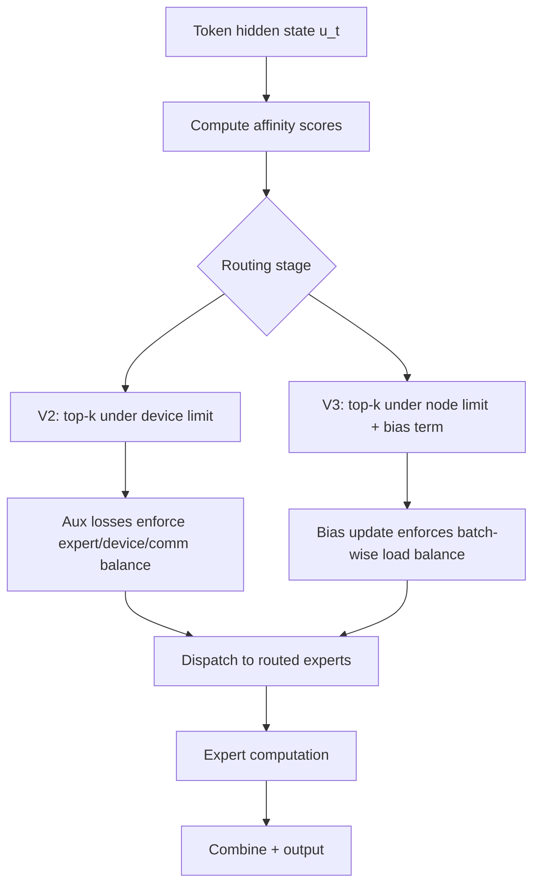
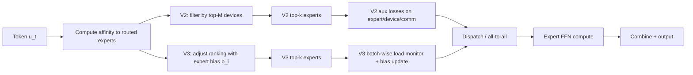

# DeepSeek 的路由与负载均衡：从 Device-Limited Routing 到 Auxiliary-Loss-Free Balancing

## 关键结论

如果说 `DeepSeekMoE` 那一页回答的是“为什么要把专家切细、为什么要区分 shared experts 与 routed experts”，那么这一页回答的就是另一个同样关键的问题：**这些 routed experts 到底怎样被选中，以及为什么负载均衡不能只靠一个辅助损失草草收场。**

DeepSeek 路线在这一点上的演进很有代表性：

- DeepSeek-V2 仍然延续了 `affinity + top-k + auxiliary losses` 的基本范式，但已经明确把系统代价纳入路由定义本身：token 不能随意打到太多设备上，因此引入 `device-limited routing` 来给 MoE 通信成本设上界 [DeepSeek-V2, Section 2.2.2]。
- V2 同时使用三类平衡损失：`expert-level`、`device-level`、`communication-level`。这说明它不再满足于“专家别塌缩”，而是开始处理**计算负载**和**接收通信负载**的系统现实 [DeepSeek-V2, Section 2.2.3]。
- 到 DeepSeek-V3，团队更进一步地承认：**auxiliary loss 虽然能逼出负载均衡，但也会伤害模型能力**。因此他们把“平衡压力”从损失项中部分拿掉，改成 bias-based 的 `auxiliary-loss-free load balancing`，即：用偏置项控制谁能进 top-k，但 gating value 仍由原始 affinity 决定 [DeepSeek-V3, Section 2.1.2]。
- V3 的关键跃迁，不只是把 `device-limited` 升级成 `node-limited routing`，也不只是“减少辅助损失”，而是把负载均衡从一种“训练时惩罚模型”的思路，推进到一种“训练时控制路由系统”的思路 [DeepSeek-V3, Sections 2.1.2, 3.2.2]。
- 更重要的是，V3 论文的消融表明：纯 auxiliary-loss-free 方法不仅更稳，还在多数 benchmark 上优于 purely auxiliary-loss-based baseline；而进一步分析表明，这种 batch-wise 更灵活的平衡方式，更有利于专家 specialization，而不是把每条序列都硬拉成平均分工 [DeepSeek-V3, Section 4.5.2; Section 4.5.3]。

一句话总结：**DeepSeek 的路由演进，本质上是在回答“怎样让专家既负载均衡，又保留足够强的专业分工”。**

## 背景 / 问题定义

在最朴素的 MoE 叙事里，router 的任务好像很简单：

1. 给每个 token 算一组 expert affinity scores；
2. 选 top-k experts；
3. 把 token 分给它们。

但一旦把 DeepSeek 这种细粒度专家、共享专家和 expert parallelism 带进来，问题就立刻复杂起来了。

### 第一层问题：专家可能塌缩

如果路由完全自由学习，少数 experts 很容易被高频命中，其他 experts 得不到足够训练，最终出现 routing collapse。这是 MoE 里最经典的问题，也是早期 auxiliary loss 存在的理由 [DeepSeekMoE, Section 3.3; DeepSeek-V2, Section 2.2.3]。

### 第二层问题：即使专家不塌缩，设备也可能不均衡

在 expert parallel 场景里，expert 不只是逻辑概念，它们真的被部署在不同设备上。于是 load balance 就不只是“每个 expert 收多少 token”，还变成：

- 哪些设备承担了更多 expert 计算；
- 哪些设备接收了更多 all-to-all 通信；
- 哪些 token 因为专家分布过散，导致跨设备 fan-out 过高。

这也是为什么 DeepSeek-V2 明确引入 device-level 和 communication-level 平衡损失，而不只满足于 expert-level balance [DeepSeek-V2, Section 2.2.3]。

### 第三层问题：平衡得太狠，会伤害 specialization

从 V3 开始，DeepSeek 更清楚地指出：如果 auxiliary loss 太强，模型虽然更均衡了，但性能会下降 [DeepSeek-V3, Section 2.1.2]。这背后其实是在说一个更深层的矛盾：

- 一方面，系统想要均匀负载；
- 另一方面，模型想让不同 experts 真正专精于不同模式和域。

如果你要求每条序列、每个 batch、每一层都“平均地用专家”，那就很可能把本应出现的 expert specialization 拉平。

因此，DeepSeek 的问题不再是“如何让路由更平均”，而是：

> 怎样在不牺牲 specialization 的前提下，把不均衡控制在系统可接受范围内？

这才是从 V2 到 V3 的核心转折点。

## 图表清单

- 图 1：路由机制总览图（Mermaid）
- 图 2：路由与负载均衡的系统流示意（Mermaid）
- 表 1：与 DeepSeekMoE / Switch / GShard 的对比
- 表 2：V2 / V3 路由关键设置

## 核心机制

### 路由机制总览图

这张图里最重要的区别有两个：

- V2 主要靠 **loss** 去“逼平衡”；
- V3 主要靠 **routing control signal** 去“调平衡”。

它们都不是简单 top-k，但思想重心已经明显不同。

## 数学基础

### V2：亲和度、top-k 与 device-limited routing

在 DeepSeek-V2 中，routed experts 的基本选择仍建立在 token-to-expert affinity 上。对于 token $u_t$，其 affinity 形式为：

$$
s_{i,t} = \operatorname{Softmax}_i(u_t^\top e_i)
$$

其中 $e_i$ 是第 $i$ 个 expert 的 centroid，$s_{i,t}$ 表示 token $t$ 对 expert $i$ 的亲和度 [DeepSeek-V2, Section 2.2.1]。

最朴素的 gated top-k 形式可写为：

$$
g_{i,t} =
\begin{cases}
 s_{i,t}, & s_{i,t} \in \operatorname{Topk}(\{s_{j,t} \mid 1 \le j \le N_r\}, K_r) \\
 0, & \text{otherwise}
\end{cases}
$$

但 V2 的关键不在这个 top-k 公式本身，而在于它增加了设备约束：

- 对每个 token，先选 affinity 最高的 $M$ 个设备；
- 再只在这些设备上的 experts 中做 top-k [DeepSeek-V2, Section 2.2.2]。

这就是 `device-limited routing`。其系统意图非常直接：**限制 token 触达设备数，从而限制 MoE 相关通信频率与 fan-out。**

### V2：三层辅助损失

#### Expert-Level Balance Loss

V2 的 expert-level balance loss 为：

$$
\mathcal{L}_{\mathrm{ExpBal}} = \alpha_1 \sum_{i=1}^{N_r} f_i P_i
$$

其中：

$$
f_i = \frac{N_r}{K_r T} \sum_{t=1}^{T} \mathbf{1}(\text{Token } t \text{ selects Expert } i)
$$

$$
P_i = \frac{1}{T} \sum_{t=1}^{T} s_{i,t}
$$

[DeepSeek-V2, Section 2.2.3]

它的目标是防止路由塌缩，让专家至少都有机会被训练到。

#### Device-Level Balance Loss

当 experts 被分到不同设备后，V2 进一步定义设备级平衡：

$$
\mathcal{L}_{\mathrm{DevBal}} = \alpha_2 \sum_{i=1}^{D} f'_i P'_i
$$

其中 $f'_i$ 与 $P'_i$ 分别聚合属于设备 $i$ 上 expert 的选择频率和亲和度 [DeepSeek-V2, Section 2.2.3]。

这个 loss 的重点不再是“专家有没有塌”，而是“设备上的计算负载是否倾斜”。

#### Communication Balance Loss

V2 甚至继续往前走了一层，显式定义 communication balance：

$$
\mathcal{L}_{\mathrm{CommBal}} = \alpha_3 \sum_{i=1}^{D} f''_i P''_i
$$

其中：

$$
f''_i = \frac{D}{MT} \sum_{t=1}^{T} \mathbf{1}(\text{Token } t \text{ is sent to Device } i)
$$

[DeepSeek-V2, Section 2.2.3]

这说明 V2 已经意识到一个非常系统化的问题：**就算发送端设备数被 device-limited routing 控住了，接收端仍可能不均衡。**

### V3：Sigmoid gating 与 auxiliary-loss-free load balancing

V3 的 routed expert 亲和度不再使用 softmax，而改为：

$$
s_{i,t} = \operatorname{Sigmoid}(u_t^\top e_i)
$$

然后对选中的 affinity scores 做归一化得到最终 gating values [DeepSeek-V3, Section 2.1.2]。

这一步已经和 V2 有差别，但更关键的是 bias-based routing：

$$
g'_{i,t} =
\begin{cases}
 s_{i,t}, & s_{i,t} + b_i \in \operatorname{Topk}(\{s_{j,t} + b_j \mid 1 \le j \le N_r\}, K_r) \\
 0, & \text{otherwise}
\end{cases}
$$

其中：

- $b_i$ 是 expert $i$ 的 bias term；
- bias **只用于决定谁进 top-k**；
- 最终与 FFN 输出相乘的 gating value 仍来自原始 affinity $s_{i,t}$ [DeepSeek-V3, Section 2.1.2]。

这点非常重要，因为它保住了两件事：

1. balance control 不直接扭曲原始门控值；
2. 平衡压力主要体现在“进入候选集合”的排序层，而不是“输出加权”的数值层。

### Bias update 机制

V3 在每个 training step 结束后监控整批 expert load：

- 若某 expert 过载，则其 bias 减少 $\gamma$；
- 若某 expert 欠载，则其 bias 增加 $\gamma$ [DeepSeek-V3, Section 2.1.2]。

也就是说，负载均衡被转化成一个在线控制过程，而不是一个额外损失项牵着主目标一起优化。

### 补充的 sequence-wise auxiliary loss

虽然 V3 主打 auxiliary-loss-free，但它没有完全丢掉 auxiliary signal，而是保留了一个极小系数的 sequence-wise balance loss：

$$
\mathcal{L}_{\mathrm{Bal}} = \alpha \sum_{i=1}^{N_r} f_i P_i
$$

其中 $\alpha$ 被设为极小值 [DeepSeek-V3, Section 2.1.2]。这说明 DeepSeek 的策略并不是“彻底不要 auxiliary loss”，而是：

- 主负载均衡机制靠 bias-based routing；
- 仅保留一个很轻的序列级兜底项，防止单序列极端失衡。

### Node-limited routing 与 no token-dropping

V3 把 V2 的 `device-limited routing` 进一步提升为 `node-limited routing`：

- 每个 token 最多只发往 $M$ 个节点；
- 这些节点由节点内 expert affinity 的聚合得分决定 [DeepSeek-V3, Section 2.1.2; Section 3.2.2]。

同时，由于其负载均衡足够有效，V3 在训练与推理中都 **不 drop tokens** [DeepSeek-V3, Section 2.1.2]。

这和 V2 形成鲜明对比：

- V2 需要 device-level token dropping 作为工程兜底 [DeepSeek-V2, Section 2.2.4]；
- V3 则通过更强的 routing control，把 token dropping 从主路径拿掉。

## 工程实现

### 从 V2 到 V3：路由思想真正变了什么

### V2：先把通信上界关进笼子

V2 的路由思想可以概括为：

1. 先承认 fine-grained experts 会放大通信成本；
2. 用 `device-limited routing` 给通信 fan-out 加边界；
3. 用三层 auxiliary losses 同时处理 expert、device 和 communication imbalance；
4. 如果还是不稳，就用 token dropping 兜底 [DeepSeek-V2, Sections 2.2.2-2.2.4]。

这是一种非常典型的“系统约束前移”做法：模型可以自由路由，但自由度必须放在工程预算之内。

### V3：从“逼均衡”转向“控均衡”

V3 则更进一步：它意识到强 auxiliary loss 虽然能让负载均衡，但可能直接伤害 model performance [DeepSeek-V3, Section 2.1.2]。因此它选择把平衡压力改成 bias-based control。

这带来的根本变化是：

- V2 更像在训练目标里加惩罚项；
- V3 更像在路由系统里加反馈控制器。

这是一个非常大的思想转弯，因为它把平衡问题从“损失函数设计”推进到了“在线调度控制设计”。

### 路由与负载均衡的系统流示意

这张图里，V2 和 V3 的真正差别不在“有没有 top-k”，而在于 top-k 前后的控制点：

- V2：top-k 基本不变，主要在后面用 losses 纠偏；
- V3：top-k 的排序本身就被 bias 重写，并在 step 级别动态调整。

### Ablation：为什么 V3 认为 auxiliary-loss-free 更值得

### 表现对比

V3 的 `Table 5` 给出了 small / large 两档模型的 ablation：在多数 benchmark 上，auxiliary-loss-free 都优于 purely auxiliary-loss-based baseline [DeepSeek-V3, Section 4.5.2]。

一个典型信号是：

- 小模型下，Pile-test BPB、BBH、MMLU、DROP、GSM8K 等多项都更好；
- 大模型下，HumanEval、MBPP、GSM8K、MATH 等 reasoning / code benchmarks 上提升更明显 [DeepSeek-V3, Section 4.5.2]。

这说明 V3 并不是为了系统好看才换平衡机制，而是在实际模型质量上也拿到了收益。

### 为什么它更有利于 expert specialization

V3 的 `Section 4.5.3` 和 Figure 9 给出了一个很有意思的解释：

- sequence-wise auxiliary loss 会把每条序列都强行拉向均匀负载；
- batch-wise auxiliary-loss-free（以及 batch-wise auxiliary loss）更灵活，不要求每个 sequence 内都平；
- 这种灵活性允许 experts 对不同 domain 形成更清晰的 specialization [DeepSeek-V3, Section 4.5.3]。

换句话说，V3 认为：

> 专家专精本身就意味着“某些序列更偏向某些 experts”。

如果你对每条序列都要求平衡，就会压制这种专精。

这也是为什么他们观察到 auxiliary-loss-free model 在不同域上表现出更强的 expert specialization patterns [DeepSeek-V3, Section 4.5.3]。

## 与主流方案对比

| 方案 | 路由控制核心 | 负载均衡核心 | 优点 | 代价 |
| --- | --- | --- | --- | --- |
| DeepSeekMoE | fine-grained experts + shared experts | expert / device auxiliary losses | 先把 specialization 问题做出来 | 仍偏辅助损失式 balance [DeepSeekMoE, Section 3.3] |
| DeepSeek-V2 | device-limited routing | expert + device + communication losses + token dropping | 显式把通信成本纳入路由设计 | auxiliary losses 多，训练与工程都更重 [DeepSeek-V2, Sections 2.2.2-2.2.4] |
| DeepSeek-V3 | node-limited routing + bias-based top-k | auxiliary-loss-free主导 + 极小 sequence loss | 平衡与 specialization trade-off 更好，且 no token dropping | 控制逻辑更复杂 [DeepSeek-V3, Section 2.1.2] |
| Switch / GShard | top-1 / top-2 coarse routing | auxiliary loss | 方案更经典，工程实现较成熟 | 对细粒度 specialization 和系统级通信控制不够精细 |

如果用一句话概括：

- DeepSeekMoE 先解决“专家怎么切”；
- V2 再解决“专家怎么分配且不把通信拖爆”；
- V3 则解决“怎么平衡这些专家而不把模型能力压坏”。

## 实现细节补充

### V2 关键设置

从论文里可以确认的 V2 路由相关设置包括：

- 每层 routed experts 分布在 `8` 个设备上；
- 每个 token 最多发往 `3` 个设备，即 $M = 3$；
- balance factors：
  - $\alpha_1 = 0.003$
  - $\alpha_2 = 0.05$
  - $\alpha_3 = 0.02$
- 训练时使用 token-dropping，评估时不 drop [DeepSeek-V2, Section 3.1.2]。

这些超参数清楚说明：V2 的主策略仍然是“多重 balance losses + 工程兜底”。

### V3 关键设置

V3 路由相关可确认设置包括：

- node-limited routing：每 token 最多发往 `4` 个节点；
- auxiliary-loss-free bias update speed：前 `14.3T` tokens 使用 $\gamma = 0.001$；
- 训练与推理均 no token dropping [DeepSeek-V3, Section 2.1.2; Section 4.2]。

而在部署中，V3 还进一步通过 redundant experts 来平衡高负载 experts，并按节点内 GPU 重新编排 experts [DeepSeek-V3, Section 3.4.1]。这说明 route-time balance 和 serve-time balance 也是分层处理的，不会靠同一个机制包打天下。

## Design trade-offs

### 为什么 DeepSeek 不满足于“把 auxiliary loss 调小一点”

直觉上，好像只要把 auxiliary loss 调轻，既能保持平衡，又不至于伤性能。但 V3 的思路比这更激进：他们认为 **balance pressure 应该换一种注入方式**，而不是只是换个权重。

原因在于：

1. auxiliary loss 本质上仍在优化主目标；
2. 权重大了伤性能，权重小了又未必够平衡；
3. 更重要的是，它不区分“哪个环节该被控制”：是排序逻辑，还是输出加权，还是单序列极端失衡。

于是 V3 才把：

- “谁能进 top-k” 交给 bias control；
- “输出权重多大” 保留给原始 affinity；
- “单序列极端失衡” 交给一个很轻的 sequence-wise auxiliary loss。

这是一次更精细的职能拆分。

### DeepSeek 路由演进的真实代价

虽然 V3 路由更漂亮，但代价也不小：

- 实现逻辑更复杂；
- 需要 step 级全局监控 expert load；
- 需要在训练框架里维护 bias update；
- 还要让路由控制与 node-limited dispatch、no token-dropping、serve-time redundant experts 一起协同工作。

也就是说，V3 不是“更简单的负载均衡”，而是“更复杂但更划算的负载均衡”。

## 小结 / 启示

DeepSeek 的路由与负载均衡演进，可以压成一句话：

> 它从“怎样避免专家塌缩”，逐步演进到了“怎样在系统可承受的约束下，让专家真正专精起来”。

因此，这条路线最值得记住的不是某个单独公式，而是下面这组演进关系：

- `DeepSeekMoE`：先重新定义专家粒度与 shared/routed 分工；
- `DeepSeek-V2`：再把通信约束和三层 balance loss 写进路由机制；
- `DeepSeek-V3`：最后把负载均衡从辅助损失推进到 bias-based routing control，并配上 node-limited routing 与 no token-dropping。

如果说 `deepseek_moe.md` 讲的是“专家为什么值得被切细”，那么这一页讲的就是另一半真相：**专家切细之后，只有路由和负载均衡也跟着升级，这套 MoE 才真的能在大系统里跑得起来，而且跑得值得。**