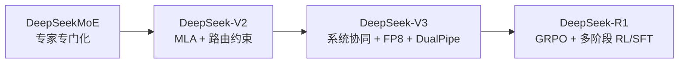
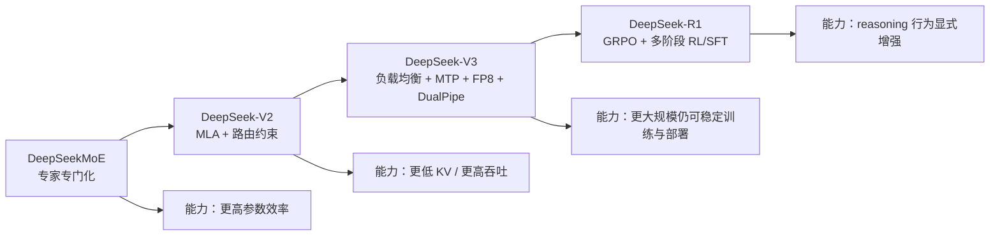

# DeepSeek 代际演进：从稀疏架构到推理强化

说明：为保持任务命名一致，文件名沿用 `v1_to_v3_evolution`；但本文实际覆盖的核心论文主线是 **DeepSeekMoE → DeepSeek-V2 → DeepSeek-V3 → DeepSeek-R1**。其中 R1 已经超出“base model 代际”范畴，代表的是训练后推理强化阶段。[DeepSeek-R1, Sections 1-3]

## 背景 / 问题定义

做代际比较时，最容易掉进两个坑。第一个坑是只看 benchmark 排名，把模型演进误读成“更大参数 + 更高分数”；第二个坑是只看局部创新，把 DeepSeekMoE、MLA、DualPipe、FP8、GRPO 看成互不相关的技巧。实际上，DeepSeek 代际演进回答的是一个更硬核的问题：**当模型规模、推理上下文、分布式通信和 reasoning 训练同时增长时，应该优先优化哪一个瓶颈，以及这些优化如何彼此接力**。[DeepSeekMoE, Section 9; DeepSeek-V2, Section 5; DeepSeek-V3, Section 6; DeepSeek-R1, Section 6]

从这个角度看，四篇论文各自的职责非常清晰：

- DeepSeekMoE 先回答“MoE 的参数是否真能转化为更高有效容量”，重点是专家专门化。[DeepSeekMoE, Sections 1, 3]
- DeepSeek-V2 回答“即使 MoE 有效，是否还能把 attention cache 和通信成本压到足够低”，重点是 MLA 和受约束路由。[DeepSeek-V2, Sections 2.1-2.2]
- DeepSeek-V3 回答“当规模进入 671B / 37B 激活时，训练框架和部署系统是否还能支撑”，重点是系统协同。[DeepSeek-V3, Sections 2-3]
- DeepSeek-R1 则把问题推进到后训练：如果 base model 已足够强，是否可以靠 RL 让 reasoning 行为本身发生质变。[DeepSeek-R1, Sections 1-3]

因此，本页的目标不是按时间顺序复述论文，而是建立一条 **架构—训练—系统—能力** 的纵向演进视角。

## 图表清单

- 图 1：架构—训练—系统—能力共同演化图（Mermaid）
- 表 1：代际核心指标总表
- 表 2：MoE 路由演进表
- 表 3：Attention 机制演进表
- 表 4：训练策略与 RL 对齐演进表
- 表 5：工程系统演进表
- 表 6：关键设计取舍总表
- 表 7：与 Llama / GPT 风格路线对比表

## 图表总览（重绘版，先看这块）

### 图 1：架构—训练—系统—能力共同演化图（Mermaid）

### 表 1：代际核心指标总表（精简）

| 代际 | 核心动作 | 主要收益 | 主要代价 |
| --- | --- | --- | --- |
| DeepSeekMoE | 细粒度专家与共享专家 | 提升参数利用率 | 路由与通信复杂度上升 |
| DeepSeek-V2 | MLA + device-limited routing | KV cache/吞吐显著改善 | 实现复杂度提升 |
| DeepSeek-V3 | aux-loss-free + DualPipe + FP8 | 超大规模训练与部署更可扩展 | 系统工程门槛更高 |
| DeepSeek-R1 | GRPO + 多阶段对齐 | reasoning 显著增强 | 可读性/稳定性需额外修正 |

## 关键结论

- DeepSeek 的主线不是单一维度的 scaling，而是 **架构稀疏化 → KV 压缩 → 系统协同 → RL reasoning** 的连续推进。[DeepSeekMoE, Section 9; DeepSeek-V2, Section 5; DeepSeek-V3, Section 6; DeepSeek-R1, Section 6]
- **DeepSeekMoE** 先解决“MoE 是否真的带来更高有效容量”。
- **DeepSeek-V2** 再解决“MoE 能不能同时高效训练和高效推理”。
- **DeepSeek-V3** 继续解决“超大 MoE 的训练、通信与部署是否还能一起成立”。
- **DeepSeek-R1** 最后把这些节省下来的预算进一步转化成更强 reasoning 行为。
- 因此，DeepSeek 的竞争力来自协同优化：只保留其中一个部件，通常拿不到论文展示的那组结果。[DeepSeek-V2, Sections 2.2.2-2.2.3; DeepSeek-V3, Sections 3.2-3.3; DeepSeek-R1, Section 6]

## 本页在系列中的位置

- 这一页是整个 DeepSeek 系列的“地图页”，适合在深入专题前先读一遍，也适合读完几篇专题后回来做总复盘。
- 如果你已经知道自己想钻哪条线：架构看 `architecture/`，训练看 `training/`，系统看 `engineering/`。
- 如果你发现不同页面都在重复提到同一个词，这一页的作用就是告诉你：**它们重复的不是废话，而是同一条代际主线在不同层面上的投影。**

## 核心机制

### 代际核心指标总表

| 代际 / 论文 | 代表模型 | 总参数 | 激活参数 | 上下文 | 训练数据 / 成本 | 推理效率信号 | 代表能力 |
| --- | --- | --- | --- | --- | --- | --- | --- |
| DeepSeekMoE | DeepSeekMoE 16B | 16.4B | 2.8B | 4K（主文公开配置） | 2T tokens；计算量约为 DeepSeek 7B 的 40.5%。[DeepSeekMoE, Sections 5.1-5.2] | 可单卡 40GB 部署，并在适当优化下接近 2.5 倍于 7B dense 的推理速度。[DeepSeekMoE, Section 5.2.1] | 以更低计算量取得与 DeepSeek 7B / LLaMA2 7B 可比的综合能力，尤其在知识与代码任务上更强。[DeepSeekMoE, Sections 5.2.1-5.2.2] |
| DeepSeek-V2 | DeepSeek-V2 | 236B | 21B | 128K | 8.1T tokens；相对 DeepSeek 67B 节省 42.5% 训练成本。[DeepSeek-V2, Abstract; Section 3.1] | KV cache 降低 93.3%，最大生成吞吐提升 5.76 倍。[DeepSeek-V2, Abstract; Section 3.2.3] | 在仅 21B 激活参数下达到顶级开源 MoE 水平，chat 版在代码、数学和中文任务上更强。[DeepSeek-V2, Abstract; Sections 3.2, 4.3] |
| DeepSeek-V3 | DeepSeek-V3 | 671B | 37B | 128K（经长上下文扩展） | 14.8T tokens；总训练成本 2.788M H800 GPU hours。[DeepSeek-V3, Abstract; Sections 4.1-4.2] | 通过 MLA、部署冗余专家和 prefilling/decoding 分离，追求在线 SLO 与高吞吐兼得。[DeepSeek-V3, Sections 3.4.1-3.4.2] | 达到开源顶级、接近领先闭源模型的基础能力，并为 R1 提供 reasoning-ready 基座。[DeepSeek-V3, Abstract; DeepSeek-R1, Section 1] |
| DeepSeek-R1 | DeepSeek-R1 / R1-Zero | 基于 DeepSeek-V3-Base；主文未重复给出总参数数值。[DeepSeek-R1, Section 1] | 主文未给出具体数值 | 评测中部分设置使用 128K；RL rollout 最大长度可到 65,536 tokens。[DeepSeek-R1, Sections 2.1, 4] | 主文给出 RL 超参数与阶段设置，但未单列完整总训练算力成本。[DeepSeek-R1, Sections 2.1, 3.2] | 不是直接优化单步吞吐，而是把测试时计算量转化为更长、更强的 reasoning 过程。[DeepSeek-R1, Sections 2.3, 6] | 在数学、代码和 STEM reasoning 上显著增强，并能蒸馏到更小模型。[DeepSeek-R1, Abstract; Sections 4, 6] |

### 架构—训练—系统—能力的共同演化

这张图对应的是一条非常明确的协同链条：DeepSeekMoE 提高参数利用率，V2 把这部分收益转化成可部署的推理效率，V3 再把系统效率放大到超大规模训练与服务，R1 则把这些节省出来的预算投入到 reasoning 行为本身。因此，R1 并不是脱离前代的独立故事，而是前面三代工程积累的自然结果。[DeepSeek-V3, Section 6; DeepSeek-R1, Section 1]

## 数学基础

### MLA：把 KV cache 从“按头缓存”改成“按 latent 缓存”

DeepSeek-V2 / V3 中 MLA 的核心不是换一个 attention 名字，而是把 key/value 先压缩到低维 latent，再在需要时恢复出参与注意力计算的表示：

$$
\mathbf{c}^{KV}_t = W^{DKV}\mathbf{h}_t,
\quad
\mathbf{k}^C_t = W^{UK}\mathbf{c}^{KV}_t,
\quad
\mathbf{v}^C_t = W^{UV}\mathbf{c}^{KV}_t
$$

其中真正需要缓存的是压缩后的 $\mathbf{c}^{KV}_t$，而不是传统 MHA 中每个头的完整 $K/V$。V2 进一步通过 decoupled RoPE 让位置编码与 KV 压缩兼容，从而避免因 RoPE 破坏投影吸收关系而在推理时重算前缀 keys。[DeepSeek-V2, Sections 2.1.2-2.1.3] V3 延续了这一结构，并把它作为更大规模训练与部署的 attention 基座。[DeepSeek-V3, Section 2.1.1]

### Auxiliary-loss-free routing：把负载均衡从 loss 项改成路由控制项

V3 的关键变化之一，是不再主要依赖辅助损失去逼迫 load balance，而是给每个专家维护一个动态 bias：

$$
g'_{i,t}=
\begin{cases}
s_{i,t}, & s_{i,t}+b_i \in \operatorname{Topk}(\{s_{j,t}+b_j\}, K_r)\\
0, & \text{otherwise}
\end{cases}
$$

其含义很直接：**是否被选中** 由加了 bias 的分数决定，但 **真正的 gating value** 仍来自原始 affinity score。这样既能动态调节负载，又不必像传统 auxiliary loss 那样把优化目标过度扭向“均匀分流”。[DeepSeek-V3, Section 2.1.2]

### GRPO：把 reasoning 优化成“组内相对优势”问题

R1 采用的 GRPO 不再为每个样本显式训练 critic，而是对同一问题采样一组输出，并用组内 reward 计算相对优势：

$$
A_i=\frac{r_i-\operatorname{mean}(\{r_1,\dots,r_G\})}{\operatorname{std}(\{r_1,\dots,r_G\})}
$$

这样做的意义在于：对可验证任务，模型不必先学会“像人一样推理”，而是可以通过结果信号迭代出更长、更有效的 reasoning 轨迹。[DeepSeek-R1, Sections 1, 2.1]

## 工程实现

### MoE 路由如何演进

| 阶段 | 路由核心 | 负载均衡机制 | 通信约束 | 设计取舍 |
| --- | --- | --- | --- | --- |
| DeepSeekMoE | 通过 finer-grained experts 提高组合灵活性，并固定 shared experts 捕获共通知识。[DeepSeekMoE, Sections 3.1-3.2] | 采用 expert-level 与 device-level balance loss，重点是避免 routing collapse 与设备级瓶颈。[DeepSeekMoE, Section 3.3] | 在 2B/16B 阶段，工程上尽量让每层专家部署简单；145B 开始显式引入 device-level balance。[DeepSeekMoE, Sections 5.1.2, 7.1.2] | 优点是先把“专家专精”问题做清楚；代价是大规模跨设备路由问题尚未成为论文主角。 |
| DeepSeek-V2 | 在 DeepSeekMoE 基础上继续 top-K routed experts + shared experts，但引入 device-limited routing，把每个 token 的目标专家限制在最多 $M$ 个设备上。[DeepSeek-V2, Sections 2.2.1-2.2.2] | 仍依赖三类辅助损失：expert、device、communication balance。[DeepSeek-V2, Section 2.2.3] | 通过限制设备覆盖数，把 MoE 通信开销显式上界化。[DeepSeek-V2, Section 2.2.2] | V2 的关键不是“路由更复杂”，而是“路由开始接受系统成本约束”。 |
| DeepSeek-V3 | 路由打分从 softmax 亲和度转为 sigmoid + 归一化，并引入 auxiliary-loss-free bias 调整做 top-K 选择。[DeepSeek-V3, Section 2.1.2] | 主机制从辅助损失转为 bias-based auxiliary-loss-free balancing，只保留极小的 sequence-wise 平衡项兜底。[DeepSeek-V3, Section 2.1.2] | 采用 node-limited routing，并在训练/推理中实现 no token-dropping。[DeepSeek-V3, Sections 2.1.2, 3.4] | 这是一次关键跃迁：从“用 loss 逼平衡”转向“把平衡写进路由控制逻辑”。 |
| DeepSeek-R1 | 论文主角不再是 MoE 路由，而是把已有基座的能力通过 RL 激发出来。[DeepSeek-R1, Sections 1-3] | 负载均衡不是主命题。 | 重点从 token-to-expert 路由转向 output-to-reward 路由。 | 演进焦点从“算子层面怎么分流”转到“训练信号如何分配”。 |

### Attention 机制如何演进到 MLA

| 阶段 | Attention 形态 | 解决的瓶颈 | 收益 | 代价 |
| --- | --- | --- | --- | --- |
| DeepSeekMoE | 仍以标准 multi-head attention 为主，论文重点不在 attention 创新。[DeepSeekMoE, Sections 5.1.2, 7.1.2] | 当时主要瓶颈还是 sparse FFN 的参数效率。 | 把研究资源集中在专家设计本身。 | KV cache 与长上下文不是其主要发力点。 |
| DeepSeek-V2 | MLA：low-rank KV joint compression + decoupled RoPE。[DeepSeek-V2, Sections 2.1.2-2.1.3] | 标准 MHA 的 KV cache 在生成阶段会限制 batch size 与 context length。[DeepSeek-V2, Section 2.1] | KV cache 减少 93.3%，最大生成吞吐提升 5.76 倍，并支持 128K context。[DeepSeek-V2, Abstract; Sections 2.1.4, 3.2.3] | 需要重新设计位置编码兼容性，并引入额外 latent/up-projection 逻辑。 |
| DeepSeek-V3 | 沿用 MLA，但把它嵌入到更完整的训练与部署系统中。[DeepSeek-V3, Section 2.1.1] | 单靠 attention 结构优化已不够，瓶颈转向更大规模系统协同。 | MLA 成为 V3 训练、部署和 R1 基座的统一 attention 形态。[DeepSeek-V3, Sections 2-3; DeepSeek-R1, Section 1] | 架构收益依赖系统实现，否则 KV 优势难完全兑现。 |
| DeepSeek-R1 | 不再修改 attention 形式，而是复用 DeepSeek-V3-Base 的结构能力。[DeepSeek-R1, Section 1] | 瓶颈转到 reasoning 训练信号，而不是 cache。 | 说明前几代 attention 创新已经足够成熟，可以把研究焦点移走。 | R1 的提升不来自更“新”的 attention，而来自更“强”的 post-training。 |

### 训练策略和 RL 对齐如何变化

| 阶段 | 训练/对齐方法 | 关键变化 | 设计动机 |
| --- | --- | --- | --- |
| DeepSeekMoE | 预训练 + SFT，对齐仍是架构验证的延伸。[DeepSeekMoE, Section 6] | 证明 MoE 也能被 instruction tuning。 | 先回答“稀疏模型能不能变 chat”。 |
| DeepSeek-V2 | 预训练后做 SFT + RL，并在 RL 中采用 GRPO、两阶段 reasoning/human preference alignment。[DeepSeek-V2, Sections 4.1-4.2] | RL 第一次被明确用作能力放大器，而不只是偏好修饰器。 | 数学与代码能力的增益，需要比单纯 SFT 更强的训练信号。[DeepSeek-V2, Section 4.2] |
| DeepSeek-V3 | 预训练与 post-training 更系统，加入 MTP、generative reward model、自奖励讨论。[DeepSeek-V3, Sections 2.2, 5.2, 5.4] | base model 本身被训练成更适合后续 reasoning 开采的底座。 | 为后续 R1 这类 reasoning-first RL 铺路。[DeepSeek-R1, Section 1] |
| DeepSeek-R1 | 先做 R1-Zero 纯 RL，再引入冷启动数据、拒绝采样、SFT、二阶段 RL 和 reward model。[DeepSeek-R1, Sections 2-3] | 从“RL 辅助对齐”变成“RL 主导 reasoning 生成”，并用后续阶段解决可读性、语言混杂和通用能力问题。 | 纯 RL 能诱导更强 reasoning，但不能自动解决产品可用性问题，因此要多阶段折返修正。[DeepSeek-R1, Sections 2.3, 3, 6] |

### 工程系统如何从“可训”走向“高效可扩展”

| 阶段 | 工程重点 | 核心机制 | 说明 |
| --- | --- | --- | --- |
| DeepSeekMoE | 把稀疏训练跑起来 | HAI-LLM、并行策略、gating 与 fused kernels。[DeepSeekMoE, Section 4.1.2] | 工程目标偏“验证可行性”，不是追求极限系统吞吐。 |
| DeepSeek-V2 | 把稀疏推理做快 | device-limited routing、通信均衡损失、共享专家与 all-to-all overlap、自定义 CUDA kernels。[DeepSeek-V2, Sections 2.2.2-2.2.3; 3.1.3] | V2 首次把“MoE 通信成本”当作一等约束写进设计。 |
| DeepSeek-V3 | 把超大 MoE 训稳、训省、部署出去 | DualPipe、cross-node all-to-all kernels、FP8 mixed precision、prefilling/decoding 分离、冗余专家部署。[DeepSeek-V3, Sections 3.2-3.4] | V3 的系统论文味道很重：不是只给新模型，而是给一整套可扩展训练/服务方案。 |
| DeepSeek-R1 | 把 RL 流水线做大 | 大规模 rollout、rule-based reward、reward models、语言一致性奖励、多阶段 pipeline。[DeepSeek-R1, Sections 2.1-2.2, 3.1-3.2] | 系统优化的焦点从“tensor 如何移动”转向“样本、奖励、策略如何闭环”。 |

## Design trade-offs

### 为什么 DeepSeek 不是简单堆参数，而是持续做系统级协同优化

这是理解 DeepSeek 路线最关键的一节。只看参数规模会得出一个过于浅层的结论：模型越大越强。但 DeepSeek 的论文证据其实反复指向另一件事——**真正限制模型能力的，不是参数上限本身，而是参数、缓存、通信、训练信号和部署方式之间的耦合瓶颈。**

先看 DeepSeekMoE。它并没有先追求更大 dense 模型，而是指出传统 GShard 风格 MoE 的问题在于专家知识混杂与冗余，因此先优化 expert specialization。[DeepSeekMoE, Sections 1, 3] 这一步的收益，是让更多参数转化为真正可分工的有效容量；代价，是后续必须开始认真面对路由与部署复杂度。

再看 DeepSeek-V2。论文实际上在说：即使 MoE 已经有效，如果 attention 仍保持标准 MHA 形态，那么长上下文和高并发生成下的 KV cache 会直接卡死推理效率。因此 V2 不满足于“模型能跑”，而是把 MLA 做成主创新，让 attention 自身变得更适合服务化部署。[DeepSeek-V2, Section 2.1] 这换来了明显的 KV cache 压缩和吞吐提升，但也要求额外处理 decoupled RoPE 和 latent projection 的实现复杂度。[DeepSeek-V2, Sections 2.1.3-2.1.4]

V3 则把 trade-off 再往前推一步：当模型进入 671B / 37B 激活规模后，问题已经不是“模型结构好不好”，而是“负载均衡是否稳定、pipeline bubble 是否可控、跨节点 all-to-all 是否能隐藏、FP8 是否可用”。[DeepSeek-V3, Sections 2.1.2, 3.2, 3.3] 这类问题没有任何一项能通过单纯堆参数自动解决，所以 V3 必须把 routing、pipeline、kernel、precision 和 deployment 全部写进主线。

最后是 R1。R1 的关键结论不是“更大模型自然更会推理”，而是 reasoning 能力可以被 RL 在可验证任务上显式诱导出来；但纯 RL 会带来语言混杂、可读性差、reward hacking 和 tool use 不足，所以又必须用冷启动数据、SFT 和第二阶段 RL 把行为拉回产品可用区间。[DeepSeek-R1, Sections 2-3, 6] 也就是说，R1 让 trade-off 从“系统效率 vs 模型规模”继续扩展到“探索自由度 vs 产品可控性”。

### 关键设计取舍总表

| 设计选择 | 为什么这样设计 | 得到什么 | 牺牲什么 |
| --- | --- | --- | --- |
| Fine-grained experts + shared experts | 传统 top-K MoE 中 routed experts 容易混杂知识且重复学习共通知识。[DeepSeekMoE, Section 1] | 更高 expert specialization，更高参数效率。[DeepSeekMoE, Sections 3-4] | 路由和部署复杂度上升。 |
| MLA 取代标准 MHA/GQA | 推理瓶颈在 KV cache，而不只是算力本身。[DeepSeek-V2, Section 2.1] | KV cache 显著压缩，吞吐提升，并更容易支持长上下文。[DeepSeek-V2, Abstract; Section 3.2.3] | 需要额外处理 RoPE 兼容性与 latent 投影实现。 |
| Auxiliary-loss-free balancing | 纯辅助损失会伤害性能，尤其在超大规模 MoE 上更明显。[DeepSeek-V3, Section 2.1.2] | 在控制负载均衡的同时更好保住模型质量。[DeepSeek-V3, Sections 2.1.2, 4.5.2] | 训练控制逻辑更复杂。 |
| DualPipe + 自定义 all-to-all kernels | 通信开销已经大到会吞掉训练收益。[DeepSeek-V3, Sections 3.2.1-3.2.2] | 把通信尽量隐藏到计算后面，支撑更大规模训练。[DeepSeek-V3, Sections 3.2.1-3.2.2] | 对集群拓扑、kernel 和调度细节要求极高。 |
| GRPO + 纯 RL 起步 | 人类标注 CoT 难扩展，且会把模型绑在人类示范风格上。[DeepSeek-R1, Section 1] | reasoning 行为可在可验证任务上自发涌现。[DeepSeek-R1, Sections 2.2-2.3] | 可读性、语言混杂、reward hacking 风险需要后续阶段修正。[DeepSeek-R1, Sections 3, 6] |

## 与主流方案对比

| 维度 | DeepSeek 路线 | 常见 Llama / GPT 风格路线 |
| --- | --- | --- |
| 参数利用思路 | 优先提高激活效率与系统效率，再放大模型与 post-training compute。 | 更常见的是先把 dense 基座做强，再围绕服务与对齐继续迭代。 |
| Attention 路线 | 通过 MLA 直接重写 KV cache 结构。[DeepSeek-V2, Section 2.1] | 更常见的是在 MHA/GQA 框架内做增量优化。 |
| MoE 观 | 不把 MoE 只看作“省算稀疏层”，而是围绕专家专门化、路由约束和部署调度做完整设计。[DeepSeekMoE, Section 3; DeepSeek-V3, Section 3.4] | 许多 dense-first 路线压根不把 sparse 架构放到主线；即便使用 MoE，也未必像 DeepSeek 这样把通信与负载均衡写进核心贡献。 |
| RL 观 | R1 证明 RL 可以直接作为 reasoning 行为发生器。[DeepSeek-R1, Sections 2-3] | 更常见的是 RLHF 作为偏好对齐收尾。 |

更直白地说：Llama / GPT 风格路线更像“把一个强 dense 模型继续打磨”；DeepSeek 路线更像“把模型、系统、推理行为一起重新设计”。这两条路都能做出强模型，但工程组织方式完全不同。

## 小结 / 启示

DeepSeek 的代际演进可以总结成一句话：**每一代都优先解决当前最贵的瓶颈，然后把由此释放出的预算投入下一阶段最能放大能力的环节。**

给工程团队的 5 条启示如下：

1. **先问瓶颈在哪一层，再决定该投算法还是投系统。** DeepSeekMoE 先打专家专门化，V2 先打 KV cache，V3 先打通信与精度，R1 再打训练信号。[DeepSeekMoE, Section 1; DeepSeek-V2, Section 2.1; DeepSeek-V3, Section 3; DeepSeek-R1, Section 1]
2. **架构创新如果不和系统约束绑定，收益很难兑现。** V2 的 MLA 需要 decoupled RoPE，V3 的 MoE 需要 DualPipe、all-to-all kernel 和部署冗余专家，否则论文中的吞吐和规模优势落不下来。[DeepSeek-V2, Sections 2.1.3, 3.2.3; DeepSeek-V3, Sections 3.2-3.4]
3. **负载均衡最好从“训练目标”逐步过渡到“控制逻辑”。** V2 主要靠辅助损失，V3 则把 bias-based auxiliary-loss-free routing 变成主机制，这是从统计平衡走向系统可控的标志。[DeepSeek-V2, Section 2.2.3; DeepSeek-V3, Section 2.1.2]
4. **Reasoning 训练要优先选“可验证任务”，再谈大规模 RL。** R1 的成功依赖数学、代码、逻辑这类能给出稳定 rule-based reward 的场景；对难验证任务，reward hacking 仍是核心风险。[DeepSeek-R1, Sections 2.2, 6]
5. **真正的竞争力来自预算重分配能力。** 当你能通过稀疏化、KV 压缩、FP8、通信重叠省出预算，就能把这些预算转成更长上下文、更大 rollout 或更强服务能力；这比单纯“加卡加参数”更可持续。[DeepSeek-V2, Abstract; DeepSeek-V3, Sections 3.2-3.3; DeepSeek-R1, Section 6]

## 思考问题

- DeepSeek 的四代演进里，哪一次转折最关键：从 DeepSeekMoE 到 V2，还是从 V3 到 R1？为什么？
- 如果没有 V3 的系统协同，R1 的 reasoning 放大会不会仍然成立？成立的是能力上限，还是只是实验可行性？
- 你会如何把 DeepSeek 这条主线翻译成自己团队的 roadmap：先做架构、先做系统，还是先做 post-training？
