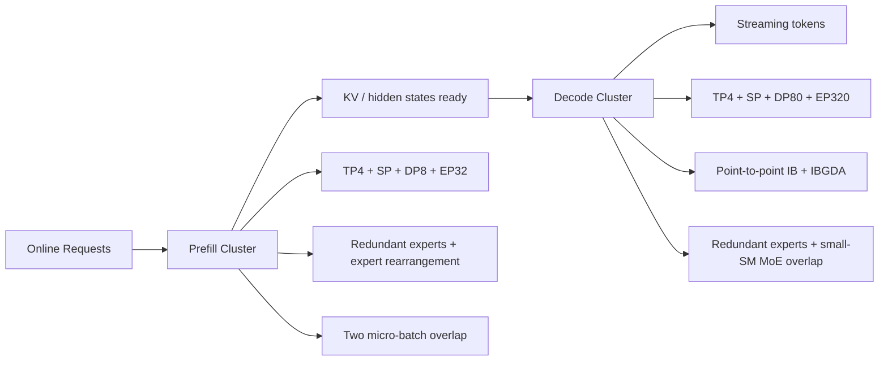

# DeepSeek 的部署与在线推理：为什么必须拆开 Prefill 和 Decode

## 关键结论

DeepSeek 的在线部署策略并不是“把训练好的模型塞进一个推理框架里”这么简单。对于 `DeepSeek-V3` 这种 `671B total / 37B activated` 的超大 MoE 模型，真正的问题不是模型能不能跑，而是：**如何同时满足线上服务的 SLO 和总体吞吐。** DeepSeek 给出的答案非常明确：

- 将在线推理拆成 `prefilling` 与 `decoding` 两个阶段，并分别部署 [DeepSeek-V3, Section 3.4]；
- 两个阶段采用完全不同的并行与资源配置，因为它们的瓶颈并不一样 [DeepSeek-V3, Sections 3.4.1-3.4.2]；
- 通过 `redundant experts` 动态复制热点专家，处理线上真实流量下的 expert skew，而不是只依赖训练时的负载均衡机制 [DeepSeek-V3, Section 3.4.1; Section 3.4.2]；
- 通过双 micro-batch overlap，把 attention、dispatch、MoE 和 combine 交错执行，尽量把 all-to-all 与 TP 通信藏在计算后面 [DeepSeek-V3, Sections 3.4.1-3.4.2]；
- `DeepSeek-V2` 先通过 MLA、KV cache quantization 和 FP8 参数，把服务吞吐的底座打轻；`DeepSeek-V3` 则把问题进一步推进到超大规模 MoE 的在线部署形态上 [DeepSeek-V2, Section 3.2.3; DeepSeek-V3, Section 3.4]。

一句话概括：**DeepSeek 的服务化关键，不是“推理更快”四个字，而是承认 prefill 和 decode 是两类完全不同的系统任务，然后分别为它们设计部署单元、并行策略和负载均衡机制。**

## 背景：为什么在线推理不能再被当成训练系统的简化版

对很多模型来说，推理部署常被理解成训练系统的一个“缩水版”：

- 训练时要并行；
- 推理时也要并行；
- 只不过 batch 更小、目标从 loss 变成 latency。

但对 DeepSeek 这类 `MLA + MoE` 大模型来说，这种理解已经不够用了。原因至少有三层。

### 第一层：Prefill 和 Decode 的算子形态不同

在 prefilling 阶段，系统要处理整段 prompt：

- attention 的二次交互仍然明显；
- 计算密度高；
- 更容易通过更大的 batch 和并行切分把硬件吃满。

而 decoding 阶段则不同：

- 每步只生成少量 token；
- attention 虽然不再是 full quadratic，但需要频繁读取历史状态；
- 单 expert 的 batch size 往往变小，瓶颈更容易变成内存访问与通信延迟 [DeepSeek-V3, Section 3.4.2]。

这意味着，如果把两者塞进同一套 deployment unit，就会出现典型的系统错配：

- 为 prefill 设计的配置可能让 decode 延迟过高；
- 为 decode 设计的配置又可能让 prefill 吞吐浪费。

### 第二层：MoE 在线流量会放大热点专家问题

训练时，DeepSeek 已经通过路由约束和 balance 机制尽量让负载更平。但上线以后，请求分布会随时间变化：

- 热门领域 prompt 会周期性集中；
- 某些 experts 会被更频繁命中；
- 即使训练期 balance 很好，服务期也可能出现 skew。

因此，服务系统必须引入**运行时负载调节**，而不是只相信训练时学出来的路由分布。这就是 `redundant experts` 的意义：它本质上是一个 serve-time 的热点复制机制 [DeepSeek-V3, Sections 3.4.1-3.4.2]。

### 第三层：DeepSeek 的结构收益只有在服务后端也跟上时才会兑现

`DeepSeek-V2` 已经展示过：

- 通过 MLA 和附加优化，DeepSeek-V2 的部署所需 KV cache 比 DeepSeek 67B 小得多；
- 在单节点 `8 x H800` 上，generation throughput 超过 `50K tokens/s`；
- prompt throughput 超过 `100K tokens/s`；
- 最大 generation throughput 达到 DeepSeek 67B 的 `5.76x` [DeepSeek-V2, Section 3.2.3]。

但 `DeepSeek-V3` 进一步说明：当模型放大到 `671B` 级别后，光有 MLA 还不够。**你还得重新设计在线推理的部署拓扑与调度方式。**

## 部署策略总览图

这张图里最重要的不是参数数字本身，而是：**DeepSeek 直接承认 prefill 和 decode 需要两套不同的集群形态。**

## 为什么要把 Prefill 和 Decode 拆开

### Prefill 的本质：高计算密度、适合吞吐导向

在 prefill 中，系统面对的是整段输入 prompt。此时最关键的是：

- attention 计算重；
- token 数量大；
- MoE experts 更有机会拿到足够大的 batch；
- 通信虽然仍贵，但可以较容易被大计算块掩盖。

因此，DeepSeek-V3 为 prefilling 选择的策略是：

- 最小部署单元为 `4 nodes / 32 GPUs`；
- attention 部分采用 `TP4 + SP + DP8`；
- MoE 部分采用 `EP32` [DeepSeek-V3, Section 3.4.1]。

这里一个关键判断是：prefill 更愿意用适度 TP 把 attention 算快，同时让 EP 规模保持在一个能让单 expert batch 足够大的范围内。论文明确说，`EP32` 的一个目标就是让每个 expert 处理足够大的 batch，从而提升计算效率 [DeepSeek-V3, Section 3.4.1]。

### Decode 的本质：低延迟、通信与访存更敏感

到了 decode，问题变了：

- 每步只生成少量 token；
- 每 expert 的 batch size 通常较小；
- bottleneck 更偏向 memory access，而不是纯算力 [DeepSeek-V3, Section 3.4.2]。

因此，DeepSeek-V3 为 decoding 配置了更大的最小部署单元：

- `40 nodes / 320 GPUs`；
- attention 采用 `TP4 + SP + DP80`；
- MoE 采用 `EP320`；
- 每个 GPU 仅承载 `1` 个 expert；
- 另有 `64` 个 GPUs 用于承载 redundant experts 与 shared experts [DeepSeek-V3, Section 3.4.2]。

这说明 decode 阶段的目标已经不是“让每个 expert 吃大 batch”，而是：

> 尽可能降低单步延迟、减少热点争用，并把 all-to-all 做成低延迟路径。

### 为什么 decode 反而需要更大的部署单元

直觉上，好像 prefill 更重，应该更吃资源；但 DeepSeek 的配置反而显示 decode 的最小部署单元更大。这背后的原因并不神秘：

- prefill 更偏大矩阵计算，较容易靠吞吐吃满设备；
- decode 更偏小步、高频、延迟敏感；
- 为了把热点专家摊开、把 all-to-all 延迟压低、把 shared experts 和冗余专家分开安置，系统需要更大的部署面 [DeepSeek-V3, Section 3.4.2]。

这类设计非常像搜索或推荐系统里的“粗排/精排分层”，只是这里分层对象从模型逻辑变成了生成过程本身。

## Mathematical Foundation

虽然部署页不是算法页，但仍然可以用一个简单性能模型解释为什么拆分阶段是合理的。

### 端到端推理延迟的分解

若把一次请求的端到端延迟写成：

$$
T_{\mathrm{serve}} = T_{\mathrm{prefill}} + N_{\mathrm{gen}} \cdot T_{\mathrm{decode-step}}
$$

则可以看到：

- `prefill` 是一次性成本；
- `decode-step` 是随生成长度线性累加的成本。

这解释了为什么 decode 阶段对系统优化尤其敏感：当 $N_{\mathrm{gen}}$ 很大时，即使单步只慢一点，总延迟也会被迅速放大。

### MoE 在线负载的热点问题

设第 $i$ 个 expert 在在线流量下的平均命中负载为 $L_i$，如果某些 experts 明显高于均值，则服务尾延迟会被这些热点 GPU 主导。可以粗略理解为：

$$
T_{\mathrm{tail}} \approx \max_i f(L_i)
$$

其中 $f(\cdot)$ 不只是计算量函数，还包含通信、排队和显存访存效应。`redundant experts` 的目的，就是把大的 $L_i$ 拆散到多个物理副本上，使尾部负载回落。

### 为什么双 micro-batch overlap 有价值

若不重叠，prefill 或 decode 的一次微批处理时间近似为：

$$
T \approx T_{\mathrm{attn}} + T_{\mathrm{dispatch}} + T_{\mathrm{moe}} + T_{\mathrm{combine}}
$$

而在成功重叠后，更理想的形式会趋近：

$$
T \approx \max(T_{\mathrm{attn}}, T_{\mathrm{dispatch}} + T_{\mathrm{moe}} + T_{\mathrm{combine}})
$$

这也是 DeepSeek 在 prefill 和 decode 都要探索双 micro-batch overlap 的原因 [DeepSeek-V3, Sections 3.4.1-3.4.2]。

## Prefill：DeepSeek-V3 为什么这样配

### 最小部署单元与并行配置

DeepSeek-V3 的 prefilling 最小部署单元为：

- `4 nodes`
- `32 GPUs`
- `TP4 + SP + DP8`
- `EP32` [DeepSeek-V3, Section 3.4.1]

并且，论文特别指出：

- 小 TP 大小 `4` 可以限制 TP 通信开销；
- 对浅层 dense MLP，使用 `1-way TP` 来节省 TP 通信 [DeepSeek-V3, Section 3.4.1]。

这表明 prefilling 的系统目标是：

1. 保留 attention 侧必要的张量切分；
2. 但避免 TP 膨胀成高频负担；
3. 让 expert 侧 batch 维持在高效率区间。

### 冗余专家：Prefill 阶段的 serve-time 负载均衡

在 prefilling 阶段，DeepSeek 引入了 `redundant experts`：

- 根据在线服务统计检测高负载 experts；
- 周期性调整，例如每 `10` 分钟；
- 在不增加跨节点 all-to-all 开销的前提下，尽量在节点内重新编排 experts；
- 对 DeepSeek-V3，prefill 阶段设置了 `32` 个 redundant experts；
- 每个 GPU 除了原有 `8` 个 experts 外，再额外承载 `1` 个 redundant expert [DeepSeek-V3, Section 3.4.1]。

这说明 serve-time balance 和 train-time balance 是两回事：

- 训练时关心的是模型能否稳定学会分工；
- 部署时关心的是现实请求流量是否把少数 experts 打成热点。

DeepSeek 没有幻想一个机制通吃两端，而是明确把它们分层处理。

### 双 micro-batch overlap

prefill 阶段为了提升吞吐并隐藏 all-to-all 与 TP 通信开销，同时处理两个计算负载相近的 micro-batches：

- 一个 micro-batch 做 attention 与 MoE；
- 另一个 micro-batch 做 dispatch 与 combine；
- 二者交错执行 [DeepSeek-V3, Section 3.4.1]。

这类设计本质上是在把部署系统往“流水线化服务”方向推，而不是把每个请求孤零零地串行跑完。

### 动态冗余策略的探索

论文还提到一个更激进的方向：

- 每个 GPU 可承载更多 experts（如 `16` 个）；
- 但每次 inference step 只激活其中 `9` 个；
- 在每层 all-to-all 开始前，在线计算全局最优路由方案 [DeepSeek-V3, Section 3.4.1]。

这说明 DeepSeek 团队把部署问题进一步看成一个**在线优化问题**，而不是固定拓扑下的静态执行问题。

## Decode：为什么系统形态完全不同

### 把 shared expert 当 routed expert 处理

在 decoding 中，DeepSeek 做了一个很有意思的系统视角变换：

- 把 shared expert 视为一个总会被选中的 routed expert；
- 因而每个 token 在 routing 时会选择 `9` 个 experts，其中 shared expert 作为一个“必选且重负载”的 expert [DeepSeek-V3, Section 3.4.2]。

这个改写的意义在于：它把 decode 阶段的负载模型统一进了 routed expert 的调度框架里，更利于服务系统统一处理热点和冗余。

### 最小部署单元与低延迟 all-to-all

decoding 阶段的最小部署单元为：

- `40 nodes`
- `320 GPUs`
- `TP4 + SP + DP80`
- `EP320` [DeepSeek-V3, Section 3.4.2]

同时：

- 每个 GPU 仅承载 `1` 个 expert；
- `64 GPUs` 专门负责 redundant experts 与 shared experts；
- dispatch / combine 的 all-to-all 通过 `direct point-to-point transfers over IB` 实现低延迟；
- 进一步利用 `IBGDA` 降低延迟、增强通信效率 [DeepSeek-V3, Section 3.4.2]。

这套方案非常清楚地说明：decode 阶段的重心已经不在“算得更满”，而在“路径更短、热点更散、单步更稳”。

### 为什么 decode 里不再需要 expert rearrangement

论文指出，decode 阶段和 prefill 不同：

- 不再需要像 prefilling 那样重新 rearrange experts；
- 因为每个 GPU 只承载一个 expert [DeepSeek-V3, Section 3.4.2]。

这个细节很重要，因为它说明 DeepSeek 并不是机械地把 prefill 策略复制到 decode，而是根据物理部署粒度改变了调度手段。

### decode 阶段的 overlap 逻辑

在 decode 中，attention 占据更大的时间比例，因此 overlap 方式也和 prefill 不同：

- 用一个 micro-batch 的 attention；
- 去 overlap 另一个 micro-batch 的 `dispatch + MoE + combine` [DeepSeek-V3, Section 3.4.2]。

而且 decode 阶段每 expert 的 batch size 通常不超过 `256` tokens，瓶颈主要是 memory access 而非计算 [DeepSeek-V3, Section 3.4.2]。因此：

- MoE 侧只需载入一个 expert 的参数；
- 访存负担较小；
- 为不拖慢 attention，可以只分配少量 SM 给 `dispatch + MoE + combine` [DeepSeek-V3, Section 3.4.2]。

这是一种非常“线上系统”味道的优化：不是追求每部分都吃满 GPU，而是追求**最关键主路径不要被次路径拖慢。**

## V2 到 V3：服务化思路怎么升级了

### V2：先把 attention 状态压轻

DeepSeek-V2 的服务侧核心突破在于：

- 参数转为 `FP8` 精度；
- KV cache 进一步做 quantization，平均每元素压到 `6 bits`；
- 借助 MLA 与这些优化，显著降低部署所需 KV cache [DeepSeek-V2, Section 3.2.3]。

最终结果是：

- 单节点 `8 x H800` 上 generation throughput 超过 `50K tokens/s`；
- prompt throughput 超过 `100K tokens/s`；
- 最大 generation throughput 达到 DeepSeek 67B 的 `5.76x` [DeepSeek-V2, Section 3.2.3]。

V2 的重点，是先把“能不能高吞吐服务”做出来。

### V3：再把超大 MoE 的在线路径做分层

而 V3 的重点已经变成：

- 怎样让超大 MoE 同时满足线上 SLO 与高吞吐；
- 怎样把 prefill / decode 的不同瓶颈分别治理；
- 怎样把热点专家问题从训练延续到部署再处理一遍；
- 怎样让 all-to-all 在在线服务环境中仍可接受 [DeepSeek-V3, Section 3.4]。

如果说 V2 主要解决了“注意力状态太重”，那么 V3 更像是在解决：

> 当注意力已经被 MLA 压轻后，超大 MoE 在线服务还剩哪些真正难的问题？

答案就是：阶段分拆、热点复制、通信隐藏和更大的部署单元。

## Implementation Details

### Prefill 阶段

可确认的 DeepSeek-V3 prefilling 配置：

- minimum deployment unit：`4 nodes / 32 GPUs`
- attention：`TP4 + SP + DP8`
- MoE：`EP32`
- `32` 个 redundant experts
- 每 GPU：原有 `8` experts + `1` 个 redundant expert
- 周期性根据在线统计调整热点专家集合（例如每 `10` 分钟） [DeepSeek-V3, Section 3.4.1]

### Decode 阶段

可确认的 DeepSeek-V3 decoding 配置：

- minimum deployment unit：`40 nodes / 320 GPUs`
- attention：`TP4 + SP + DP80`
- MoE：`EP320`
- 每 GPU 承载 `1` 个 expert
- `64 GPUs` 负责 redundant experts 与 shared experts
- 使用 direct IB point-to-point transfers + `IBGDA` [DeepSeek-V3, Section 3.4.2]

### 服务性能信号

可确认的吞吐与部署信号包括：

- DeepSeek-V2：
  - generation throughput `> 50K tokens/s`
  - prompt throughput `> 100K tokens/s`
  - maximum generation throughput `5.76x` DeepSeek 67B [DeepSeek-V2, Section 3.2.3]
- DeepSeek-V3：
  - 通过 MTP speculative decoding，decoding speed 可达到 `1.8x TPS` [DeepSeek-V3, Section 5.4.3]
  - 端到端 generation speed 超过 DeepSeek-V2 的 `2x` [DeepSeek-V3, Conclusion / Limitations]

## Design Trade-offs

### 为什么 DeepSeek 不追求单一统一的 serving 配置

如果只看维护复杂度，最简单的办法当然是：

- 一套 deployment unit；
- 一套并行配置；
- 一套 expert 布局；
- prefill / decode 都共用。

但 DeepSeek 没有这么做，因为这会同时吃亏两次：

- prefill 的高吞吐潜力被 decode 的低延迟约束拖住；
- decode 的单步延迟又会被 prefill 式的大块并行拖慢。

所以它选择更复杂但更合算的路线：**分阶段、分配置、分调度。**

### 冗余专家的收益与代价

`redundant experts` 的收益很清楚：

- 热点专家不会把少数 GPU 打爆；
- 尾延迟更容易收敛；
- 在线流量变化可以用周期性统计去修正。

但代价同样直接：

- 需要额外 GPU 容量；
- 需要周期性统计和重新分配；
- 需要避免为了平衡 GPU 而增加跨节点通信。

因此，冗余专家不是“平白无故复制参数”，而是一种明确用资源换 SLO 的策略。

### 大部署单元的现实限制

DeepSeek-V3 在论文结论里也明确承认：

- 为保证高效推理，推荐的部署单元相对较大；
- 这对小团队会构成负担 [DeepSeek-V3, Conclusion / Limitations]。

这是一个非常真实的工程 trade-off：

- 架构效率高，不等于部署门槛低；
- MoE + 分阶段 serving + 冗余专家，可以把单位吞吐做高；
- 但也会把系统组织复杂度和最小可行集群规模拉高。

## 与主流 serving 路线的对比

| 路线 | 典型思路 | DeepSeek 的不同点 | 主要收益 | 主要代价 |
| --- | --- | --- | --- | --- |
| 常规 dense serving | 单套推理拓扑兼顾 prompt 和 decode | DeepSeek 明确拆分 prefill / decode | 更容易分别优化 SLO 与吞吐 | 运维和调度更复杂 |
| 只做 KV 优化 | 聚焦 attention 缓存压缩 | DeepSeek 在 V2 先做 MLA，再在 V3 继续做 MoE serving 分层 | 不只减 KV，也治理专家热点与 all-to-all | 系统设计层次更深 |
| 静态 expert 部署 | expert 固定分布 | DeepSeek 引入 redundant experts 和动态统计调整 | 更能适应线上流量 skew | 需要额外副本和重排策略 |
| 单请求串行执行 | 简化调度 | DeepSeek 用双 micro-batch overlap | 更高吞吐，更少通信显式暴露 | 实现复杂度更高 |

## 总结

DeepSeek 的部署与在线推理策略，最值得记住的不是某一个并行超参，而是它背后的系统判断：

- `prefill` 和 `decode` 不是同一种任务，必须拆开优化；
- `train-time balance` 不能替代 `serve-time balance`，所以要有 `redundant experts`；
- `all-to-all` 不会在上线后自动消失，因此还得继续做 point-to-point、IBGDA 和 overlap；
- `MLA` 解决的是状态体积问题，而 `V3 serving` 解决的是超大 MoE 的在线路径组织问题。

如果说 `engineering/infra_optimization.md` 讲的是 DeepSeek 如何把训练系统做成可扩展工程，那么这一页补上的就是另一半：**训练系统能训出来，不代表线上系统就能优雅地接住；DeepSeek 真正难得的地方，是它把这两件事都认真做了。**