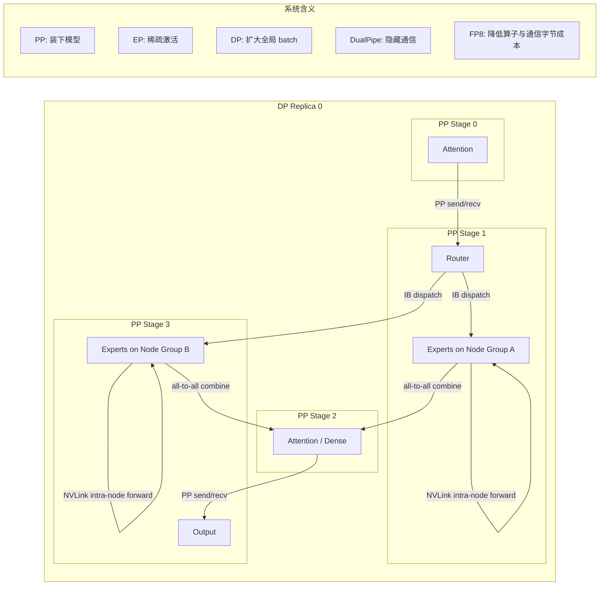

# DeepSeek 工程优化与系统性能

## 关键结论

DeepSeek 的系统效率优势，不是来自某个单点技巧，而是来自一次彻底的架构—训练—通信—硬件协同设计。MLA 先把注意力的缓存压力降下来，MoE 再把参数规模和每 token 计算解耦，FP8 mixed precision 把算力与显存效率继续往上推，而 DualPipe、受限路由、跨节点 all-to-all 内核和内存优化，则把原本会压垮训练吞吐的通信成本尽可能隐藏在计算后面 [DeepSeek-V2, Section 3.1.3; DeepSeek-V3, Section 3.2; DeepSeek-V3, Section 3.3]。

从系统视角看，DeepSeek 真正稀缺的地方不只是“提出了 MLA 和 MoE”，而是把这两类架构做成了可以稳定训练、跨节点扩展、并且高吞吐部署的工程系统。论文给出的训练成本、吞吐和稳定性指标都指向同一个结论：工程优化本身就是 DeepSeek 的核心竞争力之一 [DeepSeek-V2, Section 3.2.3; DeepSeek-V3, Abstract; DeepSeek-V3, Table 1]。

## 背景 / 问题定义

### 训练系统瓶颈总览

超大模型训练从来不是单一的 FLOPs 问题，而是多个瓶颈叠加之后的最小短板问题。对于 DeepSeek 这类大规模 MoE 模型，至少有五类资源同时决定有效吞吐：

- 算力：GEMM 和 attention kernel 决定理论计算上限。
- 显存：激活、优化器状态、临时缓冲区和 KV 相关状态决定模型是否放得下。
- 芯片内外带宽：HBM、NVLink、InfiniBand 决定数据搬运是否拖住算力。
- 通信：DP 的同步、PP 的 stage 传输、EP 的 all-to-all 共同决定扩展效率。
- 负载均衡：专家热点、节点间流量偏斜、pipeline bubble 都会吞掉集群的“账面吞吐”。

对 DeepSeek 而言，问题更尖锐：MoE 虽然降低了每 token 的激活计算量，但也把 token 路由、跨设备专家访问和跨节点 all-to-all 带进了主路径。DeepSeek-V3 明确指出，在 cross-node expert parallelism 下，计算与通信的比例大约接近 $1:1$，这意味着如果通信不能被隐藏，MoE 的理论节省会迅速被系统开销吃掉 [DeepSeek-V3, Section 3.2.1]。

### 为什么仅靠更大 GPU 不够

“换更大 GPU”能缓解一部分显存和单卡算力压力，但解决不了以下三个根问题：

1. MoE 的专家访问天然跨设备，跨节点 all-to-all 不会因为单卡更大而消失。
2. pipeline bubble 和并行同步开销是调度问题，不是单卡容量问题。
3. 带宽层级不对称依然存在：节点内 NVLink 快，节点间 InfiniBand 慢，系统必须显式围绕这种拓扑设计通信路径 [DeepSeek-V3, Section 3.1; Section 3.2.2]。

所以，DeepSeek 的思路不是“先把模型做出来，系统再去兜底”，而是从一开始就把模型设计约束在系统能高效承载的形状上。MLA、MoE、受限路由、低精度训练和并行调度是一起收敛的，而不是分开的模块化拼装。

### DeepSeek 的系统目标函数

如果把 DeepSeek 的工程目标抽象成一句话，它追求的是：

- 在不明显牺牲质量的前提下，降低每 token 的激活成本；
- 在跨节点扩展时，尽量避免高频、高体量、不可隐藏的通信；
- 在训练与部署两端都把显存和带宽留给真正有价值的计算。

这也是为什么它最终形成了以下系统分工：

- MLA 负责降低 attention 侧的状态体积和带宽压力；
- MoE 负责提高总参数规模而不线性增加每 token 计算；
- FP8 负责减少算子、激活和通信的字节成本；
- DualPipe 与跨节点 all-to-all 优化负责把通信成本从显式等待转为重叠执行 [DeepSeek-V2, Section 2; DeepSeek-V3, Introduction; DeepSeek-V3, Section 3.2; Section 3.3]。

## 图表清单

- 图 1：并行与跨节点通信路径示意图（Mermaid）
- 表 1：与 Llama / GPT 系列常见方案相比的得失
- 表 2：哪些优化是必须的，哪些是锦上添花
- 表 3：并行策略对比
- 表 4：FP16 / BF16 / FP8 对比
- 表 5：通信瓶颈与优化手段对照表

## 核心机制

### FP8 训练机制

#### 为什么引入 FP8

DeepSeek-V3 把 FP8 mixed precision 训练作为提升训练效率的核心支柱之一，而且论文强调这是首次在极大规模模型上验证 FP8 训练的有效性 [DeepSeek-V3, Introduction; Section 3.3]。原因很直接：

- FP8 GEMM 可以显著提高计算密度；
- 激活缓存和通信张量的字节数可以明显下降；
- 对大规模 MoE 来说，显存和带宽节省并不是次要收益，而是决定能否避免额外并行开销的关键收益。

DeepSeek 并没有采取“全链路一刀切 FP8”的粗暴方案，而是做了细粒度 mixed precision：大多数核心 GEMM 用 FP8，而 embedding、output head、MoE gating、normalization、attention 等敏感模块保留更高精度，以换取数值稳定性 [DeepSeek-V3, Section 3.3.1]。

#### scaling 与量化策略

DeepSeek-V3 的关键工程点，不是“把数据 cast 成 FP8”这么简单，而是如何让 FP8 在超大模型里不炸。论文给出了三层关键设计：

1. 激活按 $1 \times 128$ tile 分组量化。
2. 权重按 $128 \times 128$ block 分组量化。
3. 累加阶段引入 promotion to CUDA cores，以 FP32 累加修补 H800 Tensor Core 的 FP8 accumulation precision 不足 [DeepSeek-V3, Section 3.3.2]。

这说明 DeepSeek 的 FP8 方案本质上是一种“量化粒度 + 累加路径 + 算子分工”联合设计，而不是简单套用通用低精度框架。

#### 数值稳定性与收益

DeepSeek-V3 报告，在约 1T token 级别的验证中，FP8 相对 BF16 基线的 loss 相对误差持续低于 0.25%，说明该低精度框架的误差被控制在训练随机性可接受范围内 [DeepSeek-V3, Section 3.3]。同时，FP8 Wgrad 允许将激活以 FP8 形式缓存到反向传播阶段，从而直接降低激活内存压力 [DeepSeek-V3, Section 3.3.1]。

但代价同样明确：

- 需要细粒度 quantization，普通 tensor-wise scale 不够；
- 需要更高精度累加路径，不然大 K 维 GEMM 误差会放大；
- 不是所有模块都能安全落到 FP8；
- 通信侧也必须配合低精度张量格式，才能把收益扩展到 all-to-all 路径 [DeepSeek-V3, Section 3.3.2; Section 3.3.3]。

### 并行策略设计

#### DeepSeek-V2 的组合方式

DeepSeek-V2 使用了 16-way zero-bubble pipeline parallelism、8-way expert parallelism 和 ZeRO-1 data parallelism [DeepSeek-V2, Section 3.1.3]。一个很关键的系统判断是：由于该模型的 activated parameters 相对较少，同时部分算子通过 recomputation 节省激活内存，因此 V2 可以在训练阶段不依赖 tensor parallelism，从而减少额外通信开销 [DeepSeek-V2, Section 3.1.3]。

这件事很重要，因为主流超大模型常常把 TP 当成默认选项；而 DeepSeek 更像是在问：如果通过架构和内存优化已经能装下模型，为什么还要承担 TP 的高频 collective 开销？

#### DeepSeek-V3 的组合方式

DeepSeek-V3 延续并强化了这个方向：训练整体采用 16-way PP、64-way EP（跨 8 个节点）以及 ZeRO-1 DP [DeepSeek-V3, Section 3.2]。论文明确写出，经过系统性的 memory footprint 优化后，V3 在训练中同样避免了 costly tensor parallelism [DeepSeek-V3, Section 3.2]。

它背后的逻辑是：

- DP 负责扩大 batch 并分摊优化器状态；
- PP 负责把模型层切进多设备，解决单卡放不下的问题；
- EP 才是 MoE 真正省算力的来源；
- TP 是可选而非必选，因为 TP 带来的高频同步很容易把系统做复杂，还会在大规模训练中放大通信损耗。

#### DualPipe 的系统意义

DeepSeek-V3 的 DualPipe 不只是“比 zero-bubble 更先进的 pipeline 调度”，其关键价值在于把 forward / backward 与 EP all-to-all 和 PP 通信重叠起来 [DeepSeek-V3, Section 3.2.1]。

从系统角度看，DualPipe 解决的是两个问题：

- 减少 pipeline bubble；
- 更重要的是，把原本显式暴露的通信等待变成可被计算掩盖的重叠区间。

也就是说，DualPipe 的价值不在于“绝对减少多少字节的通信”，而在于“让这些字节更少地出现在 wall-clock time 上”。这对 cross-node MoE 尤其关键，因为真正拖慢训练的不是通信是否存在，而是通信是否被串行暴露出来。

### 跨节点通信优化

#### MoE 为什么会把通信问题放大

Dense 模型的主要通信往往更规则：TP 偏 all-reduce，DP 偏梯度同步，PP 偏相邻 stage 传输。MoE 则不同，token 经过 router 后会发往不同专家，路由结果不均匀时，就会同时出现：

- 发送端 token fan-out 增加；
- 接收端热点专家过载；
- 节点间流量倾斜；
- all-to-all 与计算互相争抢 SM、缓存和链路。

DeepSeek-V2 已经明确把这个问题纳入设计：它采用 device-limited routing，限制每个 token 最多只发往 $M$ 个设备；在实际设置中，训练阶段每个 token 最多发往 3 个 devices [DeepSeek-V2, Section 2.2.2; Section 3.1.2]。同时，V2 还加入 device-level 和 communication balance loss，试图不仅约束发送，还约束接收端负载 [DeepSeek-V2, Section 2.2.3]。

#### DeepSeek-V3 的跨节点 all-to-all 策略

DeepSeek-V3 将这一思路进一步推进到节点级：每个 token 最多发往 4 个 nodes [DeepSeek-V3, Section 2.1.2; Section 3.2.2; Section 4.2]。这不是拍脑袋的超参，而是根据集群拓扑定出来的系统边界。V3 明确指出，集群内 NVLink 带宽约为 160 GB/s，而跨节点 InfiniBand 约为 50 GB/s，前者大约是后者的 3.2 倍 [DeepSeek-V3, Section 3.2.2]。

因此它采用了分级转发：

1. 先通过 IB 把 token 传到目标节点上相同 in-node index 的 GPU；
2. 再通过 NVLink 在节点内转发到真正承载目标专家的 GPU；
3. dispatch / combine 内核与计算流重叠执行；
4. 用 warp specialization 和动态 warp 调整降低通信对 SM 的长期占用 [DeepSeek-V3, Section 3.2.2]。

这套设计的精髓，是承认带宽层级不对称，然后主动把“慢链路跨节点、快链路节点内”纳入通信路径规划，而不是指望统一抽象层自动做最优分发。

### 架构与系统协同

#### MLA 如何减轻系统压力

虽然这页不展开 MLA 数学细节，但从系统视角必须点明它的作用。DeepSeek-V2 报告，相比 DeepSeek 67B，MLA 带来的设计使 KV cache 降低了 93.3%，最大 generation throughput 提升到 5.76 倍；单节点 8 张 H800 上生成吞吐超过 50K tokens/s，prompt throughput 超过 100K tokens/s [DeepSeek-V2, Abstract; Section 3.2.3]。

这意味着 MLA 并不仅仅是“注意力结构新一点”，而是在部署端直接降低了缓存压力和解码带宽压力，从而让系统能容纳更大 batch。对于训练端，DeepSeek-V3 又进一步通过重算 MLA up-projection 和 RMSNorm 来减少激活保存 [DeepSeek-V3, Section 3.2.3]。

#### MoE 如何放大系统复杂度

MoE 的好处是显而易见的：DeepSeek-V3 671B 总参数、每 token 仅激活 37B 参数，说明它确实利用稀疏激活实现了“参数规模大幅扩张，但每 token 计算不按总参数线性增长” [DeepSeek-V3, Abstract; Section 4.2]。但这不是免费的午餐。MoE 把系统复杂度抬高到了以下维度：

- 路由必须稳定；
- 专家负载必须均衡；
- all-to-all 必须可隐藏；
- 冗余专家和部署重排必须在线调整；
- 训练与推理都要避免热点专家成为长尾瓶颈。

所以，对 DeepSeek 而言，MLA 是在减系统压力，MoE 则是在加系统压力。工程团队真正厉害的地方，是把两者放在一起仍然做成了正收益。

## 数学基础

这页不展开 MLA 或 RL 的数学细节，但系统页依然需要最基本的性能模型。可以用三个式子理解 DeepSeek 为什么必须做联合优化。

### 训练 step 的时间分解

在没有有效重叠时，训练 step 时间近似可以写成：

$$
T_{\text{step}} \approx T_{\text{compute}} + T_{\text{comm}} + T_{\text{bubble}} + T_{\text{imbalance}}
$$

而在成功实现计算—通信重叠后，更合理的近似变成：

$$
T_{\text{step}} \approx \max\bigl(T_{\text{compute}}, T_{\text{comm}}\bigr) + T_{\text{bubble}} + T_{\text{imbalance}}
$$

DualPipe 的意义就在于尽量把系统从第一种状态推向第二种状态：通信没有消失，但它更少以串行等待的形式出现 [DeepSeek-V3, Section 3.2.1]。

### MoE all-to-all 的跨节点体量

对 MoE 而言，跨节点通信量可以粗略写成：

$$
V_{\text{cross-node}} \propto N_{\text{tokens}} \cdot \bar{n}_{\text{nodes/token}} \cdot d_{\text{act}} \cdot b
$$

其中：

- $N_{\text{tokens}}$ 是当前 batch 的 token 数；
- $\bar{n}_{\text{nodes/token}}$ 是每个 token 平均触达的节点数；
- $d_{\text{act}}$ 是需要 dispatch 的激活维度；
- $b$ 是每个元素的字节数。

这解释了 DeepSeek 为什么同时做两件事：

- 用受限路由降低 $\bar{n}_{\text{nodes/token}}$；
- 用 FP8 降低 $b$ [DeepSeek-V2, Section 2.2.2; DeepSeek-V3, Section 3.3.3]。

如果不限制路由节点数，MoE 的专家越细，跨节点通信 fan-out 就越可能恶化；如果不降低元素字节数，即使通信被重叠，链路压力也仍然会上升。

### FP8 对通信与缓存的直接收益

若将激活通信从 BF16 压到 FP8，单纯从位宽上看，字节体量近似减半：

$$
V_{\text{FP8}} \approx \frac{8}{16} V_{\text{BF16}} = 0.5 V_{\text{BF16}}
$$

真实收益当然不只看位宽，还要看 scale、dequant、累加和 kernel 实现，但这个式子给出了一阶直觉：低精度不是只加速算力，也是在直接减少 all-to-all 和激活缓存的字节成本 [DeepSeek-V3, Section 3.3.3]。

### DualPipe 与 pipeline bubble

DeepSeek-V3 在 Table 2 中给出了 1F1B、ZB1P 和 DualPipe 的 bubble 形式。虽然这里不逐项推导，但至少可以把它理解为：

- 传统 PP 的 bubble 与 stage 数直接相关；
- 更先进的调度通过把 backward for weights、backward for inputs、dispatch/combine 和 PP 通信重排，减少了不可避免的空转时间；
- 代价是更高的实现复杂度，以及略多的 activation memory [DeepSeek-V3, Section 3.2.1; Table 2]。

## 工程实现

### DeepSeek-V2：早期系统化优化的基础版本

DeepSeek-V2 已经展示出很清晰的工程路线：

- 16-way zero-bubble PP + 8-way EP + ZeRO-1 DP [DeepSeek-V2, Section 3.1.3]
- 不使用 TP，以减少 collective 通信 [DeepSeek-V2, Section 3.1.3]
- device-limited routing，限制每 token 最多触达 3 个设备 [DeepSeek-V2, Section 3.1.2]
- expert/device/communication balance loss 同时约束路由塌缩、设备负载和通信接收偏斜 [DeepSeek-V2, Section 2.2.3]
- shared experts computation 与 expert all-to-all overlap [DeepSeek-V2, Section 3.1.3]
- 自定义更快的通信 CUDA kernels、routing 算法以及跨专家 fused linear [DeepSeek-V2, Section 3.1.3]

最终，V2 训练每 1T tokens 仅需 172.8K GPU hours，相比 DeepSeek 67B 的 300.6K GPU hours 节省 42.5% [DeepSeek-V2, Section 3.2.3]。这说明 DeepSeek 在 V2 阶段已经不是“论文结构创新”，而是在工程上真正拿到了成本收益。

### DeepSeek-V3：把系统优化推进到训练主轴

到 V3，系统优化从“重要支撑”进一步升级为训练主轴：

- 16-way PP、64-way EP 跨 8 nodes、ZeRO-1 DP [DeepSeek-V3, Section 3.2]
- DualPipe 实现计算—通信重叠 [DeepSeek-V3, Section 3.2.1]
- 受拓扑约束的 cross-node all-to-all 内核 [DeepSeek-V3, Section 3.2.2]
- 训练期极限 memory saving，使 TP 仍可避免 [DeepSeek-V3, Section 3.2.3]
- FP8 mixed precision + low-precision storage + low-precision communication [DeepSeek-V3, Section 3.3]
- 全流程训练稳定，无 irrecoverable loss spike、无 rollback [DeepSeek-V3, Abstract; Introduction]

V3 的训练成本表更说明问题：全训练仅 2.788M H800 GPU hours，其中 pre-training 为 2.664M H800 GPU hours，按论文假设的 H800 租赁价计算总成本约为 5.576M 美元 [DeepSeek-V3, Table 1]。对于 671B 级别 MoE 模型，这个量级本身就是系统优化有效的证据。

### 混合并行训练 step 抽象逻辑

```python
from dataclasses import dataclass


@dataclass
class Batch:
    tokens: object
    labels: object


@dataclass
class Activations:
    hidden: object
    routed: object


class DualPipeEngine:
    def overlap(self, compute_task, comm_task):
        compute_task()
        comm_task()


def train_step(batch: Batch, model, router, optimizer, engine: DualPipeEngine):
    # 1. 数据并行副本各自取一个 micro-batch
    micro_batches = split_into_micro_batches(batch.tokens)

    losses = []
    for micro in bidirectional_schedule(micro_batches):
        # 2. Pipeline stage 内先做 attention / dense 部分
        hidden = model.attention_forward(micro)

        # 3. Router 决定专家分配，并限制跨节点 fan-out
        route_plan = router.plan(hidden, max_nodes_per_token=4)

        # 4. 将 MoE dispatch 与共享专家或其他计算重叠
        def compute_shared_experts():
            model.shared_expert_forward(hidden)

        def dispatch_tokens():
            # 先跨节点，再节点内转发；通信张量尽量使用低精度
            hidden_fp8 = quantize_fp8(hidden)
            route_plan.dispatch_all_to_all(hidden_fp8)

        engine.overlap(compute_shared_experts, dispatch_tokens)

        # 5. 专家并行执行 routed experts
        expert_out = model.expert_forward(route_plan)

        # 6. combine 与下一段计算继续重叠
        combined = route_plan.combine_all_to_all(expert_out)
        logits = model.output_forward(combined)
        losses.append(cross_entropy(logits, micro))

    loss = aggregate_losses(losses)

    # 7. 反向传播也采用与 forward 对称的 overlap 策略
    loss.backward()
    optimizer.step()
    optimizer.zero_grad()

    return loss
```

这段伪代码展示的是 DeepSeek 系统思路的抽象：并行策略不是简单把 DP、PP、EP 拼起来，而是让路由限制、低精度通信和重叠调度一起服务于吞吐。

### 并行与跨节点通信路径示意图

### 并行与跨节点通信路径示意图



图里的关键不是“画出所有 stage”，而是明确三件事：

- PP 解决的是模型切分；
- EP 引入的是 all-to-all；
- DeepSeek 真正下功夫的地方，是把 IB 与 NVLink 的双层通信路径和计算重叠起来。

## Design trade-offs

### 为什么 DeepSeek 这样设计

DeepSeek 的设计顺序大体可以理解为：

1. 先确定必须做稀疏化，不然总参数规模上不去，训练成本也会更高。
2. 稀疏化以后，all-to-all 与负载均衡成为主问题，因此要做受限路由和重叠通信。
3. 如果继续做传统 TP，通信问题会更复杂，因此尽量通过 MLA、激活重算和低精度把 TP 从训练主路径里拿掉。
4. 当显存和通信都开始成为一阶瓶颈时，FP8 就不只是算子优化，而是系统优化。

这个顺序很能说明 DeepSeek 的系统哲学：先承认模型结构会制造什么系统问题，再决定用什么工程手段把这些问题摁回去。

### 与 Llama / GPT 系列常见方案相比的得失

| 路线 | 常见系统特征 | DeepSeek 的收益 | DeepSeek 的代价 |
| --- | --- | --- | --- |
| Dense Transformer | 通信模式更规整，系统实现更成熟 | DeepSeek 用 MoE 在更低每 token 计算下放大总参数规模 | 路由、all-to-all、负载均衡让系统复杂度显著上升 |
| GQA / 常规 attention serving 路线 | attention 成本可控，但 KV 压力仍然明显 | DeepSeek 用 MLA 进一步压缩缓存并提高服务吞吐 | attention 结构与 kernel 实现更复杂 |
| TP-heavy 扩展路线 | 张量切分成熟，但 high-frequency collective 多 | DeepSeek 尽量避免 TP，减少高频同步 | 必须在显存、调度和低精度上做更多工程优化 |
| 常规 BF16 训练 | 数值路径更简单 | DeepSeek 通过 FP8 降低算力、缓存和通信成本 | 需要细粒度 quantization 和更复杂累加路径 |

这里最关键的判断是：DeepSeek 获得的不是“便宜一点点”，而是一个更优的成本—能力—吞吐折中；但它为此支付的是系统复杂度，而不是模型效果本身。

### 哪些优化是必须的，哪些是锦上添花

| 类别 | 机制 | 判断 | 原因 |
| --- | --- | --- | --- |
| 必须项 | MLA | 必须 | 不先降低 attention 状态成本，部署吞吐和长上下文都很吃紧 |
| 必须项 | EP + 受限路由 | 必须 | MoE 的收益建立在专家并行上，但 fan-out 不受控会把通信拖爆 |
| 必须项 | DualPipe / overlap | 必须 | cross-node EP 已让 compute:comm 接近 $1:1$，不重叠就难以扩展 |
| 必须项 | 内存优化避免 TP | 必须 | 否则 TP collective 会进一步增加系统负担 |
| 必须项 | FP8 mixed precision | 接近必须 | 模型规模上去后，算力、缓存、通信都需要低精度协同降本 |
| 增强项 | 冗余专家部署 | 锦上添花 | 主要用于在线服务负载均衡优化 |
| 增强项 | prefilling / decoding 分离部署 | 锦上添花 | 属于进一步优化服务 SLO 与吞吐 |
| 增强项 | 双 micro-batch overlap | 锦上添花 | 用于把硬件吃得更满，但不是系统成立的前提 |

## 与主流方案对比

### 并行策略对比

| 策略 | 主要目标 | 典型通信模式 | 优点 | 代价 | DeepSeek 的使用方式 |
| --- | --- | --- | --- | --- | --- |
| Data Parallelism | 扩大 batch，复制模型 | all-reduce / optimizer sync | 简单、成熟 | 全量同步成本高 | V2/V3 都使用 ZeRO-1 DP，减少状态成本 [DeepSeek-V2, Section 3.1.3; DeepSeek-V3, Section 3.2] |
| Tensor Parallelism | 切分单层计算 | 高频 all-reduce / reduce-scatter | 单层可扩展 | collective 频繁，通信重 | 训练阶段尽量避免；V3 推理 prefill 才使用小规模 TP4 [DeepSeek-V3, Section 3.4.1] |
| Pipeline Parallelism | 切分层，装下模型 | stage send/recv | 解决单卡装不下 | bubble、调度复杂 | V2 用 zero-bubble，V3 用 DualPipe [DeepSeek-V2, Section 3.1.3; DeepSeek-V3, Section 3.2.1] |
| Expert Parallelism | 分布式承载专家 | all-to-all | MoE 真正省算力 | 负载均衡和路由复杂 | V2 使用 8-way EP，V3 使用 64-way EP 跨 8 nodes [DeepSeek-V2, Section 3.1.3; DeepSeek-V3, Section 3.2] |

### FP16 / BF16 / FP8 对比

| 格式 | 位宽 | 动态范围 / 精度直觉 | 训练效率潜力 | 风险 | DeepSeek 用法 |
| --- | --- | --- | --- | --- | --- |
| FP16 | 16-bit | 精度尚可，但 exponent 更紧 | 高 | 更容易 underflow / overflow | 论文不是主路线 |
| BF16 | 16-bit | exponent 更宽，训练更稳 | 中高 | 字节成本仍偏高 | 作为高精度主干与对照基线 [DeepSeek-V3, Section 3.3] |
| FP8 | 8-bit | 动态范围窄，需精细 scale | 很高 | 对 outlier、累加路径极敏感 | V3 用于大多数核心 GEMM、激活缓存和部分通信 [DeepSeek-V3, Section 3.3.1; Section 3.3.3] |

DeepSeek 的关键不是“FP8 替代 BF16”，而是构造了一个 BF16/FP32/FP8 分工明确的混合体系。

### 通信瓶颈与优化手段对照表

| 瓶颈 | 问题来源 | DeepSeek 优化手段 | 代价 / 约束 | 引用 |
| --- | --- | --- | --- | --- |
| MoE dispatch / combine | token fan-out + cross-node all-to-all | device/node-limited routing、warp specialization、IB->NVLink 分级转发、低精度通信 | 路由自由度被限制，工程实现复杂 | [DeepSeek-V2, Section 2.2.2; DeepSeek-V3, Section 3.2.2; Section 3.3.3] |
| PP stage 传输 | stage 间串行等待 | DualPipe 重叠 forward/backward 与 PP 通信 | 调度更复杂，激活内存略增 | [DeepSeek-V3, Section 3.2.1; Table 2] |
| DP / ZeRO 同步 | 参数和优化器状态同步 | ZeRO-1 降低状态开销 | 仍需跨 replica 协调 | [DeepSeek-V2, Section 3.1.3; DeepSeek-V3, Section 3.2] |
| 激活缓存与反向显存 | 大模型 + 长链条反向传播 | FP8 activation cache、重算 RMSNorm 与 MLA up-proj | 需要更多计算与定制格式 | [DeepSeek-V3, Section 3.2.3; Section 3.3.3] |
| 专家负载不均衡 | 热点专家 / 接收不均 | V2 的 balance losses，V3 的 auxiliary-loss-free balancing，在线冗余专家 | 需要额外监控与部署逻辑 | [DeepSeek-V2, Section 2.2.3; DeepSeek-V3, Section 2.1.2; Section 3.4.1] |

### 与 Llama / GPT / 传统 Transformer 的工程差异

在公开资料足够明确的范围内，可以做一个高粒度判断：

- 传统 dense Transformer 路线系统形态更规整，训练并行和 serving 方案也更成熟，但参数规模扩展与推理成本更重。
- Llama 一类主流开源 dense 路线更强调系统可实现性与稳定扩展，通信形态相对规则。
- DeepSeek 选择 MLA + MoE，主动换来更复杂的系统后端，以获取更好的成本效率与吞吐表现。
- GPT 系列公开资料没有充分披露其训练系统细节，因此这里只能做高粒度比较：DeepSeek 的公开文档比多数模型更明确地把系统优化写成了模型能力的一部分。

换句话说，DeepSeek 的不同，不只是“用了 MoE”，而是把 MoE 真正做成了可扩展的系统路线。

## 延伸分析

DeepSeek 的很多优势，无法只靠看架构图理解。真正决定它上限的，是以下事实：

1. 只做 MoE 而不做受限路由、通信重叠和负载均衡，训练效率会被 all-to-all 吃掉。
2. 只做 MLA 而不把推理缓存、带宽和内存策略配齐，attention 结构优势很难完全兑现。
3. 只做 FP8 而不做细粒度 quantization 与高精度 accumulation，训练稳定性会成为硬伤。
4. 只做并行切分而不做拓扑感知的 kernel 设计，集群扩展会停在纸面 MFU 上。

所以，工程优化不是模型之后的“配套工作”，而是 DeepSeek 能把架构创新变成实际训练成本优势和部署吞吐优势的必要条件。外部团队如果只复现模型结构，而不复现训练框架、通信内核和低精度路径，通常拿不到同样的成本—性能曲线。这也解释了为什么 DeepSeek 的护城河有相当一部分在系统工程。

## 小结 / 启示

从 DeepSeek-V2 到 DeepSeek-V3，最值得注意的不是某个单项指标，而是系统路线的逐步闭环：

- V2 证明 MLA + MoE 可以同时拿到推理效率和训练成本优势；
- V3 则进一步证明，在 671B 级别 MoE 上，FP8、DualPipe、拓扑感知 all-to-all 和极致内存优化可以把这些优势稳定地兑现为训练效率 [DeepSeek-V2, Section 3.2.3; DeepSeek-V3, Table 1]。

对工程实践的启示也很明确：

- 架构创新必须和系统代价一起设计；
- 稀疏模型的真正难点不在“激活少算一些”，而在“如何不被通信和负载均衡反噬”；
- 低精度训练只有与量化粒度、累加路径和通信格式共同设计时，才是大模型系统优化，而不是局部 trick；
- 真正的训练效率，来自把显存、算力、带宽、拓扑和调度看成一个联合优化问题。

如果要用一句话概括这页内容，那就是：DeepSeek 的核心不是单点技巧，而是架构—训练—系统的联合优化能力。这正是它能把大模型训练和推理效率推到更极致的根本原因。