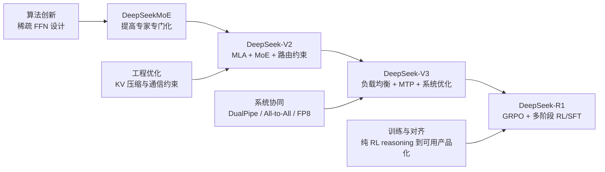

# DeepSeek 总览：从稀疏架构到推理强化

## 背景 / 问题定义

如果把 DeepSeek 系列看成四篇彼此独立的论文，很容易得到一个误判：DeepSeek 只是先做了 MoE，再做了 MLA，再做了 RL。更准确的理解是，DeepSeek 一直在围绕同一个工程问题演进：**如何在固定甚至受限的算力预算下，把参数效率、推理效率、系统可扩展性和 reasoning 能力同时抬高**。[DeepSeekMoE, Section 9; DeepSeek-V2, Section 5; DeepSeek-V3, Section 6; DeepSeek-R1, Section 6]

这条路线与典型的 dense-first 路线不同。它不是先把 dense 基座做大，再让系统工程去追赶模型；而是较早把架构稀疏化、KV cache 压缩、通信优化、负载均衡和后训练强化放进同一张路线图里。结果是，DeepSeek 的每一代都不只是“模型更强了一点”，而是在回答不同层面的瓶颈：

- DeepSeekMoE：MoE 是否真的带来更高的有效参数利用率，而不是更高的参数冗余？[DeepSeekMoE, Sections 1, 3]
- DeepSeek-V2：即使 MoE 可训，可否进一步把推理端的 KV cache 和通信成本降下来？[DeepSeek-V2, Sections 2.1-2.2]
- DeepSeek-V3：当模型进入数百 B 规模时，是否还能把 load balance、all-to-all、pipeline 与精度问题一起控住？[DeepSeek-V3, Sections 2-3]
- DeepSeek-R1：当 base model 已足够强时，是否可以把算力继续投向 reasoning 行为本身，而不是只投向更长的预训练？[DeepSeek-R1, Sections 1-3]

**本页的目标**不是复述四篇论文，而是把这条路线收敛成一条适合 MkDocs 长期维护的总览主线，帮助读者先建立地图，再进入后续专题页。

## 图表清单

- 图 1：DeepSeek 三条主线演进路线图（Mermaid）
- 表 1：DeepSeek 系列时间线
- 表 2：三条主线如何贯穿各代模型
- 表 3：各论文的核心创新、目标问题、收益与代价
- 表 4：工程实现重点总览
- 表 5：与 Llama / GPT / 传统 Transformer 路线对比

## 关键结论

- DeepSeek 的主线不是“单纯扩大模型”，而是把 **算法创新、工程优化、训练与对齐** 联合成一个预算重分配问题。[DeepSeek-V2, Abstract; DeepSeek-V3, Abstract; DeepSeek-R1, Section 6]
- DeepSeekMoE 解决的是专家专门化问题；V2 解决的是 KV cache 与通信问题；V3 解决的是超大 MoE 的训练与部署协同问题；R1 解决的是 reasoning 行为如何被显式激发与产品化。[DeepSeekMoE, Section 3; DeepSeek-V2, Sections 2-3; DeepSeek-V3, Sections 2-3; DeepSeek-R1, Sections 2-3]
- 因此，DeepSeek 的关键创新不是某一个模块，而是 **跨代持续协同优化**：先省下算力，再把省下来的预算投入更强的能力增益。[DeepSeek-V2, Section 3.2.3; DeepSeek-V3, Sections 3.2-3.3; DeepSeek-R1, Sections 2.1-2.3]

## 核心机制

### DeepSeek 系列发展时间线

| 时间 | 论文 | 一句话总结 | 主线位置 |
| --- | --- | --- | --- |
| 2024-01 | DeepSeekMoE | 用 fine-grained expert segmentation 和 shared expert isolation，把“MoE 参数多但不够专精”改造成“更专精且更省算”的稀疏架构。[DeepSeekMoE, Section 3] | 算法创新起点 |
| 2024-05 | DeepSeek-V2 | 用 MLA + DeepSeekMoE + device-limited routing，把“可训的 MoE”推进到“高效训练且高效推理的 MoE”。[DeepSeek-V2, Sections 2.1-2.2] | 架构与推理效率拐点 |
| 2024-12 / 2025-02 v2 | DeepSeek-V3 | 在 V2 底座上加入 auxiliary-loss-free load balancing、MTP、DualPipe、FP8 与部署优化，把系统协同推到更大规模。[DeepSeek-V3, Abstract; Sections 2-3] | 系统协同放大器 |
| 2025-01 / 2026-01 v2 | DeepSeek-R1 | 在 DeepSeek-V3-Base 之上，用 GRPO 驱动 reasoning 行为涌现，并通过多阶段训练把 R1-Zero 变成可读、可用、可蒸馏的 reasoning model。[DeepSeek-R1, Sections 1-3] | 训练与对齐跃迁 |

### 一张图看懂 DeepSeek 的三条主线

### 三条主线如何贯穿整条路线

| 主线 | DeepSeekMoE | DeepSeek-V2 | DeepSeek-V3 | DeepSeek-R1 |
| --- | --- | --- | --- | --- |
| 算法创新 | 通过 finer experts + shared experts 提升 expert specialization，目标是减少知识混杂和专家冗余。[DeepSeekMoE, Sections 1, 3] | 引入 MLA，把 attention 的瓶颈从“KV cache 爆炸”改写成“latent compression + decoupled RoPE”。[DeepSeek-V2, Section 2.1] | 用 auxiliary-loss-free balance 与 MTP 解决 MoE 负载均衡和训练信号稀疏问题。[DeepSeek-V3, Sections 2.1.2, 2.2] | 用 GRPO 把 reasoning 从“模仿示范”转为“基于结果的自我改进”。[DeepSeek-R1, Section 2.1] |
| 工程优化 | 重点仍在验证架构可行性，工程层面以并行训练框架和 gating/融合 kernel 为主。[DeepSeekMoE, Section 4.1.2] | 加入 device-limited routing、通信均衡损失、自定义通信/路由 kernel，开始显式约束系统成本。[DeepSeek-V2, Sections 2.2.2-2.2.3; Section 3.1.3] | DualPipe、跨节点 all-to-all kernel、FP8、prefilling/decoding 分离部署，让超大 MoE 进入“可扩展运营”阶段。[DeepSeek-V3, Sections 3.2-3.4] | 重点转向 RL 基础设施与 reward pipeline 的效率和稳定性，而不是继续扩张 base 架构。[DeepSeek-R1, Sections 2.1-2.2; 3.2] |
| 训练与对齐 | 16B 版本已验证 SFT 可让 MoE chat 化，但仍以架构验证为主。[DeepSeekMoE, Section 6] | V2 明确采用 SFT + RL，并把 GRPO 用到对齐阶段，但重点仍是通用 chat 能力与推理增益。[DeepSeek-V2, Section 4] | V3 把 post-training 做得更系统，含 SFT、RL 和 generative reward model 讨论。[DeepSeek-V3, Section 5] | R1 将 reasoning 训练推到主舞台：先 R1-Zero 纯 RL，再冷启动、拒绝采样、SFT、第二阶段 RL，形成完整推理对齐流水线。[DeepSeek-R1, Sections 2-3] |

## 数学基础

虽然本页是总览页，但如果不点出两个核心数学对象，读者很难理解 DeepSeek 为什么能把架构优化延续到 reasoning 优化。

### MLA 的核心：缓存 latent，而不是缓存完整多头 KV

DeepSeek-V2 / V3 的 MLA 先把 key/value 压缩到低维 latent，再恢复出参与 attention 计算的表示：

$$
\mathbf{c}^{KV}_t = W^{DKV}\mathbf{h}_t,
\quad
\mathbf{k}^C_t = W^{UK}\mathbf{c}^{KV}_t,
\quad
\mathbf{v}^C_t = W^{UV}\mathbf{c}^{KV}_t
$$

这意味着生成阶段真正需要缓存的是 $\mathbf{c}^{KV}_t$ 以及与位置编码解耦的少量额外分量，而不是传统 MHA 中每个头的完整 $K/V$。因此，V2 才能把 KV cache 压缩到显著更小的量级，并把这部分收益转化为更高吞吐和更长上下文支持。[DeepSeek-V2, Sections 2.1.2-2.1.4]

### GRPO 的核心：在组内做相对优势优化

R1 则把训练重心从“更强预训练”推进到“更强后训练”。其基础是 GRPO：同一个问题采样一组答案，再用组内 reward 的均值和方差计算相对优势：

$$
A_i=\frac{r_i-\operatorname{mean}(\{r_1,\dots,r_G\})}{\operatorname{std}(\{r_1,\dots,r_G\})}
$$

这使得 DeepSeek-R1 能在数学、代码、逻辑这类可验证任务上，直接把测试时计算量转化为更强 reasoning 轨迹，而不必依赖完整的 critic 管线。[DeepSeek-R1, Section 2.1]

## 工程实现

| 代际 | 工程重点 | 关键实现 | 工程意义 |
| --- | --- | --- | --- |
| DeepSeekMoE | 让稀疏训练可跑 | HAI-LLM、并行训练、gating 与跨 expert 融合 kernel。[DeepSeekMoE, Section 4.1.2] | 先证明稀疏 FFN 路线不是论文玩具。 |
| DeepSeek-V2 | 让稀疏推理高效 | Device-limited routing、通信平衡损失、共享专家与 all-to-all overlap、自定义 CUDA kernels。[DeepSeek-V2, Sections 2.2.2-2.2.3; 3.1.3] | 首次把 MoE 通信成本显式写进模型设计。 |
| DeepSeek-V3 | 让超大 MoE 规模化训练和部署 | DualPipe、cross-node all-to-all kernels、FP8 mixed precision、prefilling/decoding 分离、冗余专家部署。[DeepSeek-V3, Sections 3.2-3.4] | 系统优化从“支持训练”升级为“决定能否扩展”。 |
| DeepSeek-R1 | 让 RL 流水线可持续迭代 | 大规模 rollout、rule-based reward、reward models、语言一致性奖励、多阶段 RL/SFT pipeline。[DeepSeek-R1, Sections 2.1-2.2; 3.1-3.2] | 后训练开始像一个独立系统工程，而不是单个算法实验。 |

## Design trade-offs

| 设计选择 | 为什么这样设计 | 得到什么 | 牺牲什么 |
| --- | --- | --- | --- |
| Fine-grained experts + shared experts | 传统 top-K MoE 中 routed experts 容易混杂知识且重复学习共通知识。[DeepSeekMoE, Section 1] | 更高 expert specialization，更高参数效率。[DeepSeekMoE, Sections 3-4] | 路由和部署复杂度上升，后续必须处理通信与负载均衡。 |
| MLA 取代标准 MHA/GQA | 推理瓶颈在 KV cache，而不是只在算力本身。[DeepSeek-V2, Section 2.1] | KV cache 显著压缩，吞吐提升，并更容易支持长上下文。[DeepSeek-V2, Abstract; Section 3.2.3] | 需要额外处理 RoPE 兼容性与 latent 投影实现。 |
| Auxiliary-loss-free load balancing | 纯辅助损失会伤害性能，尤其在超大规模 MoE 上更明显。[DeepSeek-V3, Section 2.1.2] | 在控制负载均衡的同时更好保住模型质量。[DeepSeek-V3, Sections 2.1.2, 4.5.2] | 训练控制逻辑更复杂，路由实现更“系统工程化”。 |
| GRPO + 纯 RL 起步 | 人类标注 CoT 难扩展，且会把模型绑在人类示范风格上。[DeepSeek-R1, Section 1] | reasoning 行为可在可验证任务上自发涌现。[DeepSeek-R1, Sections 2.2-2.3] | 可读性、语言混杂、reward hacking 风险需要后续阶段修正。[DeepSeek-R1, Sections 3, 6] |

## 与主流方案对比

| 维度 | 传统 dense Transformer / 常见 Llama 路线 | DeepSeek 路线 |
| --- | --- | --- |
| 基础架构倾向 | 更偏 dense-first：先做稳定的大规模 dense 训练，再通过 GQA、数据配方、工程细节逐步优化。 | 更早把 sparse FFN、KV 压缩和路由通信问题拉进主线，强调参数效率与系统协同。[DeepSeekMoE, Section 3; DeepSeek-V2, Section 2] |
| 推理优化重点 | 常见做法是围绕 KV cache、量化、服务框架逐步增量优化。 | 直接在架构层引入 MLA，先改 attention 形态，再谈部署细节。[DeepSeek-V2, Section 2.1; DeepSeek-V3, Section 3.4] |
| 系统观 | 系统优化通常服务于既定模型。 | 模型结构与系统实现联合设计：路由、all-to-all、pipeline、FP8 与部署策略一起定。[DeepSeek-V3, Sections 3.2-3.4] |
| 对齐观 | 对齐常被视为 SFT/RLHF 的后续阶段。 | R1 把 RL 直接当作 reasoning 能力放大器，而非仅仅做偏好对齐。[DeepSeek-R1, Sections 1-3] |

## 小结 / 启示

DeepSeek 的真正主线，可以压缩成一句话：**不是把模型先做大、再补系统，而是让模型结构、训练系统、推理系统和 RL 对齐同步演化。** 这也是为什么它看起来横跨 MoE、attention、并行训练、低精度和 reasoning，但逻辑上并不散。

对工程团队来说，这条路线至少给出四个稳定结论：

1. 先优化参数利用率，再优化推理与训练效率，最后把省下来的预算投入更强能力，是比单纯加参数更可持续的路径。[DeepSeekMoE, Section 9; DeepSeek-V3, Section 6]
2. 架构收益如果不落到部署与通信实现上，通常兑现不成真正的产品收益；DeepSeek-V2 到 V3 的演进本质上就是在证明这一点。[DeepSeek-V2, Section 3.2.3; DeepSeek-V3, Sections 3.2-3.4]
3. 后训练不应只被视为“口风微调”，R1 证明它可以是 reasoning 行为的主要生成机制。[DeepSeek-R1, Sections 2-3]
4. 因此，DeepSeek 不是简单的论文串烧，而是一套持续演进的技术知识库主线，后续专题页应围绕这条主线展开，而不是各写各的局部亮点。

## 阅读导航

- :material-family-tree: **架构专题**

    ---

    看懂 DeepSeek 的稀疏架构主线：为什么要把专家切细、为什么 MLA 能压缩 KV cache、为什么路由与长上下文不是附属优化。

    [:octicons-arrow-right-24: 从 DeepSeekMoE 开始](architecture/deepseek_moe.md)

- :material-brain: **训练与对齐**

    ---

    聚焦预训练、GRPO、reward/verifier、RL 基础设施、distillation 与 failure modes，理解 reasoning 能力是如何被“训出来”的。

    [:octicons-arrow-right-24: 从 RL 与 Alignment 开始](training/rl_and_alignment.md)

- :material-memory: **工程系统**

    ---

    从 FP8、DualPipe、all-to-all、显存与带宽约束出发，看 DeepSeek 为什么不只是模型创新，更是系统工程创新。

    [:octicons-arrow-right-24: 查看系统优化专题](engineering/infra_optimization.md)

- :material-chart-timeline-variant: **代际对比**

    ---

    如果你想先抓主线，再回头看细节，这一页最适合快速建立“MoE → MLA → V3 系统协同 → R1 推理强化”的时间轴。

    [:octicons-arrow-right-24: 进入代际演进页](comparison/v1_to_v3_evolution.md)

### 推荐阅读路径

- **先建地图**：先看 `comparison/v1_to_v3_evolution.md`，快速理解每一代到底改了什么、为什么这样改。
- **先攻架构**：按 `architecture/deepseek_moe.md` → `architecture/mla_attention.md` → `architecture/routing_and_load_balancing.md` → `architecture/long_context_and_yarn.md`。
- **先攻 reasoning**：按 `training/rl_and_alignment.md` → `training/reward_design_and_verifiers.md` → `training/rl_infrastructure.md` → `training/distillation_and_transfer.md`。
- **先攻系统**：直接读 `engineering/infra_optimization.md`，再回看 `architecture/` 与 `training/` 的细节页。

### 使用边界

- 本页保留总览级分析，重点是建立专题地图。
- 公式、实验、实现细节和 trade-off 的完整展开，放在各子页中，避免首页变成“所有内容都塞进来”的大杂烩。
