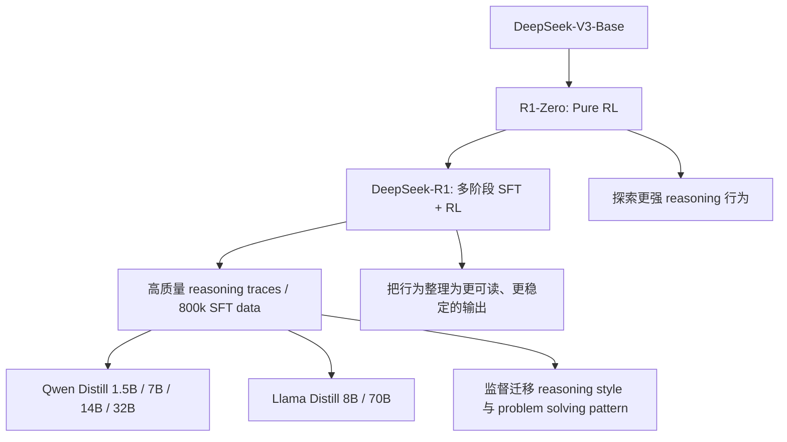
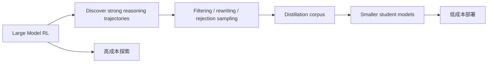

# DeepSeek-R1 Distillation：如何把长链推理能力迁移到更小模型

## 关键结论

DeepSeek-R1 的一个非常重要但容易被主线叙事遮住的贡献，是它不只证明了 **大模型可以通过 RL 学会更强 reasoning**，还进一步证明了：这些涌现出的推理行为，**可以被蒸馏到更小的开源基座上**，从而把“昂贵的 reasoning 训练”转化成“更便宜的 reasoning 能力分发” [DeepSeek-R1, Abstract; Section 1; Section 4; Section 6]。

如果说 R1-Zero / R1 回答的是“reasoning 能不能被强化学习诱导出来”，那么 distillation 回答的就是另一个更现实的问题：**这种能力能不能脱离 600B 级大基座，变成更小、更廉价、更易部署的模型资产**。

先给出这页的核心结论：

- DeepSeek 把 reasoning distillation 看成整个 R1 路线的自然收束：先让大模型通过 RL 长出更长、更强的思维链，再把这些 reasoning traces 与筛选后的监督样本蒸馏给更小模型 [DeepSeek-R1, Section 1; Appendix A.2; Appendix B.3.3]。
- 这种蒸馏不是“复制一个最终答案”，而是复制 **reasoning style、problem decomposition、reflection / verification 行为，以及面向用户的最终表达方式**。因此，distillation 的训练对象并不是一组短标签，而是带有思维链和答案结构的长轨迹监督 [DeepSeek-R1, Appendix B.3.2; Appendix B.3.3]。
- DeepSeek 明确给出了蒸馏模型谱系：Qwen 系列从 `1.5B / 7B / 14B / 32B`，Llama 系列覆盖 `8B / 70B`。这意味着他们并不是只做“一个 showcase 小模型”，而是在刻意验证 reasoning transfer 是否能跨不同参数规模和不同 base family 成立 [DeepSeek-R1, Appendix B.4.3]。
- 从论文叙述来看，DeepSeek 的关键判断是：**reasoning 并不一定要在每个小模型上重新用大规模 RL 学一遍**。只要大模型已经通过 RL 探索出高质量 reasoning 轨迹，那么 distillation 往往是更经济、更稳定、更可推广的路径 [DeepSeek-R1, Section 1; Section 6]。
- 换句话说，R1 的 distillation 不是附属功能，而是把“昂贵的探索”与“便宜的复制”分离开来的核心机制。大模型负责花钱找路，小模型负责把路走熟。

## 背景 / 问题定义

### 纯 RL reasoning 很强，但很贵

R1 的主线证明了两件事：

1. 只要 base checkpoint 足够强，再配上可验证 reward，模型可以通过 pure RL 长出长 CoT、自反思、verification 等行为 [DeepSeek-R1, Section 2.3]；
2. 但这套训练本身非常昂贵，需要大规模 rollout、reward 计算、长序列训练和复杂系统栈支撑 [DeepSeek-R1, Section 2.1; Appendix B.1; Appendix B.4.4]。

这意味着 reasoning 的“发现过程”与“部署过程”天然不对称：

- 发现过程：贵、慢、依赖 verifier 和系统工程；
- 部署过程：希望便宜、稳定、可广泛分发。

如果每个可部署模型都必须重新走一遍大规模 RL，那么 reasoning 能力的扩散成本会高得离谱。因此，distillation 的必要性就很明确：**把昂贵的 RL 发现压缩成便宜的监督迁移。**

### 为什么不能只蒸馏最终答案

对普通 classification / instruction tuning 而言，蒸馏常常只需要更好的最终标签；但 reasoning model 不一样。R1 的价值不是仅仅更常答对，而是它会：

- 生成更长的中间推理过程；
- 显式进行 reflection / verification；
- 在复杂问题上动态延长思考时间；
- 在回答时给出更像“解题过程”的结构 [DeepSeek-R1, Section 2.3; Appendix C.2]。

如果蒸馏时只保留最终答案，这些真正有价值的行为模式就会被抹平。因此，DeepSeek 的 distillation 必然更接近：**蒸馏整条 reasoning trajectory，而不仅是蒸馏终点标签。**

### 从“发现高质量推理”到“批量复制高质量推理”

DeepSeek 在附录 A.2 已经明确表达过一个观点：纯 SFT 的一个问题，是人类给出的 reasoning traces 未必最优；但一旦模型已经通过 RL 探索到更有效的推理路径，这些路径本身就可以再被 distill 给其他模型 [DeepSeek-R1, Appendix A.2]。

因此，R1 的 distillation 实际上把 post-training 切成了两个阶段：

1. **探索阶段**：大模型用 RL 在可验证任务上找到更强的推理轨迹；
2. **转移阶段**：小模型用监督方式学习这些轨迹，把 reasoning 能力迁移下来。

这个分工非常关键，因为它把“探索能力”和“复制能力”分离了开来。

## 图表清单

- 图 1：R1 Distillation 在整条路线中的位置（Mermaid）
- 图 2：RL 与 Distillation 的探索—复制分工图（Mermaid）
- 表 1：蒸馏模型谱系与 base family 对照表
- 表 2：关键训练配置汇总表
- 表 3：与传统知识蒸馏 / 指令蒸馏的对比表

## 核心机制

这张图表达的是一个核心逻辑：**RL 负责“发现”，distillation 负责“扩散”。** R1 本体不是终点，而是 reasoning data engine。

## 数学基础

Distillation 这页里，数学并不像 MLA 或 GRPO 那样以大公式为中心，但仍然可以把若干关键量形式化出来。

### 蒸馏训练集规模

论文给出，用于 distillation 的数据来自 `Section B.3.3` 所述的 **800k supervised data** [DeepSeek-R1, Appendix B.4.3]。记蒸馏训练样本总量为 $N_{\mathrm{distill}}$，则：

$$
N_{\mathrm{distill}} \approx 8 \times 10^5
$$

这些数据并不都是短回答，而是包含 reasoning 与 non-reasoning 两类样本，其中 reasoning data 约 `600k`，non-reasoning data 约 `200k` [DeepSeek-R1, Appendix B.3.3]。

### Distillation 优化目标的监督视角

如果把蒸馏后的 student 模型记为 $p_\theta$，训练样本中的整条目标轨迹记为 $y=(y_1,\dots,y_T)$，则其核心仍可写成标准 teacher-trace SFT 目标：

$$
\mathcal{L}_{\mathrm{distill}} = - \sum_{t=1}^{T} \log p_\theta(y_t \mid x, y_{<t})
$$

这里的关键不在公式形式，而在于 **$y$ 本身不再只是一个简短最终答案，而是一条经过筛选、改写、整理过的 reasoning trajectory**。

### 蒸馏阶段的学习率衰减

论文给出 distillation 使用 cosine decay scheduler，并将学习率逐步衰减到初始值的十分之一 [DeepSeek-R1, Appendix B.4.3]。若初始学习率为 $\eta_0$，最终学习率约为：

$$
\eta_{\mathrm{final}} \approx 0.1 \eta_0
$$

这说明 DeepSeek 把 distillation 当作相对稳定的 supervised fine-tuning，而不是高波动的 RL 更新。

### 训练长度与上下文窗口

蒸馏的最大 context length 为：

$$
L_{\mathrm{ctx}} = 32768
$$

batch size 为：

$$
B = 64
$$

训练时长为 `2–3 epochs` [DeepSeek-R1, Appendix B.4.3]。这几个数字直接说明：R1 distillation 不是在短样本上复刻简短答案，而是在 **长上下文** 下学习完整 reasoning 轨迹。

### 蒸馏数据是怎么来的

### 不是原始 RL rollout 全量直灌

R1 distillation 用到的监督数据，并不是把 RL 过程中的所有原始 rollout 一股脑倒进去。论文给出的路径更细：

- 先通过 first-stage RL checkpoint 做 rejection sampling；
- 再扩充 reasoning data，部分样本会使用 generative reward model（让 DeepSeek-V3 结合 ground truth 与 model prediction 做判断）；
- 同时过滤掉语言混杂、超长段落、代码块等不利于可读性的轨迹；
- 最终收集约 `600k` reasoning 训练样本 [DeepSeek-R1, Appendix B.3.3]。

这一步非常关键，因为它说明 Distillation 的输入数据已经不是“原生态 RL 痕迹”，而是 **经过筛选、质量控制、风格清洗后的 reasoning corpus**。

### 冷启动数据如何参与风格迁移

论文在 `B.3.2` 中详细描述了 cold start data 的构造方式：

- 首先从 R1-Zero 生成多条 reasoning trajectories；
- 保留答案正确且格式可读的输出；
- 数学题用 `sympy` 做表达式比较；
- 再用 DeepSeek-V3 对 reasoning 与 summary 进行改写，使其更 human-friendly；
- 对语言混杂进行显式翻译与修正 [DeepSeek-R1, Appendix B.3.2]。

这说明所谓 distillation，并不是只蒸馏“模型会想”，还蒸馏“模型怎样把想法表达得更像一个可交付的 assistant”。

### 800k 数据的结构

论文明确给出：

- reasoning-related training samples：约 `600k`
- non-reasoning training samples：约 `200k`
- 总样本量：约 `804,745` [DeepSeek-R1, Appendix B.3.3, Table 5]

而且大部分样本是单轮交互。论文也坦率承认，这会限制 multi-turn 对话能力，并把 multi-turn 扩展留作 future work [DeepSeek-R1, Appendix B.3.3]。

这意味着 Distillation 的目标非常聚焦：**优先迁移 reasoning 与单轮任务能力，而不是一口气把完整 conversational agent 全部迁移完。**

### 蒸馏模型谱系：迁移不是只做一个样板

论文在 `Appendix B.4.3` 的 Table 6 中给出了完整 distilled model 谱系：

| Distilled Model | Base Model | Initial Learning Rate |
| --- | --- | --- |
| DeepSeek-R1-Distill-Qwen-1.5B | Qwen2.5-Math-1.5B | $1 \times 10^{-4}$ |
| DeepSeek-R1-Distill-Qwen-7B | Qwen2.5-Math-7B | $8 \times 10^{-5}$ |
| DeepSeek-R1-Distill-Qwen-14B | Qwen2.5-14B | $7 \times 10^{-5}$ |
| DeepSeek-R1-Distill-Qwen-32B | Qwen2.5-32B | $6 \times 10^{-5}$ |
| DeepSeek-R1-Distill-Llama-8B | Llama-3.1-8B | $5 \times 10^{-5}$ |
| DeepSeek-R1-Distill-Llama-70B | Llama-3.3-70B-Instruct | $2 \times 10^{-5}$ |

来源：[DeepSeek-R1, Appendix B.4.3]

这张表可以看出几个很有意思的设计判断：

1. **Qwen 系列覆盖更细的参数带宽**，从 `1.5B` 一直铺到 `32B`；
2. **Llama 系列选点更稀疏**，但直接覆盖 `8B` 与 `70B`；
3. 学习率随着 base model 尺寸增大而逐渐降低，说明 DeepSeek 对大模型蒸馏采用更保守的更新幅度；
4. 小模型不是从零开始，而是建立在已有强 base family 上做 reasoning transfer。

换句话说，DeepSeek 的目标不是训练一组“R1 风格的全新模型”，而是把 reasoning 能力注入到已有主流开源模型族里。

## 工程实现

### 训练超参数

论文给出的蒸馏超参数很明确：

- 训练时长：`2–3 epochs`
- 数据：`800k` supervised data
- scheduler：cosine decay
- 学习率终点：初始值的 `1/10`
- maximum context length：`32,768`
- batch size：`64` [DeepSeek-R1, Appendix B.4.3]

这些设置传递出的工程信息是：

- 训练目标偏稳定收敛，而不是快速大步更新；
- 长上下文非常重要，说明 reasoning traces 不是短输出；
- batch size 低于 cold-start / second-stage SFT 的 `128`，说明 distillation 阶段可能更受长样本显存压力限制 [DeepSeek-R1, Appendix B.4.2; Appendix B.4.3]。

### 为什么不是给每个小模型重新跑 RL

从论文逻辑看，DeepSeek 显然认为对更小模型重新跑大规模 RL 并不是最优路径。原因至少有三点：

1. **RL 成本高**：需要 rollout、verifier、reward models 和复杂系统基础设施；
2. **小模型探索能力较弱**：它们可能更适合“学习现成高质量轨迹”，而不是重新发现这些轨迹；
3. **distillation 更可复制**：一旦大模型已经找到了高质量 reasoning 模式，就可以更低成本地批量传播 [DeepSeek-R1, Section 1; Appendix A.2; Appendix B.4.4]。

所以，这条路线更像是：

- 大模型负责昂贵探索；
- 小模型负责廉价继承。

### 冷启动风格与 reasoning style 的可迁移性

附录 B.3.2 与 B.3.3 一起说明，DeepSeek 在蒸馏前已经对 reasoning traces 做了大量“可读化”和“风格规整”处理。例如：

- 第一人称思维表达；
- 更短、更可读的段落；
- 同语言输出；
- 结尾 summary 的人类友好表达 [DeepSeek-R1, Appendix B.3.2; Appendix B.3.3]。

这意味着 distillation 迁移的不是单一能力分数，而是一个组合包：

- problem solving pattern
- reflection behavior
- answer formatting
- user-facing reasoning style

这也是它能在更小模型上保留“reasoning 味道”的原因之一。

### Distillation 与 RL 的关系：探索和复制的分工

这张图的重点在于：**RL 与 distillation 不是替代关系，而是前后接力关系。**

- RL 解决的是“从无到有找出更强推理行为”；
- distillation 解决的是“把这种行为高效扩散到其他模型”。

### 蒸馏后的能力迁移：论文给了哪些证据

论文在多个位置都强调 distilled models 的价值：

- 摘要与引言明确说，smaller distilled models 展现出强 reasoning capabilities，并超过其原始 instruction-tuned counterparts [DeepSeek-R1, Abstract; Section 1]；
- Section 4 说明 strong reasoning capability can be transferred to smaller models，详细结果放在 Supplementary F [DeepSeek-R1, Section 4]；
- D.1 明确说，对 distilled models，论文报告了 AIME 2024、MATH-500、GPQA Diamond、Codeforces 和 LiveCodeBench 上的代表性结果 [DeepSeek-R1, Appendix D.1]。

即使当前我们没有把 Supplementary F 每一张表都完全展开，这些锚点已经足够说明：DeepSeek 并不是把 distillation 当作“顺手附送”，而是把它视作 R1 系列的重要交付形态。

### Language Consistency 奖励与蒸馏模型的交叉证据

论文在 `Appendix B.6` 里专门对 `DeepSeek-R1-Distill-Qwen-7B` 做了 Language Consistency Reward 的消融 [DeepSeek-R1, Appendix B.6]。这点非常有价值，因为它说明：

1. Distilled models 并不是脱离主线随便训出来的；
2. DeepSeek 会在蒸馏模型上继续检验 reasoning RL 中发现的关键控制变量；
3. 语言一致性问题并不会因为蒸馏自动消失，仍需要通过奖励或数据风格控制维持。

论文结论是：

- 不加 LC reward，语言一致性会随训练逐步恶化；
- 加上 LC reward，可以保持稳定语言一致性；
- 数学 benchmark 基本保持；
- coding benchmark 有轻微下降 [DeepSeek-R1, Appendix B.6]。

这说明 distillation 并不是“把一切能力一起拷贝过去”，而是在可读性、一致性和原始性能之间仍要做细致权衡。

## 与主流方案对比

| 维度 | 传统知识蒸馏 / 指令蒸馏 | DeepSeek-R1 Distillation |
| --- | --- | --- |
| 迁移对象 | 更强 teacher 的答案分布或指令风格 | 更强 teacher 的 reasoning 行为与长 CoT 轨迹 |
| 样本形态 | 常偏短输出或 answer-focused | 长 reasoning trajectory + final solution |
| 上游 teacher 能力来源 | 通常来自更强预训练或更强 SFT | 来自 RL 诱导出的 reasoning emergence |
| 迁移目标 | 更像 teacher 回答 | 更像 teacher 思考并回答 |
| 主要价值 | 提升泛指令表现、压缩能力 | 把昂贵 reasoning 探索成果迁移给更小模型 |

如果用一句话概括：传统蒸馏更像“把答案教给学生”，R1 的蒸馏更像“把解题方法和表达方法一起教给学生”。

## 实现细节补充

### 关键训练配置汇总

| 项目 | 设置 | 证据 |
| --- | --- | --- |
| 蒸馏数据 | 800k supervised data | [DeepSeek-R1, Appendix B.4.3] |
| 训练轮数 | 2–3 epochs | 同上 |
| 学习率调度 | cosine decay | 同上 |
| 最终学习率 | 初始值的 1/10 | 同上 |
| 最大上下文长度 | 32,768 | 同上 |
| batch size | 64 | 同上 |

### 蒸馏模型与 base family

| 模型族 | 蒸馏覆盖规模 |
| --- | --- |
| Qwen | 1.5B, 7B, 14B, 32B |
| Llama | 8B, 70B |

### 蒸馏为什么适合作为开放模型发布路径

R1 引言里已经点出一个核心目标：让强 reasoning capability 以更低能耗、更广可用性的方式触达社区 [DeepSeek-R1, Section 1]。Distillation 正好实现了这一点：

- 训练侧：只需一次昂贵的大模型 RL 探索；
- 发布侧：可以向外分发多个不同尺寸的 distilled checkpoints；
- 使用侧：用户不必部署 600B 级基座，也能拿到相当强的 reasoning 能力。

从开源生态角度看，这一步的意义几乎和 R1 本体一样重要。

## Design trade-offs

### Distillation 的收益

1. **显著降低部署门槛**  
   reasoning 不再绑定超大基座。

2. **避免小模型重复承担 RL 成本**  
   让昂贵探索集中发生一次。

3. **迁移的不只是准确率，还有推理风格**  
   小模型更容易获得“会想”的表象与部分真实 problem-solving pattern。

4. **更适合大规模开源分发**  
   多尺寸模型让更多用户能在不同硬件预算下使用 reasoning model。

### Distillation 的代价与边界

1. **不是所有 reasoning 都能无损迁移**  
   小模型参数容量更小，不可能完整复刻大模型的全部探索空间。

2. **蒸馏质量高度依赖上游样本质量**  
   如果 reasoning traces 不稳定、可读性差、语言混杂，学生模型会把这些问题一起学过去。

3. **可能更像“模仿优秀推理行为”而不是“重新发现推理行为”**  
   这意味着 student 的真正探索能力可能仍弱于 teacher。

4. **仍需在可读性、一致性、benchmark 性能之间折中**  
   Language Consistency Reward 的消融已经说明，这些权衡在 distilled models 上同样成立 [DeepSeek-R1, Appendix B.6]。

### 为什么 DeepSeek 选择“先 RL，再 Distill”，而不是反过来

如果反过来先蒸馏一个小模型，再让它自己去做大规模 RL，问题会更多：

- 小模型本身的探索能力和 verifier 利用能力可能更弱；
- RL 系统成本并不会因为 student 小就完全消失；
- 还会重复支付探索成本。

因此，DeepSeek 选择的是更符合经济学直觉的路线：

> 用最大的模型支付探索成本，再把结果摊薄到更小模型上。

## 延伸分析

R1 Distillation 的意义不只在模型发布，还会反过来影响整个训练系统的组织方式：

- 大模型 RL 可以被视作 **reasoning data generator**；
- 筛选、重写、可读化 pipeline 本身变成高价值资产；
- 后续更小模型的训练会越来越像“消费高质量 reasoning corpus”；
- reasoning 研究重点也会从“是否存在”逐步转到“如何高效转移与部署”。

这会让 reasoning model 的产业化路径更清晰：

1. frontier model 做探索；
2. distilled models 做产品矩阵；
3. 社区与下游应用围绕 distilled checkpoints 建生态。

## 小结 / 启示

DeepSeek-R1 的 distillation 可以用一句话概括：

> 它把昂贵的 reasoning 探索，转化成了可复制、可扩散、可部署的监督迁移过程。

因此，这一步的价值不只是“多发了几个小模型”，而是建立了一种非常关键的能力生产方式：

- 大模型通过 RL 找到高质量推理路径；
- 数据管线把这些路径筛选、清洗、改写成可教的样本；
- 小模型通过 long-context SFT 学会这些 reasoning 轨迹；
- 最终，强 reasoning 从昂贵 frontier model 流向更便宜、更多样的开源模型族。

如果说 R1-Zero / R1 证明了 **reasoning can emerge**，那么 R1 Distillation 证明的就是另一件同样重要的事：**reasoning can transfer**。