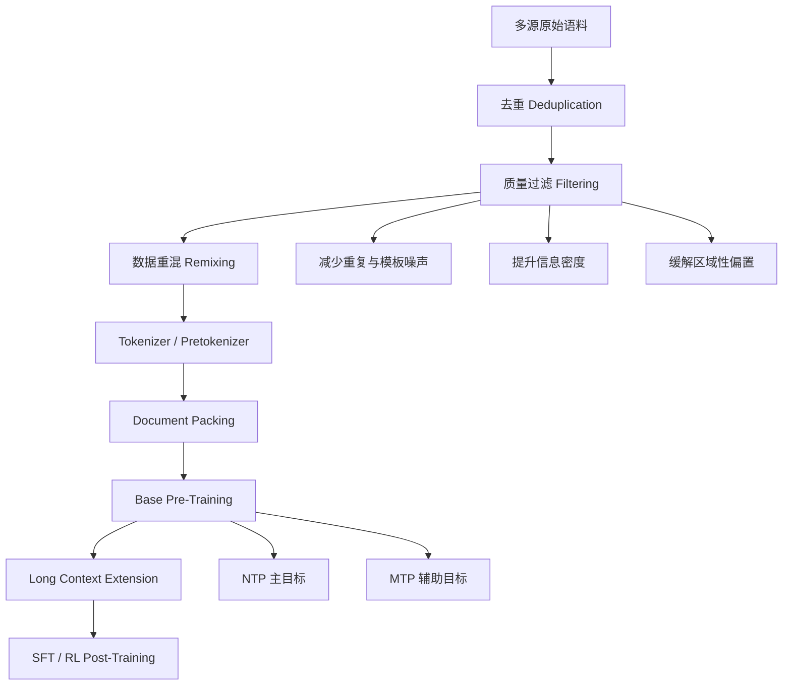
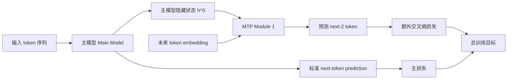

# Pretraining Strategies

## 关键结论

DeepSeek 的预训练策略并不是“把更多 token 喂给更大的模型”这么简单，而是把 **数据质量、训练目标、阶段化调度、系统效率** 联合起来做优化。它的核心思路可以概括成四点：

- 数据管线的目标不是单纯扩容，而是提高 **有效信息密度**，通过激进去重、质量过滤、重混与去偏，减少无效梯度和重复 token 对训练预算的消耗 [DeepSeek LLM, Section 2.1; DeepSeek-V2, Section 3.1.1]。
- DeepSeek 并没有把 Curriculum Learning 明确表述为独立算法模块；更准确的说法是 **阶段化训练调度**：先稳定地学基础分布，再扩上下文、再加更强训练目标，以减少一次性同时优化多个难目标导致的训练不稳 [DeepSeek-V2, Section 3.1.4; DeepSeek-V3, Section 4.3]。
- DeepSeek-V3 引入 **Multi-Token Prediction (MTP)**，把每个位置的训练信号从“只预测下一个 token”扩展为“同时学习更远一步的未来 token”，从而增加监督密度，并鼓励模型学习更具前瞻性的表示 [DeepSeek-V3, Section 2.2]。
- 这些策略与 FP8、DualPipe、跨节点 all-to-all 优化并不是平行关系，而是同一套优化哲学的不同层次：**先把训练效率榨出来，再把节省下来的预算投回模型能力** [DeepSeek-V3, Introduction; DeepSeek-V3, Section 3].

换句话说，DeepSeek 的预训练路线并不是“论文技巧拼盘”，而是一种很明确的系统观：**让每一份训练算力尽量落在高价值 token、稳定的长程训练和更强的表示学习目标上**。

## 本页在系列中的位置

- 这一页回答的是：**DeepSeek 在进入 SFT、RL 和 distillation 之前，先把怎样的 base model 底座训练出来。**
- 它是训练主线的起点：如果不先理解数据、训练目标和阶段化调度，后面的 `RL and Alignment` 很容易被误读成“凭空让模型突然变聪明”。
- 如果你更关心 post-training，下一页直接读 `rl_and_alignment.md`；如果你更关心“为什么后续 reasoning 能被放大”，这一页里的数据密度与 MTP 才是前置原因。

## 背景 / 问题定义

### 为什么“更多 token”不等于“更强模型”

当大模型进入万亿 token 规模后，预训练的主矛盾不再只是“语料够不够多”，而是：

1. 这些 token 是否包含足够高的有效信息密度；
2. 重复、模板化、低质量、强噪声内容会不会把计算预算浪费在无效学习上；
3. 模型是否能在不显著抬升训练不稳定性的前提下，学到更强的长程建模和规划能力；
4. 系统栈能否支撑更长上下文、更复杂目标和更大的并行规模。

DeepSeek 的几代论文实际上持续围绕这四个问题迭代。DeepSeek LLM 把数据工程明确拆成 **deduplication、filtering、remixing** 三个阶段 [DeepSeek LLM, Section 2.1]；DeepSeek-V2 在此基础上继续提高高质量数据比例、增加中文语料、过滤 contentious content [DeepSeek-V2, Section 3.1.1]；DeepSeek-V3 则进一步把重点放到 **减少冗余、保留多样性、提高数学和代码样本占比、扩展多语种覆盖** 上 [DeepSeek-V3, Section 4.1]。

因此，DeepSeek 的预训练更像在回答一个工程问题：**在固定训练预算下，怎样让模型看到的 token 更值钱**。

### 这页关注什么，不关注什么

本页聚焦 DeepSeek 预训练阶段里最直接影响 reasoning 底座的部分：

- 数据清洗与质量控制；
- 阶段化训练调度；
- Multi-Token Prediction；
- 与主流 Llama / GPT 风格预训练策略的差异。

本页**不深入展开** MLA、MoE、FP8 的数学细节，只在“为什么这些训练策略需要系统支持”这个层面轻量提及，因为它们不是这页的主角。

## 核心机制

### 数据管线：从“收集语料”到“筛选有效梯度”

DeepSeek LLM 最早把数据工程拆成三个动作：

- **Deduplication**：扩大去重范围，减少重复文档；
- **Filtering**：从语言与语义两侧评估文档质量；
- **Remixing**：重配不同来源与领域的比例，提升多样性与代表性 [DeepSeek LLM, Section 2.1]。

这三个动作非常关键，因为它们分别对应三类训练浪费：

- 重复样本造成的重复梯度；
- 低质量样本导致的噪声学习；
- 领域失衡带来的能力偏科。

DeepSeek-V2 延续这一逻辑，但更强调语料质量提升而不是只做规模扩充。论文明确写到：

- 扩大高质量多源语料；
- 增加中文数据占比；
- 改进 quality-based filtering algorithm；
- 过滤 contentious content 以减轻区域文化偏置 [DeepSeek-V2, Section 3.1.1]。

到 DeepSeek-V3，重点进一步转向更细粒度的语料结构优化：

- 提高数学与编程样本比例；
- 在英语、中文之外扩展更多多语种覆盖；
- refined data processing pipeline 以 **minimize redundancy while maintaining corpus diversity** [DeepSeek-V3, Section 4.1]。

这里有一个重要判断：DeepSeek 预训练里的“数据优化”并不是简单的数据清洗流水线，而是在主动调整模型会把训练预算花在哪些能力上。数学、代码、推理痕迹密度更高的数据，直接决定了后续 SFT 与 RL 能从 base model 中放大出多少 reasoning 潜力 [DeepSeek-R1, Appendix A.1]。

### 数据质量控制：去重、过滤、去偏不是配角

DeepSeek LLM 对去重的描述很直接：把 deduplication 的范围从单次 crawl dump 扩大到更大的全局范围后，去重率显著提升 [DeepSeek LLM, Section 2.1]。这背后的逻辑并不复杂：

- 如果相似网页、转载内容、镜像页面大量重复出现，模型会不断消费近似相同的 token；
- 这些 token 虽然会降低训练 loss，但对知识边界和泛化能力的贡献有限；
- 对大模型而言，这类“低难度重复梯度”会稀释掉更有价值的长尾知识与复杂模式。

Filtering 的意义则更像做 **信息密度筛选**。DeepSeek LLM 明确说 filtering 同时包含 linguistic 和 semantic 评估 [DeepSeek LLM, Section 2.1]。DeepSeek-V2 则进一步说明，目标是“移除大量 non-beneficial data，同时尽可能保留 valuable data” [DeepSeek-V2, Section 3.1.1]。这说明他们关心的不是绝对纯净，而是**高收益 token 占比**。

去偏（debias）策略也值得注意。DeepSeek-V2 提到会过滤 contentious content，以减轻特定区域文化偏置 [DeepSeek-V2, Section 3.1.1; Appendix E]。这并不意味着模型就天然“中立”，而是说明 DeepSeek 试图在预训练阶段先把过强、局部、不可控的偏置源压一压，避免这些分布在对齐阶段之前就写进 base model 的先验中。

### Tokenizer 与 pretokenizer 也是数据治理的一部分

DeepSeek 的数据质量控制并不止于“文档级过滤”，还延伸到 tokenization 细节。

DeepSeek LLM 采用 Byte-level BPE，并把数字拆分为单独 digits，这是一种偏保守但稳定的设计，能够避免某些长数字串直接变成稀有 token [DeepSeek LLM, Section 2.1]。

DeepSeek-V3 在 pretokenizer 上做了更细的工程调整：引入将标点和换行合并的 token，以提高压缩效率，但同时也承认这会带来 **token boundary bias**。为缓解这一问题，他们在训练时随机拆分部分组合 token，让模型暴露在更多边界情况中 [DeepSeek-V3, Section 4.1]。

这个细节很小，但很能体现 DeepSeek 的做法：**只要某个局部实现会在长训练中系统性放大偏差，就把它当成预训练工程的一部分来修**。

## 图表清单

- 预训练流程图：展示数据清洗、打包、base pretrain、长上下文扩展、SFT/RL 的整体关系。
- 数据质量控制对照表：对比去重、过滤、去偏、tokenizer 噪声治理分别在解决什么问题。
- DeepSeek 各代预训练策略演进表：展示 DeepSeek LLM / V2 / V3 在数据、目标、上下文与系统设计上的变化。
- NTP vs MTP 对比表：比较监督密度、实现复杂度、对推理能力的潜在影响。

### 预训练流程图



## 数学基础

### 传统 Next-Token Prediction 的目标

标准自回归预训练可以写成：给定前缀 $x_{<t}$，最大化当前位置 token 的条件概率：

$$
\mathcal{L}_{\mathrm{NTP}} = -\frac{1}{T} \sum_{t=1}^{T} \log p_\theta(x_t \mid x_{<t})
$$

这个目标简单、稳定、可扩展，是几乎所有主流 Transformer 预训练的默认选择。但它也有一个天然限制：**每个位置只给一个一步预测信号**。模型当然能通过隐藏状态隐式学到更远未来的信息，但训练目标本身并没有显式鼓励它为未来多个 token 做规划。

### MTP 的基本动机

DeepSeek-V3 借鉴 Multi-Token Prediction 思路，并把它改造成适合自己架构的顺序式实现 [DeepSeek-V3, Section 2.2]。论文给出的两个直接动机是：

1. **densify training signal**：在同一个位置上提供更密集的监督；
2. **pre-plan representations**：鼓励主模型表示不仅服务下一个 token，也服务更远未来 token 的预测 [DeepSeek-V3, Section 2.2]。

如果把第 $k$ 个额外预测深度的输出概率记为 $P^{k}_{i+k+1}$，则 MTP 在第 $k$ 层深度上的交叉熵损失为：

$$
\mathcal{L}^{k}_{\mathrm{MTP}} = -\frac{1}{T} \sum_{i=2+k}^{T+1} \log P_i^k[x_i]
$$

最终总的 MTP 辅助损失是各深度损失的平均，再乘以一个权重因子 $\lambda$：

$$
\mathcal{L}_{\mathrm{MTP}} = \frac{\lambda}{D} \sum_{k=1}^{D} \mathcal{L}^{k}_{\mathrm{MTP}}
$$

其中 $D$ 是多 token 预测深度 [DeepSeek-V3, Section 2.2]。

### DeepSeek-V3 的顺序式 MTP

与并行地直接给多个 future-token head 不同，DeepSeek-V3 的 MTP 采用 **sequential modules**：

- 第 $k$ 个 MTP module 接收前一深度的表示 $h_i^{k-1}$；
- 与第 $i+k$ 个 token 的 embedding 拼接后，经投影和一个 Transformer block；
- 再预测更远一步的 token [DeepSeek-V3, Section 2.2]。

其核心输入拼接形式可写为：

$$
h_i'^k = M_k [\mathrm{RMSNorm}(h_i^{k-1}); \mathrm{RMSNorm}(\mathrm{Emb}(t_{i+k}))]
$$

这里最值得注意的，不是公式本身，而是 DeepSeek-V3 明确强调 **保留完整 causal chain**。也就是说，MTP 不是并列多头“猜几个未来词”，而是让附加模块沿着一个受因果约束的未来预测路径逐层往前看 [DeepSeek-V3, Section 2.2]。这更像在给模型增加一种轻量级的“未来规划练习”，而不是单纯多打一份标签。

## 工程实现

### DeepSeek 的“Curriculum Learning”更准确地说是阶段化调度

用户常会把这类训练描述成 curriculum learning，但从论文证据看，DeepSeek 并没有把 Curriculum Learning 当成独立算法模块展开，也没有给出典型的 easy-to-hard 样本调度公式或课程难度打分。因此，更准确的表达应当是：

**DeepSeek 采用的是阶段化训练调度（stage-wise training schedule），而不是显式课程学习算法。**

这个阶段化体现在三个层面：

1. **数据层阶段化**：持续提高数学、代码和高质量多语种内容占比 [DeepSeek-V2, Section 3.1.1; DeepSeek-V3, Section 4.1]；
2. **上下文层阶段化**：先做基础长度预训练，再扩到 32K、128K [DeepSeek-V2, Section 3.1.4; DeepSeek-V3, Section 4.3]；
3. **目标层阶段化**：以 NTP 为主目标，在 V3 中再加入 MTP 辅助目标 [DeepSeek-V3, Section 2.2]。

这种路线的工程含义是：不要在训练一开始就同时把“长上下文、复杂未来预测、巨大 batch、多并行通信”全部压到模型身上。先把基础分布学稳，再逐步加难度，训练更可控。

### 长上下文扩展本身也是训练策略的一部分

DeepSeek-V2 先完成主预训练，再用 YaRN 把上下文扩到 128K [DeepSeek-V2, Section 3.1.4]。DeepSeek-V3 更进一步，明确采用两阶段上下文扩展：

- 第一阶段扩到 32K；
- 第二阶段再扩到 128K [DeepSeek-V3, Introduction; Section 4.3]。

这其实就是一种非常工程化的课程安排。原因很简单：

- 长上下文训练会显著抬升显存和通信成本；
- 如果在模型尚未学稳基础语言分布时就强行拉长上下文，优化信号会更稀、成本更高；
- 先在较短长度上学到稳定 base distribution，再把位置编码与上下文外推能力补上，性价比更高。

因此，DeepSeek 的上下文扩展不是孤立步骤，而是预训练策略的一部分：**先解决“会不会学”，再解决“能不能看得更长”**。

### MTP 的实现为什么不是“顺手加几个 head”

DeepSeek-V3 的 MTP 看似只是多了个辅助损失，但实现上其实很讲究。

论文给出几个关键工程点：

- MTP module 使用 **shared embedding layer** 与 **shared output head**，避免显著膨胀参数量 [DeepSeek-V3, Section 2.2]；
- 在训练框架层面，DeepSeek-V3 把浅层和深层部署在同一 PP rank，从而让 MTP 与主模型物理共享 embedding 与 output head 参数与梯度 [DeepSeek-V3, Section 3.2.3]；
- 在默认配置中，MTP 深度设置为 $D = 1$，即除了 next token，再额外预测一个 token [DeepSeek-V3, Section 4.2]；
- 推理时可直接丢弃 MTP 模块，主模型仍可独立运行；如果需要，也可把它复用于 speculative decoding [DeepSeek-V3, Section 2.2]。

这组细节说明 DeepSeek 的目标不是“做一个很花哨的训练任务”，而是：**把更强的训练目标压缩到尽量可承受的额外成本里**。

### 工程落地时最值得记住的三个点

如果把这页内容压缩成面向工程实践的 checklist，有三个点最值得反复记住：

1. **先做数据 ROI，再谈模型 ROI。** 在万亿 token 级训练里，数据去重、质量过滤和领域重混并不是外围清洗，而是直接决定单位算力产出的主工程项 [DeepSeek LLM, Section 2.1; DeepSeek-V2, Section 3.1.1]。
2. **长上下文最好分阶段扩，不要一步到位。** DeepSeek-V2/V3 的做法都说明，先学稳短上下文基础分布，再扩到 32K/128K，更符合训练稳定性与成本控制需求 [DeepSeek-V2, Section 3.1.4; DeepSeek-V3, Section 4.3]。
3. **更强目标函数必须和系统成本一起设计。** MTP 的价值不只在于更密集监督，还在于 DeepSeek 同时设计了共享 embedding / output head、物理参数共享和推理期可丢弃模块，确保收益不会被额外成本吃掉 [DeepSeek-V3, Section 2.2; Section 3.2.3]。

### DeepSeek 在预训练阶段的系统性优化哲学

如果把 DeepSeek 的预训练拆开看，很容易误以为它只是把若干局部优化拼在了一起：数据去重、质量过滤、长上下文扩展、MTP、FP8、并行优化，各管一摊。但从几篇论文连起来看，更准确的理解是：DeepSeek 在做一种 **end-to-end 的训练预算重分配**。

- 在数据侧，目标是减少重复 token、低价值 token 和高噪声 token 对训练预算的侵占 [DeepSeek LLM, Section 2.1; DeepSeek-V2, Section 3.1.1]；
- 在目标侧，目标是让单个 token 位置产生更高密度的学习信号，而不只服务 one-step prediction [DeepSeek-V3, Section 2.2]；
- 在调度侧，目标是避免一上来同时优化长上下文、复杂目标与重通信训练，降低训练不稳风险 [DeepSeek-V2, Section 3.1.4; DeepSeek-V3, Section 4.3]；
- 在系统侧，目标是把原本会被算力、显存、带宽吃掉的成本重新压缩出来，再投回模型能力提升 [DeepSeek-V3, Introduction; Section 3]。

所以 DeepSeek 的“系统性优化哲学”可以浓缩成一句话：**不是一味加预算，而是先减少预算浪费，再把省下来的预算用来训练更强的模型行为。**

### DeepSeek 各代预训练策略演进

| 版本 | 数据策略 | 训练目标 | 上下文策略 | 系统意图 | 对 reasoning 底座的意义 |
| --- | --- | --- | --- | --- | --- |
| DeepSeek LLM | 去重 + 过滤 + 重混 | 标准 NTP | 4K 级基础训练 | 建立稳定高质量 bilingual 语料底座 | 先提升基础语言与知识覆盖 [DeepSeek LLM, Section 2.1] |
| DeepSeek-V2 | 提高高质量多源数据、增中文、去偏 | 标准 NTP | 训练后扩到 128K | 把预算从重复 token 挪到更高价值数据与长上下文 | 为数学、代码、中文与长上下文能力打底 [DeepSeek-V2, Section 3.1.1; Section 3.1.4] |
| DeepSeek-V3 | 提高数学/代码比例、扩多语种、减少冗余保多样性 | NTP + MTP | 32K → 128K 两阶段扩展 | 在不显著破坏训练稳定性的前提下增强未来规划能力 | 为后续 reasoning、speculative decoding、R1 蒸馏提供更强 base checkpoint [DeepSeek-V3, Section 2.2; Section 4.1; DeepSeek-R1, Appendix A.1] |

### 数据质量控制策略表

| 策略 | 解决的问题 | DeepSeek 做法 | 工程含义 | 证据边界 |
| --- | --- | --- | --- | --- |
| Deduplication | 重复文档、重复梯度 | 扩大去重范围，做更激进去重 | 提高 token 利用率 | 未给出去重算法与阈值细节 [DeepSeek LLM, Section 2.1] |
| Filtering | 低质量、低信息密度语料 | 基于语言与语义的质量过滤 | 让训练预算更多落在高价值 token 上 | 未公开完整打分函数 [DeepSeek LLM, Section 2.1; DeepSeek-V2, Section 3.1.1] |
| Debias / contentious filtering | 特定区域文化偏置过强 | 过滤 contentious content | 降低预训练先验中的强局部偏置 | 只说明策略目标，未展开细节 [DeepSeek-V2, Section 3.1.1; Appendix E] |
| Document packing | 文档边界浪费 | V3 采用 document packing，且不加 cross-sample attention masking | 提高训练效率，同时保持较强数据连续性 | 文中未进一步解释为何不加 cross-sample mask [DeepSeek-V3, Section 4.1] |
| Tokenizer / Pretokenizer mitigation | token boundary bias、压缩效率 | 标点+换行组合 token，训练时随机拆分一部分 | 同时优化压缩效率与鲁棒性 | 文中未给出拆分比例 [DeepSeek-V3, Section 4.1] |

### MTP 机制图



### NTP vs MTP 对比

| 维度 | NTP | MTP |
| --- | --- | --- |
| 训练监督 | 每个位置只监督下一个 token | 每个位置同时监督更远未来 token |
| 训练信号密度 | 较低 | 更高，论文明确称其 densify training signals [DeepSeek-V3, Section 2.2] |
| 表示倾向 | 偏局部一步预测 | 更鼓励对未来结构进行前瞻性编码 |
| 实现复杂度 | 最低 | 更高，需要额外模块、损失、共享参数设计 |
| 推理时依赖 | 训练/推理完全一致 | 推理时可丢弃附加模块，也可复用为 speculative decoding |
| 对代码/数学潜在帮助 | 主要靠隐藏状态隐式学习长程结构 | 更可能强化对未来步骤与结构的规划能力 |
| 代价 | 简单稳定 | 更复杂，且论文未全面量化其对所有收敛指标的提升 |

### 简化版 MTP 训练循环

```python
for batch in dataloader:
    tokens = batch["input_ids"]

    # 主模型 next-token 预测
    main_hidden, ntp_logits = model(tokens)
    loss_ntp = cross_entropy(
        ntp_logits[:, :-1, :],
        tokens[:, 1:]
    )

    mtp_losses = []
    prev_hidden = main_hidden

    for k in range(1, mtp_depth + 1):
        future_embed = embed(tokens[:, k:])
        mtp_hidden = mtp_modules[k - 1](prev_hidden[:, :-k, :], future_embed)
        mtp_logits = lm_head(mtp_hidden)
        mtp_loss = cross_entropy(
            mtp_logits[:, :-1, :],
            tokens[:, k + 1:]
        )
        mtp_losses.append(mtp_loss)
        prev_hidden = mtp_hidden

    loss_mtp = lambda_mtp * sum(mtp_losses) / len(mtp_losses)
    loss = loss_ntp + loss_mtp

    loss.backward()
    optimizer.step()
    optimizer.zero_grad()
```

这段伪代码表达的是 DeepSeek-V3 的核心思路：**主模型继续做标准 NTP，但额外模块顺着因果链再往未来多看一步**。真实实现中还会包含更精细的共享参数、并行与内存优化 [DeepSeek-V3, Section 2.2; Section 3.2.3]。

## Design trade-offs

### 为什么 DeepSeek 要这样设计

DeepSeek 的预训练设计本质上在追求一个很明确的目标：**把算力从“无效 token 和训练噪声”转移到“更值钱的表示学习”上**。这会带来几个具体选择：

1. **优先清理数据冗余，而不是只拼命扩语料规模**。因为重复数据会让 loss 好看，但不一定让能力边界明显变宽。
2. **不把长上下文一开始就拉满**。因为那会显著提升系统成本和训练难度，收益却未必同步兑现。
3. **在模型已经具备较好基础分布后，再加入 MTP 这类更强的目标**，让模型的未来规划能力在更稳的底座上增长。
4. **让训练目标和推理效率挂钩**。MTP 不只是训练技巧，也给 speculative decoding 预留了接口 [DeepSeek-V3, Section 2.2]。

### 这些设计换来了什么，又牺牲了什么

| 设计 | 收益 | 代价 |
| --- | --- | --- |
| 更激进去重与过滤 | 更高 token 利用率、更干净的训练信号 | 数据工程更重，且容易误删有价值长尾内容 |
| 增加数学/代码密度 | 强化 reasoning 与代码能力底座 | 有可能压缩部分开放域知识分布 |
| 两阶段长上下文扩展 | 训练更稳，预算更可控 | 训练流程更长、更复杂 |
| MTP | 更密集监督、更强未来规划倾向，可支持 speculative decoding | 实现复杂度更高，且论文没有把所有收益做成完整统一量化 |
| 更复杂的 tokenizer / pretokenizer 修正 | 减少边界偏差，提高压缩效率 | 预处理链条更难维护 |

### 为什么不走更常见的主流方案

与主流 Llama 风格预训练相比，DeepSeek 的差别主要不是“架构不同”，而是更强调：

- **代码 / 数学 / reasoning 相关数据密度**；
- **系统性地减少无效 token**；
- **把未来规划能力写进训练目标，而不只靠 next-token objective 让它自发涌现**。

如果用一句话概括：Llama 风格路线更像“先把通用底座做大做稳”，而 DeepSeek 则更像“在通用底座上更激进地押注高价值分布和训练目标”。

## 与主流方案对比

### 与 Llama 风格预训练的对比

| 维度 | 主流 Llama 风格 | DeepSeek 路线 |
| --- | --- | --- |
| 数据哲学 | 强调大规模高质量通用语料 | 同样重视质量，但更强调减少冗余并提高数学/代码密度 |
| 上下文扩展 | 通常作为后续能力扩展 | 明确纳入阶段化训练策略 |
| 训练目标 | 以 NTP 为绝对主轴 | 在 V3 中引入 MTP 辅助目标 |
| 对 reasoning 的准备 | 主要依赖预训练自然涌现 + 后续对齐 | 在预训练阶段就提高 reasoning 相关数据密度与目标强度 |

### 与传统 GPT 风格公开范式的对比

公开 GPT 技术报告通常披露较少预训练细节，因此无法逐项精确对照。但若从公开方法高层比较，DeepSeek 的特征更鲜明地体现在：

- 明确公开 MTP 这类训练目标升级；
- 明确公开数据冗余控制与预训练去偏思路；
- 明确把训练效率、并行通信、低精度训练与模型能力增益放在同一个优化框架中 [DeepSeek-V3, Introduction; Section 3]。

也就是说，DeepSeek 在公开文献中展示出的不是单个新 trick，而是一种更完整的 **pretraining system design**。

## 小结 / 启示

DeepSeek 的预训练策略给出的最大启示，不是“以后大家都应该照搬 MTP”，而是以下三点：

1. **高质量 token 比更多 token 更重要。** 当规模足够大后，重复样本和低密度语料的边际收益迅速下降。
2. **训练目标可以为后续 reasoning 路线提前铺路。** V3 的 MTP 并没有直接等于推理能力，但它确实让 base model 更偏向未来规划式表示，这为后续蒸馏与 RL 放大提供了更好的起点。
3. **预训练不应脱离系统实现单独讨论。** 如果没有 FP8、DualPipe、通信优化与显存管理，很多“更强训练目标”都只能停留在论文层面，而无法稳定大规模落地 [DeepSeek-V3, Section 3].

最后需要明确一点：DeepSeek 并没有把 Curriculum Learning 正式定义成一套显式课程算法，因此这里更稳妥的结论是——**DeepSeek 的预训练成功，来自高质量数据工程、阶段化训练调度与更强目标函数的协同，而不是某个单独的课程学习技巧。**

## 思考问题

- 如果训练预算固定，你会优先投入到更高质量数据、MTP，还是更长上下文继续训练？为什么？
- DeepSeek 预训练里的“阶段化调度”更像课程学习，还是更像风险控制？
- 数学/代码数据比例提高后，哪些能力最可能受益，哪些能力可能被挤压？