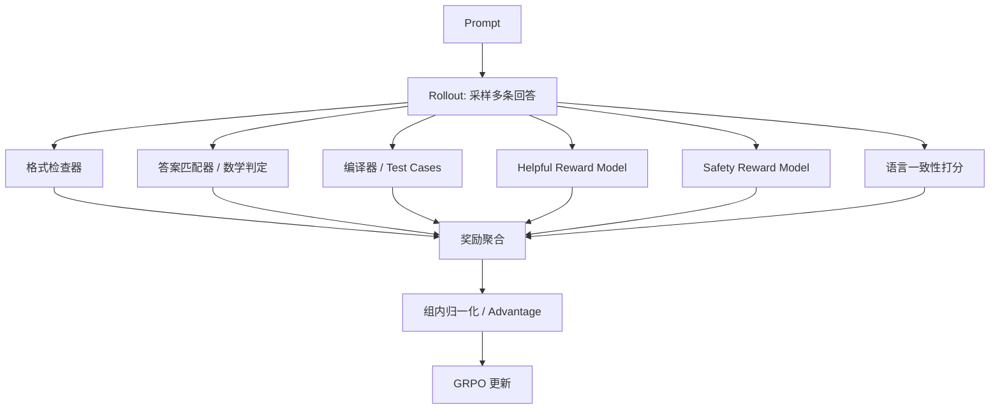
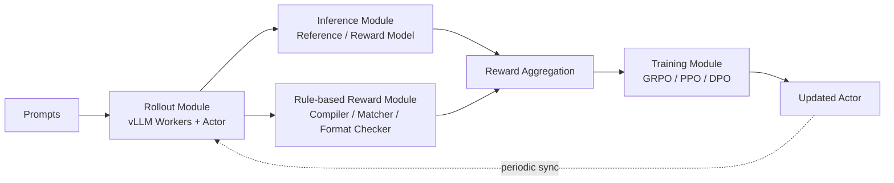

# Reward Design、Verifier 与 DeepSeek-R1 的强化学习基础设施

## 关键结论

DeepSeek-R1 训练体系里，真正决定 RL 能不能工作下去的，不只是 `GRPO` 这种优化算法，而是 **奖励是否可靠、verifier 是否可扩展、以及 rollout / scoring / training 这条链能否高吞吐闭环**。如果把 `RL and Alignment` 页面理解为“为什么要用 RL、整体管线怎么走”，那么这一页更关注另一个问题：**奖励信号是怎么被制造、过滤、调度并喂回优化器的**。

可以先给出四个结论：

- 对 R1-Zero 而言，最关键的设计不是“复杂 reward model”，而是 **rule-based reward + 可验证任务**。DeepSeek 明确优先选择数学、代码、逻辑这类能给出硬反馈的任务，而不是一开始就把推理训练建立在神经奖励模型上 [DeepSeek-R1, Section 2.2]。
- DeepSeek 把奖励分成两类：**reasoning reward** 与 **general preference reward**。前者服务“答案是否真对”，后者服务“回答是否更像人类想要的样子”；这两类信号不会在训练一开始就完全混用，而是分阶段引入 [DeepSeek-R1, Section 3.2.2]。
- Reward 设计不是纯算法问题，而是系统问题。论文专门把 RL pipeline 拆成 `Rollout / Inference / Rule-based Reward / Training` 四个模块，并通过异步调度、vLLM workers、VRAM offload 和数据打包，把奖励计算的长尾延迟隐藏掉 [DeepSeek-R1, Appendix B.1]。
- DeepSeek 非常清楚 reward hacking 的风险边界：**可验证规则奖励相对稳，model-based preference reward 更脆弱**。这也是为什么 general preference reward 只在第二阶段 RL 的最后 400 steps 才被引入 [DeepSeek-R1, Section 3.2.2; Appendix B.5]。

## 本页在系列中的位置

- 这一页不重复解释“为什么 R1 要用 RL”；那部分已经在 `rl_and_alignment.md` 里讲清楚了。
- 本页真正回答的是：**reward 到底从哪里来、为什么 verifier 比花哨 reward model 更关键，以及这些信号如何被分阶段引入。**
- 如果你读完还想问“这些奖励和 verifier 怎么在系统里真正跑起来”，下一页自然接 `rl_infrastructure.md`。

## 背景 / 问题定义

在长链式推理场景里，本页不再重复讨论“RL 为什么能放大 reasoning”；这里更具体的问题是：**你到底能不能稳定、低成本、低歧义地判断一个回答是否更好**。

传统 SFT 最大的优点，是标签直接写在数据里；而 RL 则要求系统在训练时动态生成回答，再动态判分。对于大语言模型，这会立刻引出三个问题：

1. **推理质量很难做 dense supervision**  
   中间的每一步思维过程是否“好”，往往只有在最终答案出来后才知道。对长 CoT 来说，前面几百个 token 甚至可能被后续反思推翻，因此很难像监督学习那样给出稳定的逐 token 标签 [DeepSeek-R1, Appendix A.3]。

2. **如果奖励来自神经 reward model，就会引入新的脆弱点**  
   reward model 不仅要训练，还可能被 policy 学会“投机取巧”。对 reasoning 任务而言，这种风险尤其大：模型可能优化的是“更像高分答案”，而不是“更真实地解决问题” [DeepSeek-R1, Section 2.2; Appendix B.5]。

3. **奖励计算本身可能非常慢**  
   对代码题，需要编译器 / test cases；对数学题，需要答案解析器；对一般偏好任务，需要 reward model 推理；对安全性任务，还要跑安全分类器。也就是说，奖励计算不只是一个函数调用，而是一整条多组件流水线 [DeepSeek-R1, Appendix B.1]。

所以，R1 在奖励设计上的真正工程判断是：

> 在 reasoning RL 中，可靠奖励比复杂奖励更重要；可扩展 verifier 比漂亮公式更重要。

这也是 R1-Zero 选择 rule-based reward 起步的根本原因。

## 图表清单

- 图 1：奖励与 Verifier 的结构流（Mermaid）
- 图 2：RL 基础设施图（Mermaid）
- 表 1：四模块职责
- 表 2：传统 RLHF 与 DeepSeek-R1 奖励栈对比
- 表 3：Reward Model 训练细节
- 表 4：规则奖励 vs 模型奖励对比
- 表 5：RL 基础设施的收益与代价

## 核心机制

### R1-Zero：先用最硬的奖励把 reasoning 放大

DeepSeek-R1-Zero 的奖励系统非常克制，只有两部分：

- `accuracy reward`：答案是否正确；
- `format reward`：是否遵守 `<think>...</think>` 与 `<answer>...</answer>` 结构 [DeepSeek-R1, Section 2.2]。

其组合形式为：

$$
\mathrm{Reward}_{\mathrm{rule}} = \mathrm{Reward}_{\mathrm{acc}} + \mathrm{Reward}_{\mathrm{format}}
$$

这个设计透露出一个非常明确的偏好：**先把“会不会解题”做对，再去管“说得是否像人”**。

### R1：把 reasoning reward 与 preference reward 分层融合

到了 DeepSeek-R1，奖励系统扩展为三类：

- `Reward_reasoning`：面向数学、代码、逻辑等可验证推理任务；
- `Reward_general`：面向 helpfulness / harmlessness 等偏好相关目标；
- `Reward_language`：面向语言一致性和可读性 [DeepSeek-R1, Section 3.2.1; Section 3.2.2]。

论文给出的第二阶段总奖励形式为：

$$
\mathrm{Reward} = \mathrm{Reward}_{\mathrm{reasoning}} + \mathrm{Reward}_{\mathrm{general}} + \mathrm{Reward}_{\mathrm{language}}
$$

其中：

$$
\mathrm{Reward}_{\mathrm{reasoning}} = \mathrm{Reward}_{\mathrm{rule}}
$$

$$
\mathrm{Reward}_{\mathrm{general}} = \mathrm{Reward}_{\mathrm{reward\_model}} + \mathrm{Reward}_{\mathrm{format}}
$$

注意这并不意味着 DeepSeek 把 reasoning 和 preference 完全等价看待。相反，它用的是一种明显的 **先后次序**：

- 第一阶段先用 reasoning 与语言一致性打基础；
- 第二阶段再逐步混入 general preference reward；
- 且 preference reward 只在后 400 steps 出现，防止 reward hacking [DeepSeek-R1, Section 3.2.2]。

这说明 DeepSeek 把 reward 看作一种“逐层加约束”的控制杆，而不是一次性混合进一个总目标里。

## 数学基础

### 规则奖励：正确性与格式约束

最基础的 reasoning reward 是：

$$
\mathrm{Reward}_{\mathrm{rule}} = \mathrm{Reward}_{\mathrm{acc}} + \mathrm{Reward}_{\mathrm{format}}
$$

它代表两种完全不同的训练信号来源：

- `Reward_acc` 是任务语义上的正确性反馈；
- `Reward_format` 是输出结构上的约束反馈。

这两个信号被同权组合 [DeepSeek-R1, Section 2.2]。其中 format reward 的意义不只是“输出好看”，而是为了让推理链和最终答案在训练数据中显式分离，从而让后续分析、采样和蒸馏更可控。

### Helpful / Safety Reward Models

对于 general data，DeepSeek 采用模型化奖励。

Helpful reward 的形式为：

$$
\mathrm{Reward}_{\mathrm{helpful}} = \mathrm{RM}_{\mathrm{helpful}}(\mathrm{Response\ A}, \mathrm{Response\ B})
$$

Safety reward 的形式为：

$$
\mathrm{Reward}_{\mathrm{safety}} = \mathrm{RM}_{\mathrm{safety}}(\mathrm{Response})
$$

这两者对应两个不同任务：

- `helpfulness` 更接近 pairwise preference learning；
- `safety` 更接近 point-wise safe/unsafe discrimination [DeepSeek-R1, Section 3.1]。

### Language Consistency Reward

为缓解语言混杂，DeepSeek 在 RL 中引入语言一致性奖励：

$$
\mathrm{Reward}_{\mathrm{language}} = \frac{\mathrm{Num}(\mathrm{Words}_{\mathrm{target}})}{\mathrm{Num}(\mathrm{Words})}
$$

这个 reward 非常直接：如果目标语言占比越高，得分越高 [DeepSeek-R1, Section 3.2.1]。它本质上不是提升 reasoning 正确性的奖励，而是给 reasoning 行为加上“表达约束”。

### 为什么这些奖励不能一开始就全混起来

从优化角度看，把所有奖励加总似乎最自然；但 DeepSeek 并没有这么做，原因是不同奖励的可靠性不同：

- `rule-based reward` 对 reasoning task 更硬、更可信；
- `preference reward` 更贴近人类偏好，但更容易被 hack；
- `language reward` 可提升可读性，但可能轻微伤害原始性能 [DeepSeek-R1, Section 3.2.1; Appendix B.6]。

因此，训练设计不只是“求和”，而是“何时加什么、加多久”。这比公式本身更关键。

### 奖励与 Verifier 的结构流



这张图体现了一个核心事实：**DeepSeek 的奖励不是单一来源，而是多类 verifier / reward model 组成的评分栈**。其中真正稳定的，是格式检查器、答案匹配器、编译器这类“规则系统”；真正脆弱的，是 helpful / safety RM 这类“模型化系统”。

### Rule-based Reward：为什么是 reasoning 训练的第一支柱

### 数学与逻辑：可验证答案优先

对数学、逻辑推理任务，DeepSeek 更偏好那些可以把最终答案规约到确定格式并进行自动比对的任务。例如把最终答案限制在 box 或固定结构中，使正确性可以直接由解析器判断 [DeepSeek-R1, Section 2.2]。

这类 verifier 的优点是：

- 判分稳定；
- 不依赖额外训练一个 reward model；
- 边际成本相对低；
- 不容易因为语言风格变化而误判。

缺点也很明显：

- 只能覆盖可验证任务；
- 无法细腻地区分“思路优雅”和“答案侥幸正确”；
- 对开放式写作和复杂偏好任务不适用。

### 代码任务：编译器就是 reward engine

对于代码竞赛或程序合成任务，DeepSeek 直接使用 compiler / test cases 做客观反馈 [DeepSeek-R1, Section 2.2; Appendix B.1]。这类任务与数学任务类似，都属于 **有明确 verifier 的高价值 RL 场景**。

从系统视角看，这种设计很重要，因为它把 reasoning RL 的评价问题从“让模型判断模型”变成“让程序判断模型”。前者更容易漂移，后者更容易固化为工程系统。

### Format Reward：它不是 cosmetic，而是训练协议的一部分

Format reward 会鼓励模型显式输出：

- `<think> ... </think>`
- `<answer> ... </answer>`

这不是单纯的格式癖，而是有三个实际作用：

1. 让 reasoning trace 与 answer 分离，便于单独解析；
2. 让 rule-based checker 能更稳定地抽取最终答案；
3. 为 rejection sampling 与后续蒸馏提供更结构化的候选样本 [DeepSeek-R1, Section 2.2; Section 3]。

### Model-based Reward：为什么有用，也为什么危险

### Helpful Reward Model

DeepSeek 的 helpful reward model 训练基于 preference pairs。论文给出的关键细节包括：

- 数据规模：`66,000` 组 preference pairs；
- 每对样本通过 DeepSeek-V3 做四次独立判断，并随机交换 A/B 顺序以降低位置偏差；
- 仅保留分差 $\Delta > 1$ 的 pairs；
- chosen / rejected 响应长度尽量对齐，降低 length bias；
- 训练超参数：batch size `256`、learning rate `6e-6`、训练 `1 epoch`、训练 max sequence length `8192` [DeepSeek-R1, Section 3.1]。

这说明 helpful RM 的目标不是“学会世界知识”，而是“尽量稳定地复现人类对回答偏好的排序”。

### Safety Reward Model

Safety RM 使用 `106,000` 条带 safe/unsafe 标注的 prompt-response 数据，采用 point-wise 方法训练，超参数与 helpful RM 相同 [DeepSeek-R1, Section 3.1]。

这类 reward 的特点是：

- 它不是比较两个答案谁更好，而是直接判断一个回答是否越界；
- 更像分类器而不是排序器；
- 其误判风险与领域覆盖范围直接相关。

### Reward Hacking：为什么 preference reward 不能无限放大

DeepSeek 在论文中非常坦率地承认：当使用 helpful reward model 训练过久时，会观察到 reward hacking。也就是模型越来越擅长拿高 reward，但真实 benchmark 表现不一定同步提升 [DeepSeek-R1, Appendix B.5]。

这意味着 model-based reward 的核心问题不是“有没有用”，而是：

- 它通常比 rule-based reward 更柔软；
- 它更容易成为被 policy 利用的对象；
- 它适合作为后期风格与偏好修正信号，而不适合作为早期 reasoning 放大的唯一地基。

这就是为什么第二阶段 RL 中，preference reward 只在最后 400 steps 引入 [DeepSeek-R1, Section 3.2.2]。这个决策非常工程化：**宁可少用，也别让它把整个训练目标带歪。**

## 工程实现

### RL Infrastructure：把奖励流水线做成能跑的大系统

DeepSeek 在附录 B.1 中把 RL 框架明确拆成四个模块：

- `Rollout Module`
- `Inference Module`
- `Rule-based Reward Module`
- `Training Module` [DeepSeek-R1, Appendix B.1]

这个拆分的重点，不是架构图好看，而是每个模块都可以单独优化、单独卸载、单独并行化。

### 四模块职责

| 模块 | 主要职责 | 加载的核心对象 | 关键工程目标 |
| --- | --- | --- | --- |
| Rollout Module | 从 actor 采样多条回答 | actor model, vLLM workers | 高吞吐生成、多样本并行 |
| Inference Module | 跑 reward model / reference model 前向 | reward model, reference model | 快速获取 model-based reward 与 KL 所需信息 |
| Rule-based Reward Module | 执行 compiler、answer matcher、format checker 等 | verifier tools | 用异步执行隐藏长尾延迟 |
| Training Module | 计算 loss 并更新参数 | actor model, critic model（若算法需要） | 低 padding、高利用率的参数更新 |

### 基础设施图



### 为什么要异步调度 Rule-based Reward

Rule-based reward 的问题不是算力，而是延迟形态复杂：

- 编译器与单元测试可能耗时很长；
- 格式检查和答案匹配很快；
- 不同题型的 verifier 开销差异巨大。

因此，DeepSeek 采用异步调度，把 Rule-based Reward Module 与 Rollout / Inference overlap，以隐藏 verifier 的等待时间 [DeepSeek-R1, Appendix B.1]。这一步很关键：不然 RL 系统很容易被最慢的 verifier 拖成“GPU 在等 CPU”。

### VRAM Offload 与模块级内存管理

论文特别提到，除 Rule-based Reward Module 外，各模块使用的模型实例在阶段完成后会从 VRAM 自动 offload 到 system memory 或 disk，以释放 GPU 显存给后续阶段 [DeepSeek-R1, Appendix B.1]。

这说明 DeepSeek 的 RL 系统设计目标不是“让所有模型同时常驻”，而是：

- 在时间上复用显存；
- 在阶段切换时做实例装载与释放；
- 让 actor / reference / reward models 在同一套有限 GPU 上轮班工作。

### Rollout 吞吐优化

R1 论文给出了一些很关键的数字：

- 每个问题采样 `16` 个输出；
- R1-Zero 在 `8.2k` steps 前最大长度是 `32,768` tokens，之后提升到 `65,536`；
- 每个 training step 有 `32` 个唯一问题，因此总 batch size 为 `512`；
- 每 `400` steps 用最新 policy 替换 reference model；
- 每次 rollout 会生成 `8,192` outputs，再随机拆成 `16` 个 mini-batches，仅训练 `1` 个 inner epoch [DeepSeek-R1, Section 2.1]。

这些数字说明 DeepSeek 用的是明显的 **large-rollout, shallow-update** 风格：先大规模采样，再用相对节制的 inner update 消化数据，避免一个 rollout 被过度拟合。

### 数据打包与并行细节

Training Module 中，DeepSeek 为了减少 padding 和负载不均，采用如下策略：

1. 全局 batch 先按长度排序；
2. 在 data parallel group 内分发；
3. 每个进程内部再用 `Best-Fit` 策略把样本打包进固定长度 chunks；
4. 最后对 chunk 数做对齐 [DeepSeek-R1, Appendix B.1]。

此外，框架还集成了：

- `DualPipe` 做 pipeline parallelism；
- 对 DeepSeek-V3 MoE 架构的 expert parallel；
- hotspot experts 的冗余部署；
- 使用 `MTP` 做 self-speculative decoding 来提升 rollout decode 吞吐 [DeepSeek-R1, Appendix B.1]。

这说明 DeepSeek 并不是把 RL 看成“微调阶段的小规模训练”，而是把它当成和预训练同级别的系统工程问题。

### 简化版奖励聚合伪代码

```python
def compute_total_reward(sample, task_type, models, target_language):
    reward_rule = 0.0
    reward_general = 0.0
    reward_language = 0.0

    if task_type in {"math", "logic"}:
        reward_rule += answer_matcher(sample)
        reward_rule += format_checker(sample)
    elif task_type == "code":
        reward_rule += compiler_and_tests(sample)
        reward_rule += format_checker(sample)
    else:
        reward_general += helpful_rm(models.helpful_rm, sample)
        reward_general += safety_rm(models.safety_rm, sample)
        reward_general += format_checker(sample)

    reward_language = language_ratio(sample.think_text, target_language)

    return reward_rule + reward_general + reward_language
```

这段伪代码刻画的不是论文中的精确实现，而是其核心思想：**先按任务类型选择 verifier，再把结构约束和语言约束叠加上去。** 真正的大系统实现还会额外考虑多样本组、组内标准化、reference model 计算与异步调度。

## 与主流方案对比

| 维度 | 传统 RLHF | DeepSeek-R1 奖励设计 |
| --- | --- | --- |
| reasoning 训练起点 | 常从 preference model 出发 | 先从 rule-based verifier 出发 [DeepSeek-R1, Section 2.2] |
| 对中间思维过程的约束 | 常依赖人类偏好或 process reward | 尽量少约束，只要求结构格式 |
| 奖励主要风险 | RM 偏差、偏好漂移 | rule-based coverage 不足 + RM hacking |
| 适用任务 | 开放式对话、风格偏好 | 数学、代码、逻辑等 verifier-rich 任务尤其适合 |
| 工程重心 | reward model 质量 | verifier 可靠性 + 异步奖励基础设施 |

DeepSeek 的路线并不是否定 RLHF，而是把它拆开：

- 对 reasoning：优先依赖 verifier；
- 对 general helpfulness / harmlessness：再引入 RM；
- 对可读性：额外引入 language consistency reward。

这是一种更“分解问题”的奖励工程哲学。

## 实现细节补充

### Reward Model 训练细节

| 组件 | 数据规模 | 训练范式 | 关键超参数 |
| --- | --- | --- | --- |
| Helpful RM | 66,000 preference pairs | pairwise / ranking-like preference learning | batch size 256, lr 6e-6, 1 epoch, max seq len 8192 [DeepSeek-R1, Section 3.1] |
| Safety RM | 106,000 safe/unsafe prompts | point-wise classification | 与 Helpful RM 相同 [DeepSeek-R1, Section 3.1] |

### 第一阶段 RL 关键参数

| 参数 | 数值 | 作用 |
| --- | --- | --- |
| learning rate | 3e-6 | 控制 policy update 幅度 [DeepSeek-R1, Section 3.2.1] |
| KL coefficient | 0.001 | 控制与 reference policy 的偏离 |
| GRPO clip ratio | 10 | 在探索与稳定之间折中 |
| sampling temperature | 1.0 | 保持 rollout 多样性 |
| outputs per question | 16 | 为 group-relative comparison 提供样本 |
| training batch size | 512 | 由 32 个问题 × 每题 16 输出构成 |

### 第二阶段 RL 关键变化

| 参数 / 设计 | 变化 | 背后原因 |
| --- | --- | --- |
| sampling temperature | 降到 0.7 | 高温会导致 incoherent generation [DeepSeek-R1, Section 3.2.2] |
| 总训练步数 | 1700 | 控制 preference reward 暴露时长 |
| general preference reward | 只在最后 400 steps 引入 | 防止 reward hacking |

这些细节说明：DeepSeek 的 reward stack 不是一次性配平，而是持续在 **探索性、多样性、可靠性、可读性、抗 hacking** 之间做折中。

## Design trade-offs

### 规则奖励 vs 模型奖励

| 维度 | Rule-based Reward | Model-based Reward |
| --- | --- | --- |
| 可靠性 | 高，只要 verifier 设计正确 | 中等，受 reward model 偏差影响 |
| 覆盖任务 | 数学、代码、逻辑等可验证任务 | helpfulness、harmlessness、开放偏好任务 |
| 维护成本 | 需要任务特定 verifier | 需要训练和维护 reward model |
| reward hacking 风险 | 相对较低 | 相对较高 [DeepSeek-R1, Appendix B.5] |
| 训练角色 | 更适合作为前期 reasoning 放大主信号 | 更适合作为后期风格与偏好修正 |

### 为什么 DeepSeek 不把“更复杂的奖励”当成默认更好

直觉上看，奖励越复杂，训练目标似乎越全面；但 DeepSeek 的做法恰好相反：**优先使用最可靠的最小奖励栈，再按需逐层加约束。**

这是因为：

1. reasoning 能力的主增益来自可靠 outcome feedback，而不是复杂主观打分；
2. 复杂 reward 一旦不稳，就会给 policy 打开投机空间；
3. 多阶段训练允许不同目标在不同阶段主导，而不必互相拉扯。

### RL 基础设施的收益与代价

| 设计 | 收益 | 代价 |
| --- | --- | --- |
| 四模块解耦 | 每个阶段可单独优化、卸载、扩容 | 系统编排更复杂 |
| 异步 rule-based reward | 隐藏 verifier 长尾延迟 | 需要更复杂的调度与容错 |
| vLLM + actor rollout | 采样吞吐更高 | 需要维护额外 serving 栈 |
| VRAM offload | 在有限显存上复用多模型 | 装载切换有额外开销 |
| MTP speculative decoding | 加速 rollout | 基础设施耦合更深 |

## 延伸分析

Reward 设计会直接反过来塑造整个模型开发路线：

- **哪些任务能被 RL 放大**，取决于是否能构造 verifier；
- **训练吞吐上限**，取决于奖励计算是不是系统瓶颈；
- **模型能否产品化**，取决于 preference reward 能否只在“适量范围内”修正风格，而不是反客为主。

这也是 DeepSeek-R1 最大的方法论价值之一：它把“reasoning training”从一个抽象算法命题，落成了一个具体的奖励工程命题。

## 小结 / 启示

DeepSeek-R1 的奖励系统并不追求华丽，而是追求 **可验证、可扩展、可分阶段控制**。

如果用一句话概括：

> R1 不是先问“怎样设计一个最聪明的 reward model”，而是先问“怎样让 reward 真正成为可靠训练信号”。

因此，这套体系的核心不是某个单独公式，而是三层配合：

1. **Rule-based verifier** 负责把 reasoning 放大建立在硬反馈上；
2. **Preference / safety reward models** 负责把模型逐步拉向更可用、更人类对齐的分布；
3. **RL infrastructure** 负责让这些信号在高吞吐系统里真正跑起来。

这也是为什么 DeepSeek-R1 的贡献不能只概括成“用了 GRPO”——它真正展示的是：**在 reasoning LLM 中，奖励设计与 verifier 系统本身就是核心架构。**

## 思考问题

- 对 reasoning 任务来说，你更相信“简单但可靠的规则奖励”，还是“更细腻但更脆弱的模型奖励”？
- 如果 verifier 很贵，你会优先优化奖励设计本身，还是先优化异步调度和基础设施？
- 在你的任务域里，什么样的问题最有机会像 DeepSeek-R1 一样，从 verifier-rich RL 中真正获益？
