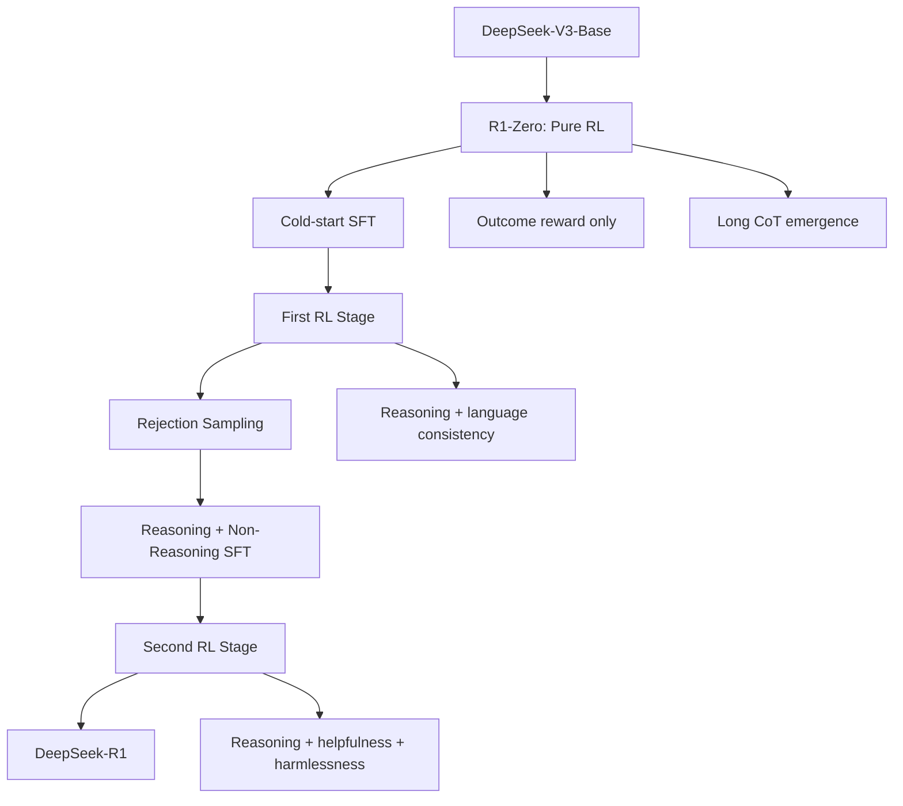
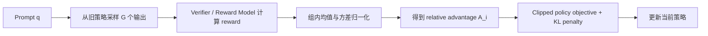

# RL and Alignment

## 关键结论

DeepSeek-R1 的真正突破，不在于换了一套 Transformer 结构，而在于把 **reinforcement learning 从“对齐收尾步骤”提升为“推理能力放大器”**。

- **先有强底座**：DeepSeek-V3-Base 提供知识、语言能力和初始推理潜力。
- **再做 pure RL 验证**：即使没有人工标注 reasoning traces，模型也能在合适奖励下长出更长、更有反思性的推理行为。[DeepSeek-R1, Sections 1, 2.3]
- **然后补可读性与可交付性**：用 cold-start SFT、rejection sampling 和第二阶段 RL，把 raw reasoning 收敛成更稳定、更符合用户偏好的模型。[DeepSeek-R1, Section 3]
- **算法上选 GRPO**：不是为了“换个名字”，而是因为长链推理场景下，value model 昂贵且难学，group-relative advantage 更适合 verifier-rich 任务。[DeepSeek-R1, Section 2.1; Appendix A.3]

所以，R1 最重要的启示不是“RL 很强”，而是：**当 base model 足够强、奖励足够可靠、系统足够稳定时，RL 可以把推理从静态模仿能力，变成可持续放大的行为能力。**

## 本页在系列中的位置

- 这一页是训练主线的总纲：它回答 **为什么 DeepSeek 要把 RL 从对齐尾声，提前到 reasoning 主舞台。**
- 如果你想看“奖励到底怎么设计、为什么 verifier 比花哨 RM 更重要”，下一页读 `reward_design_and_verifiers.md`。
- 如果你想看“这套 RL 管线如何真正跑起来”，继续读 `rl_infrastructure.md`；如果你想看“这条路线的代价”，再去 `failure_modes_and_limitations.md`。

## 背景 / 问题定义

### 传统 SFT → RLHF 范式的局限

在主流 LLM 对齐路线中，一个常见范式是：

1. 先用高质量监督样本做 SFT；
2. 再用偏好模型或奖励模型做 RLHF。

DeepSeek-R1 在附录中也回顾了这一路线，指出它的优势在于：

- SFT 可以快速把模型拉到可用分布；
- RL 再对用户偏好和更复杂目标做动态微调 [DeepSeek-R1, Appendix A.2]。

但如果目标是 **reasoning capability**，这条标准路线会遇到一个结构性问题：

- 人工写出的 CoT 不一定是最优推理路径；
- 人类示范往往缺少模型在长推理过程中会自发产生的反思、验证、改写与回溯；
- 一旦先用人类风格 SFT 强行把模型压到某种推理模板上，后续 RL 的探索空间就被提前收窄了 [DeepSeek-R1, Section 1].

DeepSeek-R1 的核心问题意识因此非常明确：

**如果我们真正关心的是“模型如何学会更强推理”，那么人类给出的思维样板，未必应该成为第一性约束。**

### R1-Zero 想回答什么，R1 又想修复什么

R1-Zero 试图证明一件相当激进的事：

> 只要 base checkpoint 足够强，再配上可靠的 outcome reward，模型可以通过 pure RL 自己长出长推理、自我校验和策略切换能力，而不必先喂人工标注的 reasoning traces [DeepSeek-R1, Abstract; Section 1].

论文表明，R1-Zero 确实做到了这一点：

- thinking time 持续增长；
- 推理过程中出现自我反思与 alternative exploration；
- 数学、代码、STEM 等可验证任务显著提升 [DeepSeek-R1, Section 2.3].

但 R1-Zero 也暴露出几个明显问题：

- 可读性差；
- 语言混杂；
- 对 general helpfulness 和开放域问答支持不足 [DeepSeek-R1, Section 1].

因此，R1 的真正任务不是“重新学一次 reasoning”，而是：

1. 保住 R1-Zero 已经长出来的 raw reasoning 能力；
2. 让它变得更可读、更可控；
3. 让 reasoning 与 helpfulness / harmlessness / instruction following 共存；
4. 把可用于产品交付的对话能力重新拼回来 [DeepSeek-R1, Section 3].

### 从 SFT 到 RL 的路线：DeepSeek 的偏离点在哪里

如果用一句话概括 R1 与主流路线的差异，那就是：**它没有把 RL 当成 SFT 之后的小修小补，而是把 RL 提前到了 reasoning 能力塑形的核心阶段。**

传统路线通常是：

1. 先用大规模 SFT 获得可用对话分布；
2. 再用 RLHF 或偏好优化做用户偏好校准。

DeepSeek-R1 的路线则更像：

1. 先用 V3-Base 提供强预训练底座；
2. 直接用 pure RL 验证 reasoning 行为能否自然涌现；
3. 再用 cold-start SFT 和 rejection sampling 把涌现出的行为整理为更可交付的表达；
4. 最后用 mixed RL 把 reasoning、helpfulness、harmlessness 重新对齐 [DeepSeek-R1, Section 1; Section 3].

这个偏离点很重要，因为它意味着 DeepSeek 不是先问“怎样得到一个好聊天模型”，而是先问“怎样得到一个更强的 reasoner”，然后再把它修成好聊天模型。

## 图表清单

- R1 训练路线总图：展示从 V3-Base 到 R1 的多阶段演化。
- GRPO 流程图：展示 group rollout、reward、relative advantage、policy update 的关系。
- PPO vs GRPO 对比表：说明为什么 GRPO 更适合长 CoT reasoning。
- R1 各阶段能力变化表：展示 Dev1 / Dev2 / Dev3 / R1 的收益与代价。

## 核心机制

### 从 DeepSeek-V3-Base 到 R1：不是一步到位，而是多阶段蒸馏与再强化

DeepSeek-R1 的 pipeline 不是单轮训练，而是多阶段能力搬运与再放大。论文给出的主线可以概括为：

1. **DeepSeek-V3-Base**：提供知识、语言与已有 reasoning 潜力；
2. **DeepSeek-R1-Zero**：在没有 SFT 的情况下做 pure RL，观察 reasoning 能力能否自然涌现；
3. **Cold-start SFT**：对部分高质量 reasoning 轨迹做人类可读化与风格化整理；
4. **First RL Stage**：继续强化 reasoning，同时引入语言一致性；
5. **Rejection Sampling + SFT**：把更强 reasoning 样本蒸馏进更稳定、可控的模型；
6. **Second RL Stage**：把 reasoning 与 general helpfulness / harmlessness 联合优化，得到最终 R1 [DeepSeek-R1, Figure 2; Section 3].

这一流程最有意思的地方在于：DeepSeek 并不是在“RL 或 SFT 二选一”，而是让它们各做最擅长的事：

- RL 负责探索、放大、筛出高价值推理行为；
- SFT 负责把这些行为蒸馏成可读、可复用、可对话的模型习惯。

### R1 的 reasoning 是如何逐步“训练出来”的

这条路线可以理解成四个阶段的能力演化：

1. **潜力阶段**：V3-Base 已经在预训练中见过大量数学、代码与推理痕迹风格数据，因此它不是空白底座，而是“有潜力但未被系统放大”的模型 [DeepSeek-R1, Appendix A.1]。
2. **涌现阶段**：R1-Zero 用 pure RL 让模型在 outcome reward 驱动下学会更长思考、更强反思和验证 [DeepSeek-R1, Section 2.3]。
3. **可读化阶段**：Cold-start SFT 与 rejection sampling 把原始 CoT 整理为更符合人类阅读习惯的表达 [DeepSeek-R1, Section 3; Appendix B.3.2]。
4. **对齐阶段**：第二阶段 RL 再把 helpfulness、harmlessness、语言一致性和 instruction-following 融进来 [DeepSeek-R1, Section 3.2.2].

所以，R1 的 reasoning 能力不是一次性靠某个数据集“灌进去”的，而是通过 **探索 → 选择 → 蒸馏 → 再强化** 的闭环逐步塑造出来的。

### R1 训练路线图



## 数学基础

### GRPO 的目标函数

DeepSeek-R1 使用 **Group Relative Policy Optimization (GRPO)** 作为核心 RL 算法 [DeepSeek-R1, Section 2.1]。对每个问题 $q$，GRPO 从旧策略 $\pi_{\theta_{old}}$ 中采样一组输出 $\{o_1, o_2, \dots, o_G\}$，然后最大化如下目标：

$$
J_{\mathrm{GRPO}}(\theta) = \mathbb{E}_{q \sim P(Q), \{o_i\}_{i=1}^{G} \sim \pi_{\theta_{old}}}
\left[
\frac{1}{G}
\sum_{i=1}^{G}
\min\left(
\frac{\pi_\theta(o_i \mid q)}{\pi_{\theta_{old}}(o_i \mid q)} A_i,
\operatorname{clip}\left(\frac{\pi_\theta(o_i \mid q)}{\pi_{\theta_{old}}(o_i \mid q)}, 1-\varepsilon, 1+\varepsilon\right) A_i
\right)
- \beta D_{KL}(\pi_\theta \| \pi_{ref})
\right]
$$

其中：

- $\varepsilon$ 是 clip ratio；
- $\beta$ 是 KL 惩罚系数；
- $\pi_{ref}$ 是参考策略；
- $A_i$ 是 group-relative advantage [DeepSeek-R1, Section 2.1].

### KL 项与 relative advantage

R1 论文采用了一个 KL estimator：

$$
D_{KL}(\pi_\theta \| \pi_{ref}) = \frac{\pi_{ref}(o_i \mid q)}{\pi_\theta(o_i \mid q)} - \log \frac{\pi_{ref}(o_i \mid q)}{\pi_\theta(o_i \mid q)} - 1
$$

更关键的是 advantage 定义：

$$
A_i = \frac{r_i - \operatorname{mean}(\{r_1, r_2, \dots, r_G\})}{\operatorname{std}(\{r_1, r_2, \dots, r_G\})}
$$

这意味着 GRPO 不再尝试估计一个独立的 value function，而是用**同一道题的组内表现**来决定每个样本相对有多好 [DeepSeek-R1, Section 2.1].

### relative advantage / group comparison 的意义

这个设计有三个非常关键的含义。

第一，它把“一个答案好不好”从绝对分数问题变成相对排序问题。对 reasoning 任务来说，绝对 reward 往往尺度不稳定，但组内比较更可靠：

- 同一 prompt 下采样的多个解答共享题目难度；
- 如果某个答案显著更正确、更规范，它会自然在组内胜出；
- 这样做减少了对全局 reward calibration 的依赖。

第二，它绕开了 value model。PPO 需要训练一个 value model 预测从当前位置开始的累计回报，但在长 CoT 场景里，这件事很难：

- 中间 token 是否“好”，往往要等最后答案出来才能判断；
- 模型还可能在后文反思、推翻、重写前文；
- 因而基于 partial response 的 value estimation 会非常噪 [DeepSeek-R1, Appendix A.3].

第三，组内标准化还能在一定程度上控制 variance。虽然论文没有把 GRPO 形式化证明成“更低方差”的普适算法，但 group normalization 确实让 advantage 不再过度依赖 reward 的绝对量纲，而更依赖组内区分度，这对 rule-based verifier 场景尤其重要 [DeepSeek-R1, Section 2.1; Appendix A.3]。

## 工程实现

### 为什么 Group Relative 更适合 reasoning 场景

DeepSeek-R1 主要面对的是数学、代码、逻辑、STEM 这类 **可以构造 verifier** 的任务 [DeepSeek-R1, Section 2.2; Appendix B.3.1]。这些任务的共同特点是：

- 最终答案通常可验证；
- 过程很长，但 outcome reward 相对可靠；
- 中间步骤不一定有人工可标注的 dense supervision。

在这种场景里，GRPO 比 PPO 更顺手，原因主要有三点：

1. **不需要 critic / value model**
   - 节省显存与训练算力；
   - 避免长 CoT 下 value estimation 难以学习的问题 [DeepSeek-R1, Appendix A.3].

2. **更适合 outcome-based reward**
   - DeepSeek-R1-Zero 主要依据最终正确性与格式打分；
   - 不需要为中间每一步思维过程拟合一个人工定义的过程奖励 [DeepSeek-R1, Section 2.2].

3. **组内归一化适合同题多样本比较**
   - reasoning 问题天然适合“同题采多个解，再比谁更好”；
   - 这让优化过程更像做相对排序，而不是估计一个全局绝对值。

### R1-Zero 的奖励设计：少约束、强反馈

R1-Zero 的奖励系统很克制，主要由两部分组成：

- **accuracy reward**：答案是否正确；
- **format reward**：是否遵守 `<think>` / `<answer>` 格式要求 [DeepSeek-R1, Section 2.2].

合起来可写为：

$$
Reward_{rule} = Reward_{acc} + Reward_{format}
$$

DeepSeek 明确强调，他们没有用 neural reward model 去做 reasoning reward，因为这样更容易出现 reward hacking，而且还要额外训练模型、增加复杂度 [DeepSeek-R1, Section 2.2]。

这背后的设计取舍很清楚：

- 对 reasoning 任务，**可靠 verifier 比华丽 reward model 更重要**；
- 在奖励信号可靠的情况下，尽量少地规定过程，让模型自己探索更好的思路；
- 先让模型学会“解决问题”，再去管“如何更像人类那样表达”。

### R1 的多阶段奖励设计

到了正式的 R1，奖励函数变得更综合。第二阶段 RL 中，论文给出：

$$
Reward = Reward_{reasoning} + Reward_{general} + Reward_{language}
$$

其中：

$$
Reward_{reasoning} = Reward_{rule}
$$

$$
Reward_{general} = Reward_{reward\_model} + Reward_{format}
$$

此外还有语言一致性奖励：

$$
Reward_{language} = \frac{Num(Words_{target})}{Num(Words)}
$$

它用来缓解中英混杂等语言不一致问题 [DeepSeek-R1, Section 3.2.1; Section 3.2.2].

这里的关键点在于：DeepSeek 并没有把“reasoning 奖励”和“人类偏好奖励”一开始就完全混在一起，而是分阶段引入。尤其是第二阶段里，general instruction data 与 preference-based reward 只在最后 400 步引入，原因是更长时间使用 model-based preference reward 会诱发 reward hacking [DeepSeek-R1, Section 3.2.2].

这是一种非常务实的工程判断：**reasoning 增强和偏好对齐可以兼容，但不应该在训练一开始就混成一锅。**

### RL 基础设施如何把大规模 reasoning rollouts 跑起来

R1 的一个常被低估的事实是：它不是只靠一个漂亮的目标函数赢下来的，**还靠一套能把 rollout、reward、训练、显存管理真正串起来的 RL 基础设施** [DeepSeek-R1, Appendix B.1]。

论文把 RL 框架拆成四个模块：

- **Rollout module**：负责从 actor policy 采样多条候选输出；
- **Inference module**：运行 reward model / reference model 前向；
- **Rule-based reward module**：执行编译器、答案匹配器、格式检查器等 verifier；
- **Training module**：计算损失并更新策略 [DeepSeek-R1, Appendix B.1]。

其中最重要的工程细节有三类：

1. **Rollout 与 verifier 解耦**：规则奖励模块可以异步执行，与 rollout / inference 重叠，以隐藏长尾延迟 [DeepSeek-R1, Appendix B.1]。
2. **显存与内存分层管理**：不同阶段使用的模型会在 VRAM、系统内存和磁盘之间做 offload / reload，避免所有模块同时常驻 GPU [DeepSeek-R1, Appendix B.1]。
3. **推理后端为 RL 服务**：DeepSeek 使用 vLLM worker 做 rollout，并在 MoE 架构下结合 expert parallel、热点专家冗余、副模块复用等方式提高采样吞吐 [DeepSeek-R1, Appendix B.1]。

这部分工程含义非常直接：**没有足够高吞吐、低显存压力的 RL 基础设施，GRPO 再合适，也很难在 10K 级训练步、超长 CoT 输出和多候选组采样下稳定跑起来。**

### GRPO 训练流程图



### PPO vs GRPO 对比

| 维度 | PPO | GRPO |
| --- | --- | --- |
| 是否需要 value model | 需要 | 不需要 |
| advantage 来源 | 奖励 + value model（常配 GAE） | 同题多样本组内归一化 reward |
| 显存 / 算力成本 | 更高，需要额外 critic / value 路径 | 更低 [DeepSeek-R1, Section 2.1] |
| 长 CoT 适配性 | value estimation 难，partial response 难预测最终 reward | 更适合 outcome-based verifier 场景 [DeepSeek-R1, Appendix A.3] |
| KL 处理方式 | 常作为 dense reward 加入 | 直接写入目标函数中的 KL estimator [DeepSeek-R1, Appendix A.3] |
| 长度偏置风险 | KL 作为 dense reward 可能隐式惩罚长输出 | 相对更弱，但仍要控制 KL 与 clip |
| 主要风险 | 训练更重、value 学不稳 | 依赖 group 内 reward 区分度与 verifier 质量 |

### 与 PPO 的 design trade-off

GRPO 并不是“无代价优于 PPO”。它的优势和代价都很明确：

#### 得到的东西

1. **省掉 value model**：
   - 资源更省；
   - 工程路径更短；
   - 长 CoT 下不必去估计非常难的 value target [DeepSeek-R1, Appendix A.3].

2. **更适合同题多采样**：
   - 推理问题往往可以对一个题目采多个解法；
   - group-relative comparison 天然匹配这种 rollout 方式。

3. **更符合 verifier-rich reasoning 场景**：
   - 如果 reward 来自编译器、数学判定器、格式规则，GRPO 很容易接上。

#### 付出的代价

1. **依赖 reward 的组内区分度**：
   - 如果一组样本的 reward 都一样，优势信号就会很弱；
   - 如果 verifier 粗糙，组内比较也会失真。

2. **不是天然免疫 reward hacking**：
   - DeepSeek 自己也明确承认，在 model-based reward 上训练太久会出现 reward hacking [DeepSeek-R1, Section 3.2.2; Section 6].

3. **仍然需要稳定性设计**：
   - KL coefficient；
   - clip ratio；
   - reference model 定期更新；
   - 合理 rollout 长度与 batch 结构 [DeepSeek-R1, Section 2.1; Section 3.2.1].

### variance、stability 与 reward shaping

DeepSeek 在 R1 里做的稳定性工程，实际上就是围绕这三件事展开：

- **Variance**：通过 group mean/std 归一化 reward，把绝对奖励变成相对优势，减弱尺度波动影响 [DeepSeek-R1, Section 2.1]；
- **Stability**：通过 clip、KL penalty、reference model 更新、适中的 temperature 控制训练不要发散 [DeepSeek-R1, Section 2.1; Section 3.2.1; Section 3.2.2]；
- **Reward shaping**：通过 accuracy、format、language consistency、helpfulness / safety reward model 等组成最终奖励，但又避免在不可靠 reward 上训练过久 [DeepSeek-R1, Section 2.2; Section 3.2.2].

一个特别值得注意的细节是 clip ratio。论文明确指出：

- clip 太小会让很多 token 的梯度被截断，性能下降；
- clip 太大又会让训练不稳定 [DeepSeek-R1, Section 3.2.1].

这说明 GRPO 虽然比 PPO 更适合 reasoning，但它仍然是一种需要精细调参和系统工程支撑的 RL 算法，不是“把 reward 一接上就自动长脑子”。

### R1 各阶段能力演化

| 阶段 | 主要目标 | 收益 | 代价 / 问题 |
| --- | --- | --- | --- |
| R1-Zero | 纯 RL 验证 reasoning emergence | 长 CoT、自反思、验证行为显著增强 [DeepSeek-R1, Section 2.3] | 可读性差、语言混杂、泛化到 general task 弱 |
| Dev1（cold-start + RL） | 把 raw reasoning 改造成更可读对话思维 | instruction-following 提升 [DeepSeek-R1, Section 4] | reasoning 指标短期有回落 |
| Dev2 | 继续 reasoning-oriented RL | 代码、数学、STEM 推理显著增强 [DeepSeek-R1, Section 4, Table 3] | 通用用户偏好指标提升有限 |
| Dev3 | reasoning + non-reasoning SFT | reasoning 与 general generation 更平衡 [DeepSeek-R1, Section 4] | 训练管线更复杂 |
| R1 | 混合 reasoning / helpfulness / harmlessness RL | ArenaHard、AlpacaEval、instruction following 显著增强 [DeepSeek-R1, Section 4, Table 3] | overthinking、prompt sensitivity、language mixing 仍未彻底消失 [DeepSeek-R1, Section 6] |

### 简化版 GRPO 训练循环

```python
for batch in prompt_loader:
    prompts = batch["prompts"]

    # 1) 对每个 prompt 采样一组输出
    grouped_outputs = [
        sample_group(old_policy, prompt, group_size=G)
        for prompt in prompts
    ]

    # 2) 计算 reward：可来自 verifier、规则、reward model
    grouped_rewards = []
    for prompt, outputs in zip(prompts, grouped_outputs):
        rewards = [compute_reward(prompt, output) for output in outputs]
        grouped_rewards.append(rewards)

    # 3) 组内归一化，得到 relative advantage
    grouped_advantages = []
    for rewards in grouped_rewards:
        mean_r = mean(rewards)
        std_r = std(rewards) + 1e-6
        grouped_advantages.append([(r - mean_r) / std_r for r in rewards])

    # 4) 计算 clipped objective + KL penalty
    loss = 0.0
    for prompt, outputs, advantages in zip(prompts, grouped_outputs, grouped_advantages):
        for output, adv in zip(outputs, advantages):
            ratio = policy_prob(policy, prompt, output) / policy_prob(old_policy, prompt, output)
            clipped = clip(ratio, 1 - eps, 1 + eps)
            kl = kl_estimator(policy, ref_policy, prompt, output)
            loss += -min(ratio * adv, clipped * adv) + beta * kl

    loss = loss / (len(prompts) * G)
    loss.backward()
    optimizer.step()
    optimizer.zero_grad()
```

这段伪代码刻画了 DeepSeek-R1 的核心逻辑：**不是让模型学“标准答案长什么样”，而是让它在同题多解中学会哪类输出更值得保留和放大。**

## Design trade-offs

### 为什么 DeepSeek 不采用更常见的方案

从外部看，DeepSeek 的路线似乎有些“逆风”：大多数团队更愿意先用大量人工 CoT + SFT 打底，再上较保守的 RLHF。DeepSeek-R1 则选择了更激进的路线：先用 pure RL 观察 reasoning 能否自然涌现，再把涌现出的模式做蒸馏与对齐 [DeepSeek-R1, Section 1; Section 3]。

为什么这样做？

1. **他们怀疑人工 CoT 会限制探索空间**；
2. **他们的 base model 已足够强**，具备被 RL 放大的潜力 [DeepSeek-R1, Appendix A.1]；
3. **他们优先解决的是 reasoning，而不是先做一个温顺聊天机器人**；
4. **他们有足够强的系统栈支撑大规模 RL**，包括 rollout、vLLM、rule-based reward、异步调度与内存管理 [DeepSeek-R1, Appendix B.1].

### 对齐带来的收益与副作用

DeepSeek-R1 的对齐并不只是“更安全更礼貌”，而是做了三种能力重构：

- **可读性重构**：减少语言混杂，把原始 CoT 变成人类更容易消费的解释；
- **行为重构**：让模型更会遵循指令、更贴近用户偏好；
- **边界重构**：在 reasoning 保持较强的同时，纳入 harmlessness 和 safety 约束 [DeepSeek-R1, Section 3.1; Section 4].

但这些收益都有代价：

1. **可读性奖励会轻微损失一部分原始性能**，论文自己承认 language consistency reward 有轻微性能下降 [DeepSeek-R1, Section 3.2.1]；
2. **reasoning 与 general helpfulness 的最优点不完全一致**，因此需要分阶段而不是一次性联合优化；
3. **对齐后仍可能 overthink**，尤其对简单问题也给出很长推理 [DeepSeek-R1, Section 6]；
4. **prompt sensitivity 仍存在**，论文直接指出 few-shot prompting 反而会劣化性能 [DeepSeek-R1, Section 6].

换句话说，对齐不是免费午餐。R1 的价值在于它给出了一个相对平衡的工程解：**先把 reasoning 能力放大，再用最少必要的对齐把它拉回可用分布。**

## 与主流方案对比

### 与传统 PPO / RLHF 的对比

| 维度 | 传统 PPO / RLHF | DeepSeek-R1 路线 |
| --- | --- | --- |
| 典型起点 | SFT 后再做 RLHF | R1-Zero 直接 pure RL，再回补 SFT [DeepSeek-R1, Section 1; Section 3] |
| 奖励来源 | 偏好模型常占主导 | reasoning 先依赖 rule-based verifier，再逐步引入 preference reward |
| 核心 RL 算法 | PPO 较常见 | GRPO |
| reasoning 处理 | 常把 reasoning 当对齐产物 | 把 reasoning 当可被 RL 放大的核心能力 |
| 工程重心 | 稳定聊天与偏好优化 | reasoning emergence + 可读化 + 再对齐 |

### 与 Llama / Instruct 路线的对比

主流 Llama/Instruct 路线通常更强调：

- 先通过大规模 instruction tuning 获取可用聊天能力；
- 再通过偏好优化让回答更稳定、更像人类偏好。

DeepSeek-R1 的不同点在于，它把 RL 推到更靠前的位置，并把“推理是否能被 outcome reward 放大”作为核心命题来做。换句话说，Llama/Instruct 更像是在做“更好的 assistant”，而 R1 首先在做“更强的 reasoner”，然后才把它修成更好的 assistant。

### 与传统 Transformer 训练哲学的对比

传统 Transformer 论文更常把推理看成预训练自然涌现或 SFT 模仿结果，而 R1 明确强调：

- reasoning 可以由纯 RL 驱动涌现；
- 只要有可靠 verifier，复杂推理行为就能通过 trial-and-error 被持续强化；
- 真正的难点不只是模型结构，而是奖励、稳定性和系统效率 [DeepSeek-R1, Section 6].

这也是 DeepSeek 路线最有研究价值的地方：**它把 reasoning 从“静态能力”改写成了“可优化行为”。**

## 小结 / 启示

DeepSeek-R1 给未来 open reasoning model 至少留下了四个重要启示。

1. **强 reasoning 不一定要先靠大量人工 CoT 喂出来。** 如果 base model 足够强、任务有 verifier，pure RL 可以放大出超出人类示范模板的行为模式 [DeepSeek-R1, Section 1; Section 2.3]。
2. **GRPO 不是 PPO 的简化替身，而是更适合 verifier-rich long-CoT 场景的折中方案。** 它牺牲了一部分通用性，换来长推理场景下更合理的资源与稳定性配置 [DeepSeek-R1, Appendix A.3]。
3. **reasoning 模型最终仍要回到工程可用性。** raw reasoning 很强不代表可交付，语言一致性、可读性、helpfulness、harmlessness 仍然必须补齐 [DeepSeek-R1, Section 3].
4. **开放问题依然存在。** 对不可验证任务，reward model 可靠性仍是瓶颈；tool use、structured output、software engineering RL 也还未被 fully scaled [DeepSeek-R1, Section 6].

因此，R1 的真正价值不只是 benchmark 分数，而是它展示了一种更清晰的方法论：

**先用预训练造出有潜力的底座，再用 verifier 驱动的 RL 放大 reasoning，最后用蒸馏与对齐把这种能力收敛为长期可维护的产品能力。**

## 思考问题

- 如果你的任务没有可靠 verifier，GRPO 这条路线还能站得住吗？缺的是算法、奖励，还是系统基础设施？
- R1 选择“先放大 reasoning，再补可读性和对齐”，而不是反过来。这个顺序在哪些任务上会特别有效，在哪些任务上会翻车？
- 如果你要把 R1 的方法迁移到工具调用或结构化输出场景，第一步最该改 reward、环境，还是 rollout 系统？