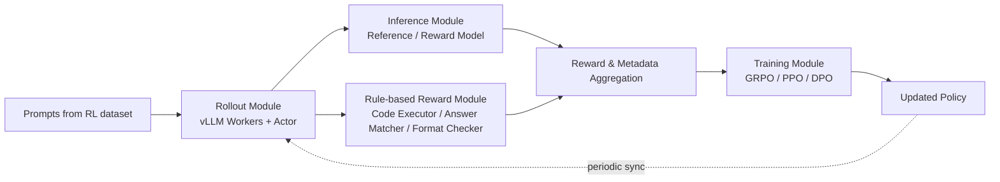
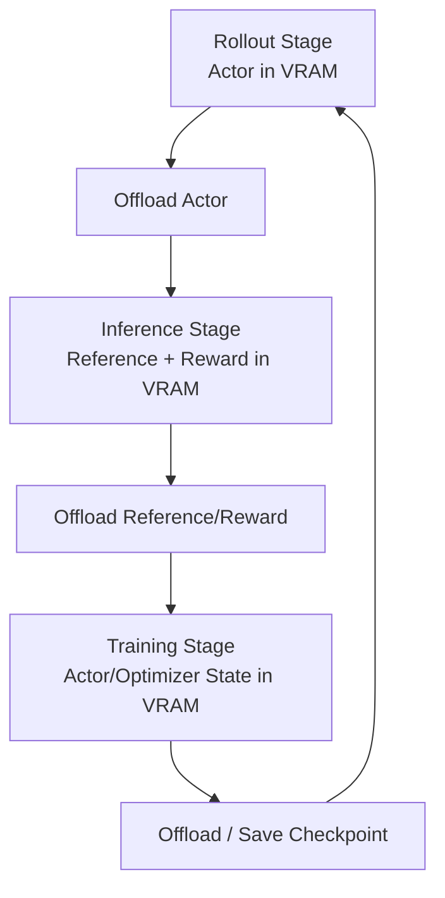

# DeepSeek-R1 的 RL Infrastructure：如何把长 CoT 强化学习真正跑起来

## 关键结论

在 DeepSeek-R1 里，`GRPO` 当然重要，但真正把 reasoning RL 从论文概念变成可持续训练系统的，是它背后的 **RL infrastructure**。如果没有这套基础设施，超长 CoT、同题多采样、rule-based verifier、reward model 和策略更新很容易互相卡死，最后变成“算法没问题，系统先趴下”。

这一页可以先给出五个结论：

- DeepSeek 把 RL 训练显式拆成 `Rollout / Inference / Rule-based Reward / Training` 四个模块，不是为了软件工程上的整洁，而是为了把 **采样、判分、训练、显存占用** 解耦 [DeepSeek-R1, Appendix B.1]。
- 这套拆分的核心目标不是最小化单模块延迟，而是 **最大化整个训练闭环的吞吐**：慢 verifier 要被异步隐藏，模型实例要轮流驻留显存，长序列样本要做长度排序与打包，否则 GPU 很快会开始等 CPU、等 IO、等 padding [DeepSeek-R1, Appendix B.1]。
- Rollout 侧不是普通推理服务，而是“为 RL 而优化的高吞吐生成系统”：DeepSeek 用 `vLLM workers`、MoE expert parallel、hotspot expert 副本，以及 `MTP` 自推测解码来缩短最长样本的完成时间 [DeepSeek-R1, Appendix B.1]。
- Training 侧不是简单拿回样本就反向传播，而是要解决两个现实问题：**超长序列 padding 浪费** 与 **多设备负载不均**。因此 DeepSeek 明确使用全局长度排序、Best-Fit packing 和 chunk 对齐策略 [DeepSeek-R1, Appendix B.1]。
- 真正高杠杆的工程设计，是 **模块级 VRAM offload / reload**。DeepSeek 不是让 actor、reference、reward model 全部常驻 GPU，而是让它们按阶段轮班占用显存，使 RL 可以在有限资源下处理数万 token 级长输出 [DeepSeek-R1, Appendix B.1]。

## 背景 / 问题定义

从高层看，R1 的训练似乎只是“多了个 RL 阶段”；但从系统角度看，它比常规 SFT 或短输出 RLHF 要难得多，主要有三个原因。

### 第一，样本不是现成的，而是要在线生成

SFT 的训练样本已经写在数据集里；而 DeepSeek-R1 的 RL 样本要先由当前策略在线 rollout 出来。更麻烦的是，这些 rollout 不是每题一条，而是 **同一问题要采样一组输出**，这样 GRPO 才能进行组内比较 [DeepSeek-R1, Section 2.1]。

这意味着系统必须先回答：

- 怎么高吞吐生成多条超长回答？
- 怎么把不同长度的序列组织成可训练 batch？
- 怎么让 rollout 与后续判分、训练衔接？

### 第二，奖励不是一个统一的神经网络前向

对 R1 而言，reward 来自多个来源：

- rule-based reward：格式检查、答案匹配、编译器 / test cases；
- model-based reward：helpful RM、safety RM；
- 训练所需的 reference model 前向信息 [DeepSeek-R1, Section 2.2; Section 3.1; Appendix B.1]。

所以“计算奖励”并不是一次 GPU 前向，而是一条混合流水线：一部分吃 GPU，一部分吃 CPU / 外部 verifier，一部分还具有强长尾延迟。这就要求系统层面做 **异步重叠**，否则最慢的 verifier 会把整个训练循环拖住。

### 第三，长 CoT 会把所有系统问题放大

R1-Zero 在 8.2k step 之前的最大 rollout 长度是 `32,768`，之后提高到 `65,536`；每题采样 `16` 个输出；每步有 `32` 个问题；每个 rollout 生成 `8,192` 个 outputs，再拆成 `16` 个 minibatches [DeepSeek-R1, Section 2.1]。

这几个数字叠在一起，几乎把所有大模型系统问题都拉到了台前：

- 生成端：最长样本决定尾延迟；
- 训练端：padding 浪费随长度分布急剧增加；
- 显存端：actor / reference / reward model 很难同时常驻；
- 调度端：一旦某个模块阻塞，整条 RL 闭环吞吐就会塌。

所以，DeepSeek-R1 的 RL infrastructure，本质上是在回答这样一个问题：

> 怎样让“长输出 + 多样本 + 多 verifier + 多模型切换”依然保持高吞吐、可训练、可扩展？

## 图表清单

- 图 1：RL Pipeline 四模块结构图（Mermaid）
- 图 2：模块级 VRAM 轮班图（Mermaid）
- 表 1：常见 RLHF 与 R1 基础设施对比表
- 表 2：论文明确给出的关键训练与 rollout 数字
- 表 3：模块解耦的收益与代价总表

## 核心机制

DeepSeek 在附录 B.1 中明确把 RL framework 拆成四个模块：

1. `Rollout Module`
2. `Inference Module`
3. `Rule-based Reward Module`
4. `Training Module` [DeepSeek-R1, Appendix B.1]

### 总体结构图

这张图里最重要的不是框图本身，而是模块边界背后的设计哲学：

- `Rollout` 关心的是 **生成吞吐**；
- `Inference` 关心的是 **GPU 前向型评分**；
- `Rule-based Reward` 关心的是 **外部 verifier 与 CPU 侧长尾任务**；
- `Training` 关心的是 **反向传播效率与多设备负载均衡**。

换句话说，DeepSeek 不让一个“万能训练进程”同时兼顾所有事情，而是让不同类型的工作负载各自优化。

## 数学基础

基础设施页面里，数学不是主角，但仍然可以把系统目标写得更明确。

### 每步样本规模

论文给出的第一阶段 RL 配置是：

- 每题采样 `16` 个输出；
- 每步有 `32` 个唯一问题 [DeepSeek-R1, Section 2.1; Section 3.2.1]。

因此每个训练 step 的候选输出规模可写为：

$$
N_{\mathrm{samples/step}} = N_q \times G = 32 \times 16 = 512
$$

其中：

- $N_q$ 是每步问题数；
- $G$ 是每题采样条数。

这也是论文直接给出的 training batch size `512` 的来源。

### Rollout 总产出规模

论文还指出，每次 rollout 会生成 `8,192` 个 outputs，再拆成 `16` 个 minibatches，只训练 `1` 个 inner epoch [DeepSeek-R1, Section 2.1]。

记 rollout 总产出为 $N_{\mathrm{rollout}}$，则：

$$
N_{\mathrm{rollout}} = 8192
$$

每个 minibatch 大小近似为：

$$
N_{\mathrm{minibatch}} = \frac{8192}{16} = 512
$$

这说明 DeepSeek 的策略是：**先大规模收集样本，再用相对浅的更新去消化它们**。从系统角度看，这种 large-rollout / shallow-update 设计可以减少 rollout 与 update 的频繁切换成本。

### 模块重叠后的有效步耗时

如果不做模块重叠，单步总耗时可以粗略写成：

$$
T_{\mathrm{step,serial}} = T_{\mathrm{rollout}} + T_{\mathrm{infer}} + T_{\mathrm{rule}} + T_{\mathrm{train}}
$$

其中：

- $T_{\mathrm{rollout}}$：生成多条回答的时间；
- $T_{\mathrm{infer}}$：reward / reference model 前向；
- $T_{\mathrm{rule}}$：编译器、答案匹配等 verifier 时间；
- $T_{\mathrm{train}}$：参数更新时间。

而 DeepSeek 的目标是通过 overlap，把 rule-based reward 隐藏到 rollout / inference 之后。理想化地，可把有效步耗时写成：

$$
T_{\mathrm{step,overlap}} \approx \max(T_{\mathrm{rollout}} + T_{\mathrm{infer}},\ T_{\mathrm{rule}}) + T_{\mathrm{train}}
$$

这不是论文中的原始公式，而是其系统意图的直接抽象：**最慢 verifier 不再线性叠加到所有模块之后，而是尽量与其他阶段重叠。**

### 显存峰值：常驻 vs 轮班

如果 actor、reference、reward model 和 training model 全部常驻 VRAM，则峰值显存大致接近：

$$
M_{\mathrm{resident}} \approx M_{\mathrm{actor}} + M_{\mathrm{reference}} + M_{\mathrm{reward}} + M_{\mathrm{train}}
$$

而如果按模块阶段 offload / reload，则峰值显存更接近：

$$
M_{\mathrm{peak}} \approx \max(M_{\mathrm{rollout}}, M_{\mathrm{infer}}, M_{\mathrm{train}})
$$

DeepSeek 的模块级 offload 设计，本质上就是把显存占用从“求和问题”变成“取最大值问题” [DeepSeek-R1, Appendix B.1]。这对长 CoT RL 非常关键，因为序列一长，activation、KV cache 和模型实例切换都会一起抬高资源压力。

### Padding 浪费的直觉表达

若一个 packed chunk 的固定长度为 $L_{\mathrm{chunk}}$，其中第 $i$ 个样本的真实长度为 $l_i$，那么这个 chunk 的 padding waste 可以写为：

$$
W_{\mathrm{pad}} = \sum_i (L_{\mathrm{chunk}} - l_i)
$$

DeepSeek 的长度排序 + Best-Fit packing，本质上就是在尽量减小 $W_{\mathrm{pad}}$ [DeepSeek-R1, Appendix B.1]。对超长 CoT 训练而言，这类 padding waste 会直接转化为 GPU 算力浪费。

## 工程实现

### Rollout Module：高吞吐采样不是普通推理服务

### vLLM Workers 为何是核心

论文指出，prompts 会被均匀分发到多个 `vLLM workers`，每个 worker 都加载 actor model，以采样多条回答 [DeepSeek-R1, Appendix B.1]。

这里的关键点在于，RL rollout 与线上 serving 虽然都在“生成文本”，但目标不同：

- 线上 serving 通常关注单请求延迟；
- RL rollout 更关注 **大规模多样本吞吐**。

也就是说，这里的生成后端不是为了“用户快点拿到一个答案”，而是为了“训练系统快点拿到一大堆候选答案”。

### MoE 架构下的 rollout 额外复杂度

DeepSeek-R1 构建在 DeepSeek-V3 基底之上，因此 rollout 不是普通 dense model 推理，而是 MoE 推理。论文明确提到，在 rollout 阶段他们：

- 跨节点实现 expert parallelism；
- 部署 redundant copies of hotspot experts；
- 减少 memory access overhead；
- 平衡不同 experts 的计算负载 [DeepSeek-R1, Appendix B.1]。

这说明 rollout 端的难点不只是“生成得快”，而是“在稀疏模型上生成得快，而且别让热点专家把系统拖死”。

### MTP 与 self-speculative decoding

论文还提到，`MTP` 组件被用于 self-speculative decoding，以加快 decoding 并缩短最长样本的完成时间 [DeepSeek-R1, Appendix B.1]。

这点非常关键，因为 RL rollout 的尾延迟几乎总被最长样本主导。使用 MTP 的价值，不只是平均吞吐更高，而是让长尾样本更早结束，从而减少整批 rollout 的等待时间。

### Inference Module：不是训练，只是打分前向

Inference Module 的职责相对单纯：

- 加载 reward model；
- 加载 reference model；
- 对 rollout 生成的样本做前向，得到 model-based reward 和其他必要信息 [DeepSeek-R1, Appendix B.1]。

这一步的系统含义在于：**把“生成”和“打分”分开**。原因主要有两个：

1. actor / reward / reference model 的资源需求不同；
2. 打分前向不需要反向传播，但需要尽快吞吐掉一大批样本。

如果把这一步和 rollout 或 training 强行绑死在一起，模型常驻显存和阶段切换成本都会更高。

### Rule-based Reward Module：慢 verifier 必须被系统性隐藏

### 为什么它是最长尾的一环

在 DeepSeek 的 RL 闭环里，rule-based reward module 反而最容易被低估。因为它不一定吃 GPU，却可能最慢：

- 代码执行要跑编译与测试；
- 数学答案匹配可能涉及表达式解析；
- 格式检查虽快，但只是其中一类 verifier [DeepSeek-R1, Appendix B.1; Appendix B.3.1]。

这类工作负载的特征是：

- 算法异构；
- 延迟分布长尾；
- 很难统一 batch 化。

所以 DeepSeek 选择了统一接口 + 异步调度，而不是试图把所有 verifier 硬塞进一个同步 GPU pipeline。

### 异步重叠为何是必要而不是锦上添花

论文明确说，Rule-based Reward Module 的执行会与 Rollout / Inference overlap，以隐藏其 latency [DeepSeek-R1, Appendix B.1]。这不是一个“优化项”，而是 reasoning RL 的必要条件。

原因很简单：如果每个训练 step 都必须先等所有代码执行、答案匹配、格式检查完全结束，再开始下一阶段，那么：

- GPU 采样会空等；
- reward model 前向会空等；
- 训练器会空等。

换句话说，异步调度在这里不是提高 10% 吞吐的小技巧，而是决定系统是否能保持持续饱和的主开关。

### Training Module：真正的瓶颈常常不是反向，而是 padding

### 支持多种 RL 算法，但主要目标是高效更新

论文指出，Training Module 设计成支持 `PPO / GRPO / DPO / ...` 等多种 RL 算法 [DeepSeek-R1, Appendix B.1]。但就 R1 实际使用场景而言，这个模块最重要的工程价值不是“算法可插拔”，而是：

- 如何把超长序列组织成高利用率 batch；
- 如何让多设备训练负载尽量均衡；
- 如何把 rollout 回流样本快速消化成策略更新。

### 全局长度排序 + Best-Fit Packing

DeepSeek 给出的 packing 流程非常明确：

1. 全局 batch 先按长度排序；
2. 在 data parallel group 内分发；
3. 每个进程内部用 `Best-Fit` 策略把样本打包进固定长度 chunks；
4. 最后再让各进程 chunk 数相等 [DeepSeek-R1, Appendix B.1]。

这套流程的核心目标是两个：

- 降低 padding waste；
- 防止某些设备分到更长样本而成为慢 rank。

### DualPipe 的作用

Training Module 中还集成了 DeepSeek-V3 使用的 `DualPipe` 算法，以提高 pipeline parallelism 效率 [DeepSeek-R1, Appendix B.1]。这说明 R1 的 RL 训练并没有另起炉灶，而是在预训练阶段打磨出来的系统工具链上继续复用。

这也是 DeepSeek 路线的一个重要特征：**训练系统资产是跨阶段复用的**。预训练中用于超大模型并行的机制，不会在 RL 阶段被抛弃，而是继续服务于更复杂的 reasoning training。

### VRAM Management：为什么“轮班驻留”比“全部常驻”更现实

论文明确提到，除 Rule-based Reward Module 外，每个模块结束后，模型实例都会从 VRAM 自动 offload 到 system memory 或 disk，以便后续阶段重用显存 [DeepSeek-R1, Appendix B.1]。

### 阶段轮班图

这一设计背后是非常实际的资源判断：

- actor model 在 rollout 和 training 中都要用，但不是同一时刻都要高占用；
- reference / reward model 在 inference 阶段重要，但训练阶段没有必要常驻；
- rule-based verifier 本身不需要占用 GPU 主显存。

因此，最优策略不是“让一切都留在显存里随时待命”，而是“谁正在工作，谁占显存；谁暂时不用，谁让路”。

## 与主流方案对比

| 维度 | 常见 RLHF / 短输出后训练 | DeepSeek-R1 的 RL Infrastructure |
| --- | --- | --- |
| 输出长度 | 相对较短 | 长 CoT，可达 32K/65K 级别 [DeepSeek-R1, Section 2.1] |
| 采样模式 | 每 prompt 少量样本 | 每题组采样，服务 GRPO |
| verifier | 更偏 reward model | rule-based + reward model 混合 |
| 关键系统瓶颈 | RM 前向与训练切换 | verifier 长尾 + rollout 吞吐 + padding + 显存切换 |
| 基础设施重点 | policy / RM 训练闭环 | 模块解耦、异步重叠、VRAM offload、packing |

DeepSeek-R1 的难点不只是“规模更大”，而是 **工作负载更异构**。同一个训练 step 里，系统要同时处理：

- 高吞吐文本生成；
- GPU 前向打分；
- CPU / 外部工具 verifier；
- 反向传播与参数同步。

这类异构性，正是它必须采用模块化 RL infrastructure 的根本原因。

## 实现细节补充

### 论文明确给出的关键数字

| 项目 | 数值 | 位置 |
| --- | --- | --- |
| 每题采样输出数 | 16 | [DeepSeek-R1, Section 2.1; Section 3.2.1] |
| 每步问题数 | 32 | 同上 |
| 每步 batch size | 512 | 同上 |
| rollout 总输出数 | 8192 | [DeepSeek-R1, Section 2.1; Section 3.2.1] |
| minibatch 数 | 16 | 同上 |
| inner epoch | 1 | 同上 |
| reference model 更新周期 | 每 400 steps | 同上 |
| rollout max length（前期） | 32,768 | [DeepSeek-R1, Section 2.1] |
| rollout max length（后期） | 65,536 | [DeepSeek-R1, Section 2.1] |

### 基础设施复用的系统资产

| 资产 | 在 RL 中的作用 |
| --- | --- |
| vLLM workers | 提高 rollout 吞吐 |
| MoE expert parallel | 降低跨节点稀疏推理成本 |
| hotspot expert 副本 | 减少热点专家负载不均 |
| MTP speculative decoding | 缩短 rollout 长尾 |
| DualPipe | 提升 training pipeline 效率 |
| model offload / reload | 降低显存峰值 |

## Design trade-offs

### 模块解耦的收益与代价

| 设计 | 收益 | 代价 |
| --- | --- | --- |
| Rollout / Inference / Reward / Training 解耦 | 每类工作负载各自优化，便于重叠与扩展 | 调度系统更复杂，状态管理更麻烦 |
| 异步 rule-based reward | 隐藏长尾 verifier 延迟 | 容错与结果汇总更复杂 |
| VRAM offload | 把峰值显存从“求和”压到“取最大值” | 需要额外装载开销 |
| 长度排序 + Best-Fit packing | 降低 padding waste，提高多设备均衡 | 预处理逻辑更复杂，batch 组织成本更高 |
| MTP speculative decoding | 提升 rollout 吞吐，减少长尾 | 系统耦合更深，需要模型结构支持 |

### 为什么这套系统特别适合 DeepSeek-R1

DeepSeek-R1 的训练目标有一个很鲜明的特征：**它比普通后训练更像“轻量版在线搜索 + 可验证强化学习”**。同题多采样、超长回答、外部 verifier、本地训练器，这些元素天然要求系统具备如下特性：

1. 生成必须高吞吐；
2. verifier 必须能异步接入；
3. 模型实例必须可切换驻留；
4. 训练必须能消化长序列而不被 padding 吞掉。

这正好解释了为什么 DeepSeek 的 RL infrastructure 看起来“很像一套独立平台”，而不是普通训练脚本上多加几个模块。

## 延伸分析

R1 的 RL infrastructure 不只是服务一篇论文，它实际上改变了“reasoning model 应该怎样训练”的系统思维：

- 如果任务有 verifier，那么 RL 系统的上限往往受制于 **verifier 吞吐与调度**，不只是模型 FLOPs；
- 如果输出很长，那么真正的吞吐瓶颈常常出现在 **padding、长尾样本、显存驻留策略**；
- 如果模型是 MoE，那么 rollout 侧就必须继承预训练级别的并行与负载均衡能力；
- 如果未来要做 tool use / structured output，类似的模块化 RL framework 依然是最自然的演化起点 [DeepSeek-R1, Section 6]。

也就是说，DeepSeek-R1 展示的不只是一个“能训出更强推理”的方法，而是一种 **reasoning-native training system** 的雏形。

## 小结 / 启示

DeepSeek-R1 的 RL infrastructure 可以概括成一句话：

> 它不是把 RL 当成一个 loss function，而是把 RL 当成一个跨生成、评分、验证、训练和显存管理的全栈系统问题。

因此，这套系统最值得记住的，不是某个单独组件，而是它们如何协同：

- `Rollout Module` 负责把多样本超长 CoT 高吞吐地产生出来；
- `Inference Module` 负责快速消费 GPU 型评分任务；
- `Rule-based Reward Module` 负责把 verifier 长尾延迟隐藏进异步流水线；
- `Training Module` 负责把超长样本高效变成参数更新；
- `VRAM offload / reload` 则让整个系统在有限资源下依然可运行。

如果说 `GRPO` 解决的是“怎么优化”，那这套 RL infrastructure 解决的就是另一个更现实的问题：**怎么把这种优化真的跑到足够大、足够长、足够稳定。**
