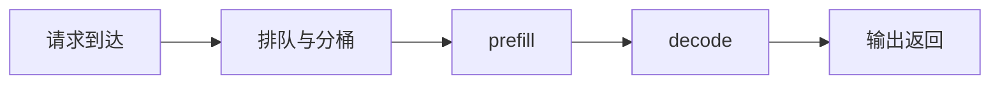

# 面试笔记重构作战手册

这份手册服务于一个目标：把笔记从**按顺序堆章节**，升级成**可复习、可跳转、可面试表达**的知识网络。

---

## 1. 先改结构，再补内容

重构顺序建议固定为：

1. 先补 `README.md` / `00-index.md` 这样的入口页。
2. 再为核心主题补上**相对路径交叉链接**。
3. 然后统一单篇笔记模板。
4. 最后再逐篇补代码、踩坑记录、Q&A。

这样做的原因很简单：

- **入口页**决定你能不能快速找到内容；
- **交叉链接**决定你能不能把知识点串起来；
- **统一模板**决定你能不能把一篇笔记讲成面试答案。

---

## 2. 文件命名规范

新增或重写笔记，统一使用：

`序号_领域_核心知识点.md`

例如：

- `01_Java基础_多线程与并发.md`
- `02_AIInfra_KVCache与PagedAttention.md`
- `03_CPP_RAII与智能指针.md`

### 命名原则

- **序号**：保证同目录下的阅读顺序与排序稳定。
- **领域**：方便快速检索，也方便按主题聚合。
- **核心知识点**：直接体现这一篇到底在解决什么问题。

### 当前仓库的迁移说明

当前仓库已有一批对外可访问的稳定链接，因此**不建议一次性批量重命名旧文件**。更稳妥的做法是：

- 旧文件维持现有 slug，避免打断外部链接；
- 新增/重写的笔记开始执行新命名规范；
- 在索引页中维护旧路径到新命名规范的映射说明。

---

## 3. 相对路径链接规范

每篇笔记都要有至少一个“向前回链”和一个“向后延伸”链接。

### 常见写法

- 同目录跳转：`[Paged KV](07-paged-kv-and-allocator.md)`
- 上级目录跳转：`[返回 AI Infra 总索引](../00-index.md)`
- 跨章节跳转：`[Attention 与 KV Cache](../03-llm-architecture/02-attention-kv-cache.md)`

### 最低要求

每篇核心笔记至少补齐：

- **1 个基础概念回链**：读者能回到前置知识；
- **1 个系统实战延伸**：读者知道下游落地场景；
- **1 个平行概念对照**：读者能横向比较相近主题。

---

## 4. 单篇笔记的实战型模板

每个小章节都必须至少按下面 4 段顺序组织：

### 4.1 背景：为什么会有这个技术

这一段必须回答：

- 它出现前的主流方案是什么；
- 当时的核心痛点是什么；
- 旧方案为什么失败，失败在什么边界；
- 为什么这个技术后来成了高频面试点。

### 4.2 技术介绍：实现机制 + 原汁原味代码

这一段必须尽量贴近真实工程实现。

要求：

- 优先引用真实项目中的代码、接口、配置或调用链；
- 如果代码太长，只截最关键的几行，并解释上下文；
- 如果只能写伪代码，要明确标注“这是简化版”；
- 不要只停留在概念描述，要解释数据结构、函数分工和关键流程。

### 4.3 面试考点

每篇末尾至少 2～3 题，最好覆盖：

- 定义题：你是否能讲清楚它是什么；
- 比较题：你是否能讲清 trade-off；
- 场景题：你是否能从指标/报错反推问题。

回答尽量写成“回答要点”，方便直接拿来口述。

### 4.4 思考题

至少给出 3 道思考题，重点是继续往下推：

- 如果 workload 变了，这个结论还成立吗；
- 如果资源预算变化，trade-off 会怎么变；
- 如果迁移到别的框架 / 硬件 / 系统层级，会遇到什么问题。

### 4.5 推荐补充段落

在以上 4 段之外，推荐补：

- **关联知识网络**：前置 / 平行 / 延伸
- **💥 实战踩坑记录**：真实报错、误判、根因、修复
- **对比表 / 决策表**：把 trade-off 压成表格

可以用引用突出原始报错：

> RuntimeError: CUDA out of memory while allocating KV cache

---

## 5. 排版规范：让重点一眼能看到

### 加粗与高亮

- 用 **加粗** 标出定义、结论、关键词。
- 不要整段加粗；只加粗能帮助快速扫读的词。

### 表格

碰到对比类知识，优先用表格整理，例如：

| 主题 | 优点 | 代价 | 适用场景 |
|---|---|---|---|
| Continuous Batching | 吞吐更高 | 调度更复杂 | 高频动态请求 |
| Static Batching | 简单稳定 | 对动态请求不友好 | 离线或固定输入 |

### Mermaid

复杂流程、架构关系、调度链路，优先用 Mermaid：



### Few-shot 改写范式：直接把“学生笔记”改成“工程手册”

如果你在带新人，最有效的方式通常不是讲抽象原则，而是给他看几个颗粒度一致的 `Before / After`。

核心原则只有一句：

> 不要只写“这个概念是什么”，而要写成“它怎么推、怎么算、会踩什么坑、能支持什么工程决策”。

#### 案例 1：从“死记公式”到“推导核算”

**Before**

- 写法：`Training FLOPs ≈ 6 × N_params × N_tokens，这个公式很有用。`
- 问题：只有结论，没有来源，也没有把公式变成决策。

**After**

- 先解释为什么是 `6PN`：
    - 前向约 `2PN`
    - 反向约 `4PN`
    - 总计约 `6PN`
- 再补一个真正能拿来面试的算例：
    - `7B` 模型、`300B` tokens、单卡有效 `400 TFLOPs`
    - 训练时长约 `364 天`
- 最后落到工程结论：
    - **单卡不可能完成，必须上分布式集群**

判断标准：

- 是否解释了公式的来源；
- 是否给了能复算的数字例子；
- 是否把公式转成了资源与架构决策。

#### 案例 2：从“泛泛而谈”到“精确到字节”

**Before**

- 写法：`显存预算要考虑参数、梯度、优化器状态、激活。Adam 会占很多显存。`
- 问题：知道方向，但没有量级，读完依然不知道会不会 OOM。

**After**

- 直接给出 **Adam 的 16 Bytes/Param 定律**：
    - 参数（FP16/BF16）：`2 Bytes`
    - 梯度（FP16/BF16）：`2 Bytes`
    - Master Weight（FP32）：`4 Bytes`
    - 一阶矩 `m`（FP32）：`4 Bytes`
    - 二阶矩 `v`（FP32）：`4 Bytes`
- 再补一条量级结论：
    - `7B × 16 Bytes ≈ 112 GB`
    - **单张 80G 卡静态显存都不够，更别说 activation**

判断标准：

- 尽量消灭“很多 / 大概 / 不少”这种词；
- 优先给字节、FLOPs、延迟、吞吐这类可量化数字；
- 最后一定落到资源边界或系统取舍。

#### 案例 3：从“记 API”到“懂底层机制”

**Before**

- 写法：
    - `y = x.t()` 可能是 view
    - `z = y.contiguous()` 可能复制内存
- 问题：描述了现象，但没解释“为什么会这样”。

**After**

- 先把对象拆开：Tensor = `Storage + Metadata(shape/stride/dtype/device)`
- 再解释：
    - `x.t()` 常常只是改 `stride`，所以只是 **view**
    - `contiguous()` 需要物理连续布局时，往往会 **真实申请新内存并复制**
- 再补工程后果：
    - 大张量上频繁触发 `contiguous()`，会制造显存尖峰和额外带宽开销
- 最后给面试回答套路：
    - **显存莫名上涨，先查是不是隐式 copy，而不是先怀疑 CUDA 坏了**

判断标准：

- 不只写 API 用法，要写底层对象模型；
- 不只写“会变慢”，要写为什么会变慢；
- 最后补一个真实排障场景。

#### 一句话检查法

如果一段笔记满足下面三条里的两条以上，通常就已经从“学生总结”升级成“工程笔记”了：

- 有推导，不只报结论；
- 有数字，不只讲趋势；
- 有机制，不只背 API；
- 有决策，不只记定义。

---

## 6. 重写一篇笔记时的检查清单

- [ ] 标题能否直接说明这一篇的核心问题？
- [ ] 开头是否有一句话的 What & Why？
- [ ] 是否保留了最小可讲的代码/操作示例？
- [ ] 是否记录了真实踩坑与排障路径？
- [ ] 是否补了 2～3 个面试高频问答？
- [ ] 是否至少有 3 个相对路径交叉链接？
- [ ] 是否使用表格或 Mermaid 来压缩复杂描述？

---

## 7. 一份可直接复制的骨架

````md
# 标题

## 核心定义（What & Why）

一句话说明：它是什么、解决什么问题、为什么重要。

## 关联知识网络

- 前置：[]()
- 平行：[]()
- 延伸：[]()

## 核心代码 / 操作演示（How）

```lang
# 只保留最关键逻辑，并写注释
```

## 对比表

| 方案 | 优点 | 代价 | 适用场景 |
|---|---|---|---|
| | | | |

## 💥 实战踩坑记录（Troubleshooting）

> 贴原始报错信息

- 现象：
- 根因：
- 解决：

## 🎯 面试高频 Q&A

1. 问题：
   - 回答要点：
2. 问题：
   - 回答要点：

## Mermaid（可选）


````
